---

In this post, I share some useful information about (mostly Bayesian) hypothesis testing
that I've picked up over the years.
I've gleaned most of this information from 
Gelman et al's [Bayesian Data Analysis](http://www.stat.columbia.edu/~gelman/book/),
Gelman and Hill's [Data Analysis Using Regression and Multilevel/Hierarchical Models](http://www.stat.columbia.edu/~gelman/arm/),
McElreath's [Statistical Rethinking](https://xcelab.net/rm/statistical-rethinking/),
the documentation and source code of [brms](https://github.com/paul-buerkner/brms),
and a few other sources I can't remember.

When I first sat down to write, I wanted to do a short post about multiple comparisons in Bayesian analyses. However, I quickly realised to do so I needed to go over some background about frequentist and Bayesian hypothesis testing, and then when I started writing about the background I forgot to stop, leading to the essay below. If you know all the basics, feel free to skip straight to the 
[**Bayesian Multiple Comparisons**](#bayesian-multiple-comparisons) section below.

> The source code for all of the figure in this post can be found [here](https://github.com/EoinTravers/hugo.eointravers.com/blob/master/content/post/hypothesis/Source.Rmd).

# The Basics

Statistical inference lets us do two things:
*estimate the parameters* of a statistical model,
and *test statistical hypotheses*.
Implicitly or explicitly, these hypotheses 
are about whether or not the parameters in a model taken on particular values (like $0$).
[This post](https://lindeloev.github.io/tests-as-linear/)
does a great job of explaining the relationship between common statistical tests
and parametric models.

We can test hypotheses using either
frequentist statistics (p-values and confidence intervals)
or Bayesian statistics (Bayes factors, posterior estimates, and credible intervals).

## Frequentist Hypothesis Testing

In classical, or *frequentist* statistics,
probabilities represent the frequencies at which
particular events happen:
a 50% probability of a coin landing heads means
that if you flipped the coin 100 times,
you should expect it to come up heads 50 times, give or take.
Frequentist hypothesis testing provides a set of rules which, 
if you follow them correctly,
will control the frequency at which you make particular errors,
for instance how often you wrongly decide there is an effect
when there really isn't.

### P-Values

The **p-value** is at the heart of frequentist hypothesis testing.
A p-value tells us the probability of getting a particular test statistic,
$t$, that is *as big as the one we have or bigger*
under the null hypothesis that there is actually no effect.
The most common test statistic is the $t$ statistic,
calculated as part of the t-test.
By convention, we usually conclude an effect is *statistically significant*
if the p-value is less than $0.05$.
We call this threshold the $\alpha$ value, $\alpha = 0.05$.

We normally use **two-tailed p-values**, 
or *two-tailed tests*,
which are the probability of getting
a *positive or negative* test statistic
(that is, an effect in either direction)
as big as or bigger than the one we have.
If we call test statistic we actually got $\hat t$,
and $\text{abs}(\hat t)$ is it's absolute value
(that is, making it positive if it's negative),
the p-value is the probability of getting
either a positive t-value greater than $\text{abs}(\hat t)$
or a negative value less than $-\text{abs}(\hat t)$
under the null hypothesis.
We can write this mathematically[^maths notation] as
$p = P(t \gt \text{abs}(\hat t) | H_0) + P(t \lt -\text{abs}(\hat t) | H_0)$,
or $p = P(\text{abs}(t) \gt \text{abs}(\hat t) | H_0)$.

For the t statistic, the total probability
of finding either $t \gt 2$ or $t \lt -2$ is $\approx 0.05$
(the exact value depends on how many data points you have).
As a result, we usually say an effect is *significant*
if the t statistic exceeds these thresholds.
In other words, 
if there is actually no effect (the *null hypothesis is true*)
$-2 \lt t \lt 2$ 95% of the time.
This means if you only believe an effect is real
when $\hat t \lt 2$ or $\hat t \gt -2$,
you'll only commit *type 1 errors*
--- believing there is an effect when there really is none --- 
5% of the time.

[^maths notation]: $P(x|y)$ means *the probability of* $x$, *given that* $y$ *is true*, or the probability of $x$ *conditional* on $y$. $P(x|y,z)$ is *the probability of* $x$ *given that* $y$ *and* $z$ *are true*.

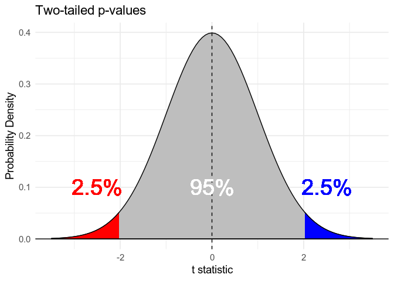

Sometimes, we'll see **one-tailed p-values**.
These come up in cases where we're only interested in effects in one direction.
If we're only interested in positive effects,
the one-tailed p value is the probability of finding a positive test statistic
as big as the one we have or bigger under the null hypothesis,
given that the statistic we have is positive
$P(t \gt \hat t | H_0, \hat t \gt 0)$
Since we're not interested in negative effects, 
we can use a lower threshold for significance,
for example deciding an effect is real if $\hat t >$ approximately $1.66$,
and still only commit type 1 errors 5% of the time.

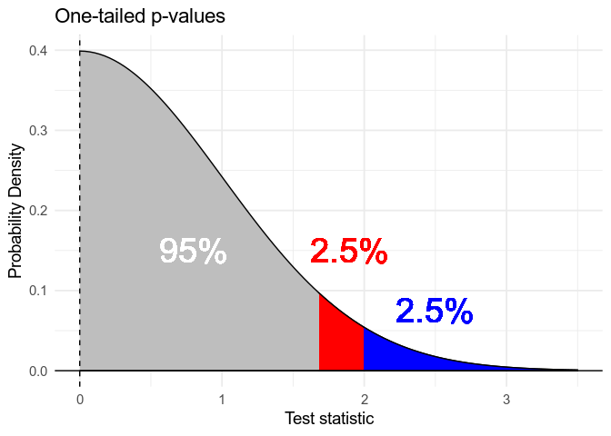

A one-tailed p-value is half the value of the corresponding two-tailed p-value:
if $p_{\text{two-tailed}} = .08$, $p_{\text{one-tailed}} = .04$.
One-tailed p-values can be controversial,
because it's easy to calculate a two-tailed value,
see that it's almost significant, 
and then decide to report the significant one-tailed value instead.
One-tailed tests can only really be trusted if
a) it's only physically possible for an effect to be in one direction, or 
b) the researcher has pre-registered their analysis using a one-tailed test,
including the predicted direction of the effect,
and they are committed to admitting surprise 
if the effect turns out to be in the "wrong" direction.

### Confidence Intervals

The other important idea in frequentist hypothesis testing is the *confidence interval*.
When we fit a model to our data,
we look for the **maximum likelihood** parameters:
the parameters under which our data is most likely,
or in other words, the parameters that are most consistent with our data.
If we're looking for a parameter $\beta$,
this gives of $\hat \beta$, our estimate of $\beta$.
We can also calculate a 95% *confidence interval*
(interval = range of values)
$[\beta_{\text{Low}}, \beta_{\text{High}}]$.
This interval is constructed 
so that 
<b>95 times out of 100, the interval will contain the true value</b>.
Confidence intervals are often misinterpreted as showing the range of values
we're 95% confident contain the true value.
This is actually the definition of Bayesian credible intervals, discussed below.

Confidence intervals are useful for hypothesis testing,
because if the null hypothesis is that $\beta = 0$,
the probability of getting a 95% confidence interval that doesn't include $0$
is less than $0.05$.
In other words, if the 95% confidence doesn't include $0$, $p \lt .05$.

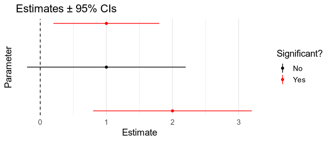

This works for other intervals too: if the 90% interval doesn't include $0$, $p < .10$.
Since the one-tailed p-value is half the two-tailed p-value,
we also know that if the 90% interval doesn't include $0$, 
$p_{\text{two-tailed}} < .10$, and so $p_{\text{one-tailed}} < .05$.
This means that you can use 90% confidence intervals as a proxy for one-tailed tests.

### Multiple Comparisons

[XKCD](https://xkcd.com/882/) covers the problem of multiple comparisons better than I can:

The more tests we run, the more likely it is we'll find at least one 
that is significant ($p < .05$) even though the null hypothesis is true.
There are lots of ways of addressing this, 
but the most common approach is to use the **Bonferroni correction**.
Let's say we're running two tests, $k = 2$.
We can either adjust the $\alpha$ threshold we use to decide what's significant,
$\alpha_{\text{Adjusted}} = \frac{\alpha}{k} = .025$,
or keep $\alpha = .05$ and adjust the p-values themselves,
$p_{\text{Adjusted}} = k\times p$.
Either way, this correction ensures that
if the null hypothesis is true 
(there are no effects in either case)
we'll only wrongly decide there are one or more effects
5% of the time.
We can apply the same correction to confidence intervals:
if we're running $k$ tests, our adjusted confidence intervals should be $k$ times as wide.

## Bayesian Hypothesis Testing

In Bayesian, or *"subjectivist"* statistics,
probabilities represent subjective beliefs:
a 50% probability of a coin landing heads means
that I'm 50% the coin will come up heads next it's tossed.
Bayesian hypothesis testing provides rules
for calculating how you should updates your beliefs about different hypotheses
in light of the evidence you see.

### Posterior Belief

In Bayesian inference, we use distributions
to represent quantities --- that is, model parameters --- we're uncertain about.
We start out with *prior distributions*,
representing our beliefs before we've seen our data (blue).
We then see some data (red),
and the data will be more consistent with some parameters than others
(the *likelihood*, blue).
The rules of Bayesian inference tells us how to update our beliefs about the parameters 
now that we've seen the data to obtain *posterior beliefs* 
(purple; NB: Posterior = behind/after).
These posterior beliefs are a compromise between what we believed beforehand
and what the data says.

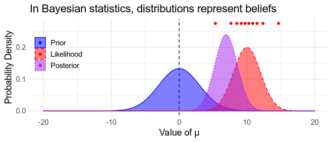

Bayesian distributions are easy to interpret.
The mode of the distribution (the highest point in the curve)
is the most likely value of the parameter.
If 95% of the the distribution is between two values,
$\beta_{\text{Low}}$ and $\beta_{\text{High}}$
then according to the model
there's a 95% probability that the parameter is somewhere between these two value,
or in other words, we're 95% confident that $\mu$ is between $\mu_{\text{Low}}$ and $\mu_{\text{High}}$.
This interval is called a <i>Bayesian credible interval</i>.
Notice that this is what people often mistakenly think confidence intervals tell us. 

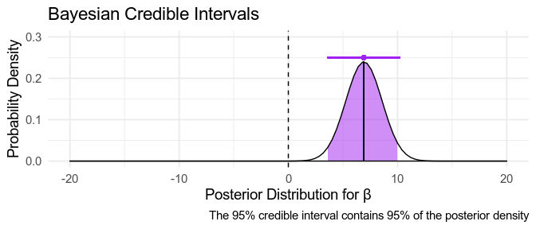

Sometimes, when we have no idea what our prior should be,
we might use a very broad *uninformative prior*,
or even a *uniform prior*,
reflecting that we believe all possible parameter values,
from $- \infty$ to $+ \infty$ are equally probable.
If we use a uniform prior, 
the posterior distribution only depends on the data,
and so we end up with parameters that match the frequentist 
maximum-likelihood estimates, described above:
the posterior mode is the same as the maximum-likelihood value,
and the **credible intervals match the confidence intervals**.

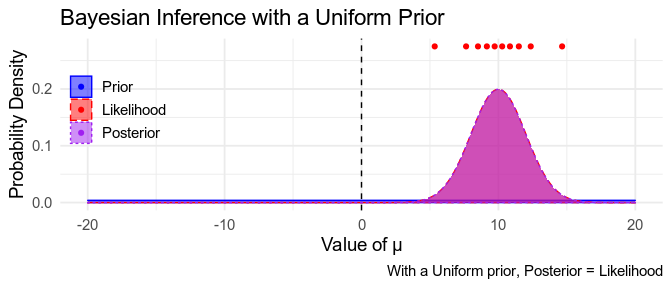

### Credible Interval Tests

95% credible intervals are commonly used as a simple way 
to decide whether an effect is "real" or not:
if the credible interval does not include 0, the effect is genuine.
If it includes 0, it might not be.
[Gelman and Tuerlinckx (2000)](http://www.stat.columbia.edu/~gelman/research/published/francis8.pdf)
call this making a *claim with confidence*.
If we use uniform priors, 
we know that the credible intervals and confidence intervals match,
so we can infer that $p < .05$ if the credible interval excludes 0.
With informative priors, 
the interpretation is a little bit more complicated,
but this remains a simple, sensible rule of thumb.
I come back to this idea below.

### Posterior Sign Tests

Once we've calculated our posterior distribution for $\beta$,
we can interrogate it directly.
For instance, if 99% of the posterior distribution is above $0$,
we are 99% sure that $\beta > 0$,
$P(\beta > 0) = .99$,
and 1% sure that $\beta < 0$:
This test goes by a few names, but let's call it a *posterior sign test*.

However, this evidence isn't as strong as it sounds.
For example, if our posterior distribution is centred on 0,
we find that $P(\beta > 0) = .5$ and $P(\beta < 0) = .5$.
This is the case no matter how certain we are about the value of $\beta$,
illustrated below.
The reason for this is that we're only considering two hypotheses here:
either $\beta > 0$, or $\beta < 0$,
while ignoring the possibility that $\beta = 0$.
To test the hypothesis that $\beta = 0$,
we need to calculate the Bayes Factor, which we'll come to shortly.

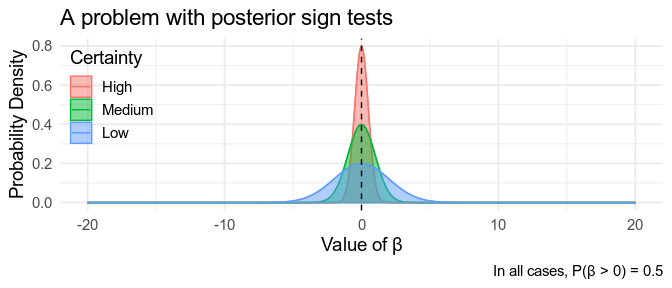

Interestingly, the posterior sign test is closely related to the one-tailed p-value.
If uniform priors are used
posterior $P(\beta > 0)$ turns out to be exactly the same
as one minus the one-tailed p-value for a positive effect,
$P(\beta > 0) = 1 - p_{one-tailed}^+$
This also means that if the whole
**90%** (not 95%) credible interval for $\beta$ 
is greater than $0$,
posterior $P(\beta > 0) > 0.95$.

### Regions of Practical Equivalence

You can also use the posterior to show evidence for the null hypothesis.
Let's say you're not really interested in differences $\delta$ 
smaller than a certain size, $d$.
Any values of $\delta$ smaller than than this
are *practically equivalent* to zero,
and the interval $-d \lt \delta  \lt d$
is called the *Region Of Practical Equivalence*, or **ROPE**.
If 99% of the posterior distribution is within the ROPE,
you can be 99% sure that $-d \lt \delta  \lt d$.
It's convenient to use credible intervals to visualise these tests:
if the 95% credible interval falls within the ROPE,
$P(-d \lt \delta  \lt d) \gt 0.95$.

This approach works for any kind of effect size,
for instance, you might decide that you're not interested in 
correlation coefficients $\rho$ less than $.1$.
However it's important that you decide on the ROPE
before you run the analyses.
Otherwise, it's very easy to cherry-pick a value that gives the result you want,
for example by choosing a region just wide enough to contain 
$\gt 95\%$ of the posterior. Don't do that.

### Bayes Factors

The *Bayes Factor* (BF) represents a different approach
to Bayesian hypothesis testing.
The BF is the ratio of *marginal* likelihoods, $\frac{P(\text{Data}|H_1)}{P(\text{Data}|H_0)}$,
where $P(\text{Data}|H)$ means *the likelihood of observing our data under hypothesis H*.
$H_0$ is the null hypothesis, typically that $\beta = 0$.
$H_1$ is the alternative hypothesis, $\beta \neq 0$.

The tricky bit about the BF is that $H_1$ doesn't specify
what the value of $\beta$ actually is.
Instead, it requires a prior distribution over possible values.
As a result, $P(\text{Data}|H_1)$ is a average 
over all possible values of $\beta$,
weighted by how likely each value in according to the prior.
This is called [*marginalising*](https://en.wikipedia.org/wiki/Marginal_distribution) 
over possible values of $\beta$.

If $\beta$ is discrete, this is a simple weighted average
over the $n$ possible values,
$\beta_1, \beta_2, \dots, \beta_n$,
where $P(\beta_i)$ is the prior probability
that $\beta = \beta_i$,
$P(\text{Data} | H_1) = \sum_i^n P(\text{Data} | \beta_i)  P(\beta_i)$.
If $\beta$ is continuous (e.g. a decimal value)
this is an integral,
$P(\text{Data} | H_1) = \int P(\text{Data} | \beta)  P(\beta) d\beta$.

This means that the Bayes Factor you get depends on the prior you use for $\beta$.
Imagine you collect your data and find that it is most consistent
with a small value of $\beta$.
If your prior was that $\beta$ is likely to large/far from 0 (a broad prior),
most of your prior will be a bad match for the data,
while $H_0$ ($\beta=0$) will be a relatively good match.
On the other hand, if your prior was that $\beta$ was likely to be small/close to 0,
most of the prior will be a fairly good match for the data,
and on average it will be a better match than $\beta=0$ was.

Setting an appropriate prior is complicated, and I won't discuss it here.
Most analyses will just use the default prior settings.
In the commonly-used [BayesFactor](https://richarddmorey.github.io/BayesFactor/)
package for R, 
the default prior for t-tests is a Cauchy distribution 
with a mean of $0$ and scale parameter of $r = \frac{\sqrt{2}}{2}$, 
for reasons I won't go into.
In general, it's easier to find evidence in favour of $H_0$
if $H_1$ is broad (a large value of $r$),
and easier to find evidence against of $H_0$
if $H_1$ is narrow (a small value of $r$).
Keep this in mind when interpreting other people's results,
but please don't use this information to massage your own findings.

#### Interpreting Bayes Factors

A Bayes Factor of $\frac{1}{1} = 1$ means means that the data is equally likely under
$H_0$ as under $H_1$.
Otherwise, you have the option of reporting either $BF_{10}$,
the Bayes Factor in favour of $H_1$,
$\frac{P(\text{Data}|H_1)}{P(\text{Data}|H_0)}$,
or $BF_{01} = \frac{1}{BF_{10}}$,
the Bayes Factor in favour of $H_0$,
$\frac{P(\text{Data}|H_0)}{P(\text{Data}|H_1)}$.

| $BF_{10}$ | $BF_{01}$ |
| :-------- | :-------- |
| 0.25      | 4         |
| 0.5       | 2         |
| 1         | 1         |
| 2         | 0.5       |
| 4         | 0.25      |

For example, $BF_{10} = 3$ means that the data is three times as likely 
under $H_1$ as it is under $H_0$:
$\frac{P(\text{Data}|H_1)}{P(\text{Data}|H_0)} = \frac{3}{1}$.

What we really want to know is how likely it is that $H_1$ is true, and $H_0$ false.
To find this, we first need to decide 
how likely we thought it was the one or other hypothesis was true
before seeing any data: the prior odds $\frac{P(H_1)}{P(H_0)}$, assuming that one or other model is true[^m-closed].
Note that this means there are two kinds of priors:
prior beliefs about which hypothesis or model is true,
and prior beliefs about the values of the parameters in each model.
If our prior belief was that $H_1$ and $H_0$ were equally likely,
$\frac{P(H_1)}{P(H_0)} = \frac{1}{1}$,
we can treat $BF_{10}$ as the posterior probability that $H_1$ is true
since 
$$
\begin{align}
\frac{P(H_1|\text{Data})}{P(H_0|\text{Data})} 
 &= 
  \frac{P(H_1)}{P(H_0)} \times
  \frac{P(\text{Data}|H_1)}{P(\text{Data}|H_0)}
  \newline
 &= \frac{1}{1} \times BF_{10} 
 \newline
 &= BF_{10} 
\end{align}
$$

What if our prior beliefs about which model is true were different?
We just multiply the Bayes Factor
by whatever prior odds, $\frac{P(H_1)}{P(H_0)}$, we believed.
I come back to this idea below.

[^m-closed]: This assumptions is actually pretty complicated, given that it's pretty obvious that our simple mathematical models don't fully describe the processes that generate our data (that is, ["all models are wrong"](https://en.wikipedia.org/wiki/All_models_are_wrong)). This is discussed in some detail in [this blog post](https://djnavarro.net/post/a-personal-essay-on-bayes-factors/), in particular the bit about *m-closed* problems.

#### Thresholds

Bayes factors can be interpreted simply as a statement about
the odds that one or other hypothesis is true,
assuming that one or other is true,
and that the prior odds were $\frac{1}{1}$.

However, it is customary to use the values in the table below,
from [Lee & Wagenmakers (2013)](https://bayesmodels.com/)
as thresholds:
there is "moderate" evidence of an effect if $BF_{10} \gt 3$, 
but only "anecdotal" evidence
if $1 \lt BF_{10} \lt 3$. 

| Bayes Factor | Strength of evidence |
| ------------ | -------------------- |
| BF $= 1$     | No evidence          |
| BF $\gt 1$   | Anecdotal evidence   |
| BF $\gt 3$   | Moderate             |
| BF $\gt 10$  | Strong               |
| BF $\gt 30$  | Very strong          |
| BF $\gt 100$ | Extreme evidence     |

This can be a bit weird.
First, there is no meaningful different between $BF = 2.99$ and $BF = 3.01$,
but following this rule will lead you to claim there is an effect in the latter case,
but that you don't know in the former case.
More importantly, 
people do not have good intuitions about ratios
(e.g. $BF = \frac{3}{1}$ or $BF = 3$).

Consider $BF = 3$, *moderate evidence*.
If our prior belief was that $H_1$ and $H_0$ were equally likely,
$\frac{P(H_1)}{P(H_0)} = \frac{1}{1}$, then
$P(H_1) = \frac{P(H_1)}{\text{Total Prob}} = \frac{P(H_1)}{P(H_1) + P(H_0)} = 0.5$.[^odds]
After seeing the data, 
$\frac{P(H_1|\text{Data})}{P(H_0|\text{Data})} = BF_{10} = \frac{3}{1}$, so
$P(H_1|\text{Data}) = \frac{3}{3 + 1} = 0.75$.
In other words, we've gone from 50% certain
that $H_1$ is true to 75% certain.
The same calculations are shown for other BFs in the table below.
Is this "moderate" evidence?
I think most people would say it isn't,
but the verbal label ("moderate") and the odds formatting ($\frac{3}{1}$) 
mean that this isn't obvious.
It's also quite common to see $BF \gt 3$ used as a Bayesian equivalent to $p < .05$: if $BF > 3$, the effect is real. 

My advice is
a) when reporting results, include the actual posterior model probabilities,
$P(H_1|\text{Data})$, and
b) when interpreting results, 
calculate this value yourself,
rather than leaning too much on the verbal labels,
and decide for yourself whether you think the evidence is strong enough.

[^odds]: Odds of $\frac{a}{b}$ are equivalent to a probability of $\frac{a}{a+b}$.

<!-- This doesn't render properly, so including HTML below -->
<!-- | $BF_{10}$ | $BF_{01}$ | Prior $P(H_1)$ | Posterior $P(H_1|\text{Data})$ | -->
<!-- | --------: | --------: | -------------: | -----------------------------: | -->
<!-- |      0.05 |        20 |            50% |                           4.8% | -->
<!-- |      0.10 |        10 |            50% |                           9.1% | -->
<!-- |      0.33 |         3 |            50% |                            25% | -->
<!-- |         1 |         1 |            50% |                            50% | -->
<!-- |         3 |      0.33 |            50% |                            75% | -->
<!-- |        10 |      0.10 |            50% |                          90.9% | -->
<!-- |        20 |      0.05 |            50% |                          95.2% | -->

<table>
    <thead>
        <tr class="header">
            <th style="text-align: right;"><em>B</em><em>F</em>10</th>
            <th style="text-align: right;"><em>B</em><em>F</em>01</th>
            <th style="text-align: right;">Prior <em>P</em>(<em>H</em>1)</th>
            <th style="text-align: right;">Posterior <em>P</em>(<em>H</em>1|Data)</th>
        </tr>
    </thead>
    <tbody>
        <tr class="odd">
            <td style="text-align: right;">0.05</td>
            <td style="text-align: right;">20</td>
            <td style="text-align: right;">50%</td>
            <td style="text-align: right;">4.8%</td>
        </tr>
        <tr class="even">
            <td style="text-align: right;">0.10</td>
            <td style="text-align: right;">10</td>
            <td style="text-align: right;">50%</td>
            <td style="text-align: right;">9.1%</td>
        </tr>
        <tr class="odd">
            <td style="text-align: right;">0.33</td>
            <td style="text-align: right;">3</td>
            <td style="text-align: right;">50%</td>
            <td style="text-align: right;">25%</td>
        </tr>
        <tr class="even">
            <td style="text-align: right;">1</td>
            <td style="text-align: right;">1</td>
            <td style="text-align: right;">50%</td>
            <td style="text-align: right;">50%</td>
        </tr>
        <tr class="odd">
            <td style="text-align: right;">3</td>
            <td style="text-align: right;">0.33</td>
            <td style="text-align: right;">50%</td>
            <td style="text-align: right;">75%</td>
        </tr>
        <tr class="even">
            <td style="text-align: right;">10</td>
            <td style="text-align: right;">0.10</td>
            <td style="text-align: right;">50%</td>
            <td style="text-align: right;">90.9%</td>
        </tr>
        <tr class="odd">
            <td style="text-align: right;">20</td>
            <td style="text-align: right;">0.05</td>
            <td style="text-align: right;">50%</td>
            <td style="text-align: right;">95.2%</td>
        </tr>
    </tbody>
</table>

### Density Ratios

The Bayes Factor has another useful interpretation.
Your prior distribution for $\beta$ reflects the values you believed to be probable
before seeing any data.
Some of the prior probability will be around $\beta = 0$,
and the probability density at 0 (the height of the curve over 0)
is proportional to how probable you believe $\beta = 0$ to be.
Your posterior distribution reflects the values you believe to be probable
after seeing the data.
The density at $\beta = 0$ will either have increased,
indicating that you believe $\beta = 0$ to be more likely now that you've seen the data,
or decreased, indicating you believe it to be less likely.

The *Savage-Dickey density ratio* 
$\frac{P(\beta = 0|\text{Data})}{P(\beta = 0)}$
is, conveniently,
the same as the Bayes Factor,
$\frac{P(\text{Data}|\beta \neq 0)}{P(\text{Data}|\beta = 0)}$.
This should make clear how the BF depends on your prior.
If your prior has a lot of density on 0 (a narrow prior), 
your data will probably reduce it (evidence in favour of $H_1$).
If your prior has little density on 0 (a broad prior), 
your data will probably increase it (evidence in favour of $H_0$).
This is illustrated below.

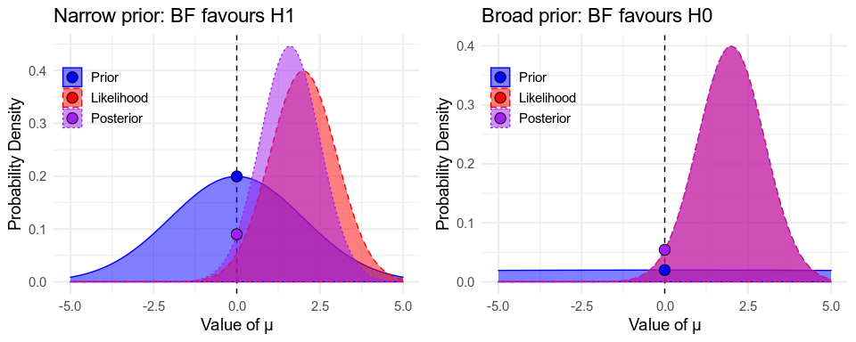

## Bayesian Multiple Comparisons

We've now reached the bit I wanted to talk about
when I started writing this post, about 3,000 words ago.
Do you need to worry about multiple comparisons when doing Bayesian statistics?
Gelman, Hill & Yajima [(2012)](http://www.stat.columbia.edu/~gelman/research/published/multiple2f.pdf)
wrote a paper entitled
"*Why we (usually) don't have to worry about multiple comparisons*"
that is often-cited, and [often-misinterpreted](https://statmodeling.stat.columbia.edu/2014/10/14/one-lifes-horrible-ironies-wrote-paper-usually-dont-worry-multiple-comparisons-now-spend-lots-time-worrying-multiple-comparisons/)
to mean that multiple comparisons aren't a problem in Bayesian analyses.
The short answer is that you do need to worry, 
but in a different way than you do for frequentist stats.

Consider a study where participants give $p = 20$ different numeric ratings in a survey,
and the analysis plan is to see if any variables questions correlate with any others.
There are $\frac{p^2 - p}{2} = 190$ individual correlations here,
and so $k = 190$ tests. The plots below show simulations of this scenario with $n = 50$ observations. The simulated variables are all independent, so the true correlation between them all is $\rho = 0$. However, because of *sampling error*, some variables will happen to be positively correlated in our sample, and some negatively. Since we run 190 tests, some of these spurious correlations end up strong enough to be statistically significant, $p < .05$. In fact, the probability of erroneously finding one or more test with $p < .05$ under the null hypothesis that all the variable are independent is $1 - 0.95^k \approx 0.99994$, which isn't great[^none-sig].

[^none-sig]: The probability of one test being non-significant under $H_0$ is $0.95$. The probability of all $k$ tests being non-significant is $0.95^k$, so the probability of this not happening is $1 - 0.95^k$.

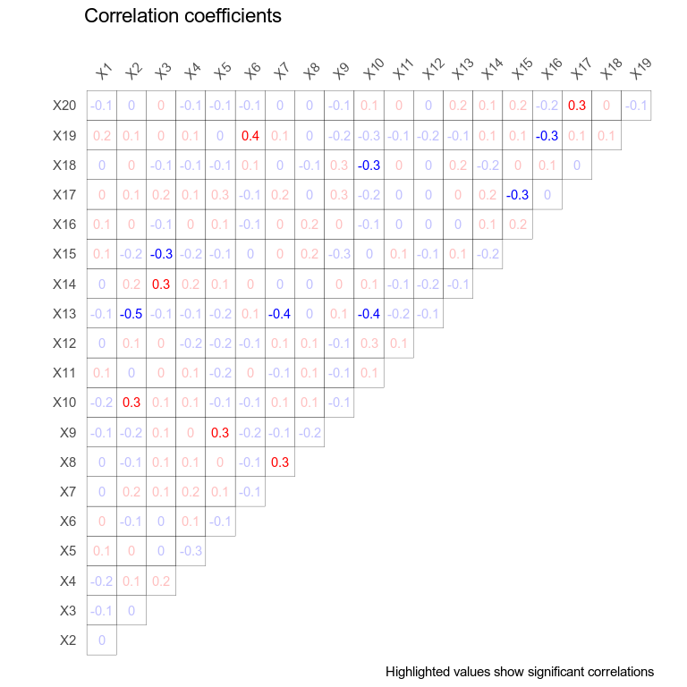

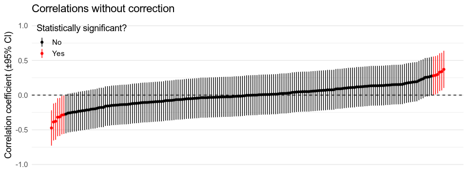

In a frequentist analysis, we would adjust $\alpha$ accordingly,
and only trust correlations with a p-value of less than
$\frac{.05}{k} \approx 0.00026$.
If all of the correlations are actually $\rho = 0$,
the probability of erroneously finding one or more tests where
$p < .00026$ is $0.05$, as desired.

### Bayes Factors

What if we used 190 Bayes Factors instead?
If we found $BF_{10} = \frac{20}{1}$ for one of the tests,
do we really have *strong evidence* for this correlation?
Recall that 

$$
\frac{P(H_1|\text{Data})}{P(H_0|\text{Data})} =
  \frac{P(H_1)}{P(H_0)} \times
  BF_{10}
$$

$BF_{10} = \frac{20}{1}$ means that $H_1$ is 20 times more likely than $H_0$
<b>if and only if</b> the prior odds, $\frac{P(H_1)}{P(H_0)}$
were $\frac{1}{1}$.
This means that you can naively interpret 
the results of your 190 different Bayes Factors
only if you believed beforehand there was a 50:50 chance
that any two variables would be correlated.
Otherwise, since you've done the calculations with prior beliefs that are too credulous
--- they show too much belief in the number of effects to be found ---
you've ended up with posterior beliefs that are too credulous as well.

Adjusting for this is simple.
If you actually only believe that one in every ten pairs of variables
are likely to be correlated,
your real prior odds are $\frac{P(H_1)}{P(H_0)} = \frac{1}{9}$,
and your updated belief is
$\frac{P(H_1|\text{Data})}{P(H_0|\text{Data})} = \frac{1}{9} \times BF_{10}$.

### Posterior Estimates

Similar logic applies if you're making decisions based on 
the posterior distributions of your 190 correlation coefficients,
$\rho_1, \rho_2, \dots, \rho_{190}$,
either by deciding that a correlation is genuine when
the 95% credible interval excludes $0$,
or using posterior sign tests. There are two main ways of addressing this.

#### Using the right priors

If we use a uniform prior for every coefficient,
the 95% credible intervals will match the 95% frequentist confidence intervals,
and since drawing a conclusion when the 95% confidence interval excludes 0
is the same as doing so when $p < .05$ (see above),
we end up making many wrong decisions in the case when there are really no correlations.
Again, this is because we've used overly credulous priors,
assuming that $\rho = \pm1$ is just as likely as $\rho = 0$,
in a world where most correlations are probably close to $0$ if they exist at all.
With more conservative, less credulous priors, 
all of our estimates get pulled closer to $0$,
and so the probability of seeing effects that aren't there is reduced.

What priors should we use?
In rare cases, we know exactly the answer.
For example, adult Irish men are on average 
177 cm tall, with a standard deviation of 7 cm$^{\text{[Citation needed]}}$.
This means that if you don't know anything else about a given Irishman,
you should use this, rather than a uniform distribution,
as your prior about their likely height.
Most of the time, though, we have to rely on vaguer intuitions.
If we use a Normal distribution with mean $0$ and SD $.1$
as our prior for the correlation coefficients in the example above,
we're implying that we think 95% of true correlation coefficients
are likely to be $\gt -.2$ and $\lt .2$,
and equivalently that we're 95% confident that
each individual correlation will be in that range,
since 95% of that distribution is within that range
(let's ignore the restriction that $-1 \le \rho \le 1$ for now). Note that these are priors for the distribution of the *true values* of the correlation coefficients, which are the correlations we would find if sampling error wasn't an issue.

If our priors match the actual distribution of effect sizes/correlations,
something cool happens.
Gelman and Tuerlinckx ([2000](http://www.stat.columbia.edu/~gelman/research/published/francis8.pdf), also discussed in [this simpler blog post](https://statmodeling.stat.columbia.edu/2016/08/22/bayesian-inference-completely-solves-the-multiple-comparisons-problem/))
show that if the priors are properly calibrated,
the multiple comparison problem goes away.
If most effects are tiny, and your priors reflect that,
you're very unlikely to see effects that aren't there.
Conversely, if most effects are large, and your priors reflect that,
you give yourself a good chance of finding any effects that are there.

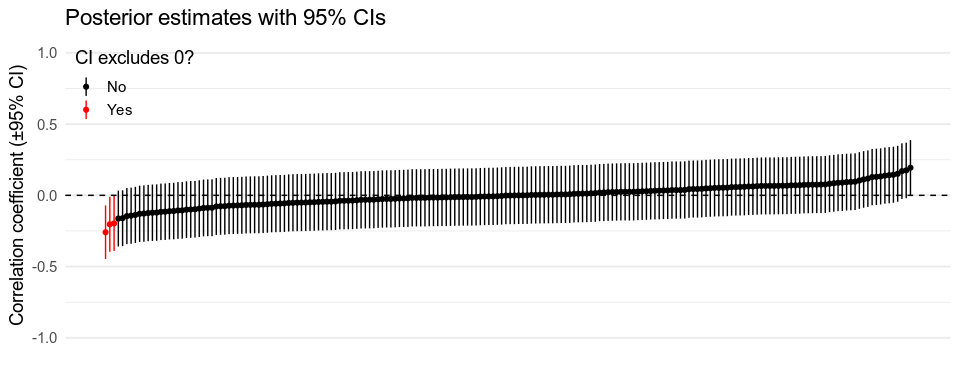

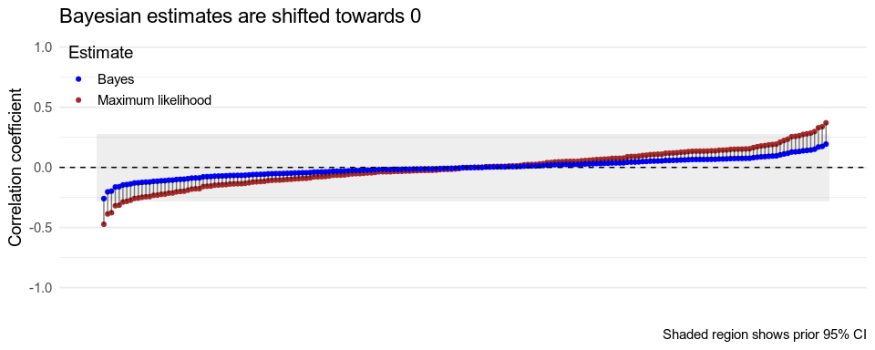

#### Using multilevel models

What if you're not sure how the effect sizes should be distributed?
This is where the Gelman, Hill & Yajima
[(2012)](http://www.stat.columbia.edu/~gelman/research/published/multiple2f.pdf)
paper comes in.
They show that multilevel modelling
--- the kind you can do using frequentist statistics using the [`lme4`]() package for R,
or Bayesian statistics using [`brms`]() or [`Stan`]() ---
lets you do something similar.
Multilevel models allow us to *partially pool* information within groups.
For example, if we're estimating a regression weight $\beta$
for each participant in our experiment,
we might believe that this parameter should be similar across participants,
so our estimate for one participant is influenced by data from everyone else.

More formally, this means that instead of assuming that
$\beta$ is the same for all participants (*complete pooling*),
or estimating $\beta_1, \beta_2, \dots, \beta_n$ independently for every participant (*no pooling*),
we assume that the $\beta_i$ parameters are normally distributed across participants,
with a mean $\mu_{\beta}$ and standard deviation $\sigma_{\beta}$.
This means we simultaneously estimate $\mu_{\beta}$ and $\sigma_{\beta}$ (the *hyperparameters*)
as well as the participant-level parameters $\beta_i$,
with the former defining the prior distribution for the latter
(you do still need to set priors for the hyperparameters,
but since all of your data goes into estimating these the priors don't matter much).

Returning to our correlation example, we can do something similar
by assuming that the individual correlation coefficients,
$\rho_1, \rho_2, \dots, \rho_{190}$,
are normally distributed across correlations,
with average correlation $\mu_{\rho}$ and standard deviation $\sigma_{\rho}$.
Thus, the prior each correlation depends on the values of all the other correlations.[^stan-corr]

Gelman, Hill & Yajima (2012) show that these automatically-estimated priors
deal with the issue of multiple comparisons in much the same way as
the manually-set priors discussed above.
I've included their Figure 1 below, 
contrasting the effect of using Bonferroni adjustment 
(widening the confidence intervals)[^adjust-ci]
with that of using a multilevel model
(pulling all estimates towards their average).

[^stan-corr]: I was going to include an example, but I don't think this can be done in `brms`, and coding it in `Stan` was too much work.
[^adjust-ci]: [To be precise](https://en.wikipedia.org/wiki/Bonferroni_correction#Confidence_intervals), with $\alpha = 0.05$ and $k$ contrasts, replace the $1 - \alpha = 95$% confidence interval with the $1 - \frac{\alpha}{k}$ interval. For example, with $k = 2$ contrasts, use the $1 - \frac{0.05}{2} = 97.5$% CI.

The nature of the multilevel model used will obviously differ from case to case.
For example, if we're including a large number of noisy self-report measures
as predictors of a neural response,
we might assume that the regression weights for these measures a common distribution,
and group the accordingly.
Or we might look at how a single predictor affects multiple outcomes,
and do something similar.

# Conclusions

So, to conclude,

- There's more than one way to test a hypothesis, and
- You have to worry about multiple comparisons, even when you're a Bayesian.

# Important Topics I've Skipped

- Statistical power: The probability of concluding that there is an effect, given that the true effect is a particular size.
- Type S and Type M errors: Getting the sign/direction (S) or the magnitude (M) of the effect wrong.
- "The Garden of Forking Paths": Multiple comparisons are an issue even if you only run one test (but could have hypothetically run different ones if the data looked different).
- Sampling error is very important. I only briefly mention it here.
- Decision Theory: Taking the costs of different kinds of errors into account when testing hypotheses and making decisions --  for example,  a false negative coronavirus test is much worse than a false positive.
- Model comparison, out-of-sample predictions, cross-validation, and the other machine learning-related approaches to hypothesis testing. 

# Further Reading

- [BayesFactor package for R](https://richarddmorey.github.io/BayesFactor/)
- Bayesian hypothesis tests using `brms`
  - [Official documentation](https://www.rdocumentation.org/packages/brms/versions/0.6.0/topics/hypothesis)
  - [Matti Vuorre's blog](https://vuorre.netlify.app/post/2017/03/21/bayes-factors-with-brms/)
- Ly, Verhagen & Wagenmakers (2016). 
  [Harold Jeffreys’s default Bayes factor hypothesis tests: Explanation, extension, and application in psychology](https://www.sciencedirect.com/science/article/pii/S0022249615000383)
- [Documentation for the `retrodesign` R package](https://cran.r-project.org/web/packages/retrodesign/vignettes/Intro_To_retrodesign.html). Includes a nice discussion of *type S and type M errors*, which I skip here.
- Gelman, Hill, & Yajima (2012). [Why we (usually) don't have to worry about multiple comparisons](http://www.stat.columbia.edu/~gelman/research/published/multiple2f.pdf).
  - [Related blog post](https://statmodeling.stat.columbia.edu/2014/10/14/one-lifes-horrible-ironies-wrote-paper-usually-dont-worry-multiple-comparisons-now-spend-lots-time-worrying-multiple-comparisons/)
- Gelman & F. Tuerlinckx (2000). [Type S error rates for classical and Bayesian single and multiple comparison procedures](http://www.stat.columbia.edu/~gelman/research/published/francis8.pdf)
  - [Related blog post](https://statmodeling.stat.columbia.edu/2016/08/22/bayesian-inference-completely-solves-the-multiple-comparisons-problem/)
- Solomon Kurz has ported the examples from John Krushke's excellent [Doing Bayesian Data Analysis](http://doingbayesiandataanalysis.blogspot.com/) book to R. In particular, check out
  - [Null hypothesis significance testing](https://bookdown.org/ajkurz/DBDA_recoded/null-hypothesis-significance-testing.html)
  - [Bayesian hypothesis testing](https://bookdown.org/ajkurz/DBDA_recoded/bayesian-approaches-to-testing-a-point-null-hypothesis.html)
  - [Power and sample size](https://bookdown.org/ajkurz/DBDA_recoded/goals-power-and-sample-size.html)
- Lee & Waganmakers (2013). [Bayesian Cognitive Modeling: A Practical Course](https://bayesmodels.com/). (another great book!)

# Footnotes

