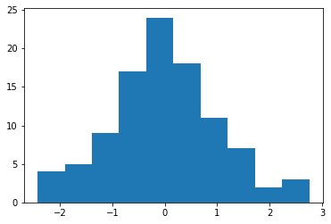

---
title: Toggling code cells in Jupyter HTML Outputs
summary: "Or, How I Wasted an Afternoon."
date: 2020-01-11
source: jupyter
---


When writing a blog post in Twitter, I found there was no easy way to
reproduce the rather lovely **code folding** effect you get in 
([Rmarkdown documents](https://bookdown.org/yihui/rmarkdown/html-document.html#code-folding)),
so I went and made one myself, illustrated here.

Actually, I've written a few of them, as the code changes slightly depending on where you want to achieve code folding.

First, here's some toggleable code.


```python
for i in range(9, -1, -1):
    if i > 0:
        print('.' * (i) + ('%i' % i) + '.' * (9-i))
    else:
        print('>Lift Off!')
```

    .........9
    ........8.
    .......7..
    ......6...
    .....5....
    ....4.....
    ...3......
    ..2.......
    .1........
    >Lift Off!


```python
%matplotlib inline
import matplotlib.pyplot as plt
import numpy as np
plt.hist(np.random.normal(0, 1, 100));
```





## Jupyter Magic

To activate toggling directly in a live Notebook using
the [%%JavaScript magic](https://jupyter-notebook.readthedocs.io/en/stable/examples/Notebook/JavaScript%20Notebook%20Extensions.html), just nclude the cell below in your notebook
If the notebook is [truster](https://jupyter-notebook.readthedocs.io/en/stable/security.html),
it will automatically run when you load the page.


```javascript
%%javascript
function toggler(){
    if(window.already_toggling){
        // Don't add multiple buttons.
        return 0
    }
    let btn = $('.input').append('<button>Toggle Code</button>')
        .children('button');
    btn.on('click', function(e){
        let tgt = e.currentTarget;
        $(tgt).parent().children('.inner_cell').toggle()
    })
    window.already_toggling = true;
}
// Since javascript cells are executed as soon as we load
// the notebook (if it's trusted), and this cell might be at the
// top of the notebook (so is executed first), we need to
// allow time for all of the other code cells to load before
// running. Let's give it 5 seconds.

setTimeout(toggler, 5000);
```


    <IPython.core.display.Javascript object>


Notebooks that have toggling enabled will keep this feature
when you convert them to HTML pages using `jupyter nbconvert`.

I believe that this code could be packaged to create a jupyter extension, but I don't know how, and don't have much interest right now.

## NBConvert Templates

It should be possible to create a
[custom template](https://nbconvert.readthedocs.io/en/latest/customizing.html)
for `jupyter nbconvert` that injects the same code,
or something very like it.
Unfortunately, the documentation on how to do this is not straightforward.


## Hugo

This site is generated using the [Academic](https://github.com/gcushen/hugo-academic) theme for 
[Hugo](https://gohugo.io/).


To post Jupyter notebooks, I convert them to `.md` files using the command
`jupyter nbconvert index.ipynb --to markdown --NbConvertApp.output_files_dir=.`,
and following the instructions [here](https://github.com/gcushen/hugo-academic/blob/master/exampleSite/content/post/jupyter/index.md).

I've added the following rule to the site header template for my version of the theme,
located in `/path/to/my_page/themes/academic/layouts/partials/site_head.html`,
just before the `</head>` tag.


```js
{{ if eq $.Params.source "jupyter"}}
<script
  src="https://code.jquery.com/jquery-3.4.1.min.js"
  crossorigin="anonymous"></script>

<script type="text/javascript" async
      src="https://cdnjs.cloudflare.com/ajax/libs/mathjax/2.7.5/MathJax.js?config=TeX-MML-AM_CHTML">
</script>

<script type="text/x-mathjax-config">
  MathJax.Hub.Config({
      tex2jax: {
          inlineMath: [['$','$'], ['\\(','\\)']],
          displayMath: [['$$','$$'], ['\[','\]']],
          processEscapes: true,
          processEnvironments: true,
          skipTags: ['script', 'noscript', 'style', 'textarea', 'pre'],
          TeX: { equationNumbers: { autoNumber: "AMS" },
                 extensions: ["AMSmath.js", "AMSsymbols.js"] }
      }
  });
</script>

<script>
  function toggler(){
      let btn = $('.language-python').parent()
                                     .prepend('<button>Toggle Code</button>')
                                     .children('button');
      btn.on('click', function(e){
          let tgt = e.currentTarget;
          $(tgt).parent().children('code').toggle()
      })
  }
  $(window).on('load', toggler)
</script>
{{ end }}
```

I then add `source: jupyter` to the metadata of all Jupyter posts.
This means that this code is added to these posts, and only these posts.

Something very similar should work for other static site generators such as Pelican.


# Toggle All

Finally, it would be simple to add a Show/Hide All button at the top of the page, but I haven't got around to doing so yet. Soon, maybe.
