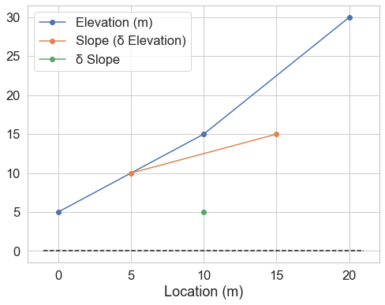
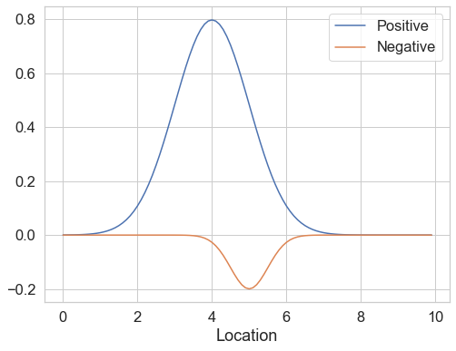
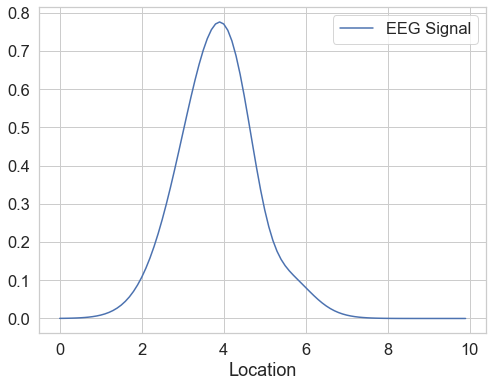
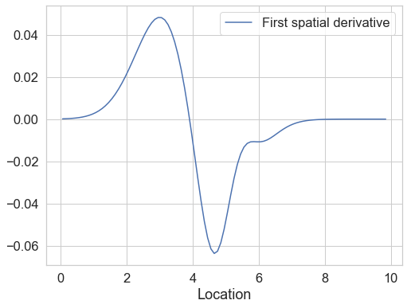
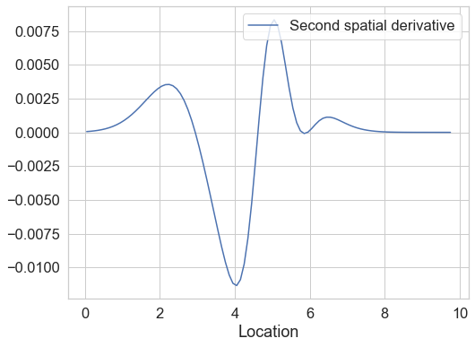
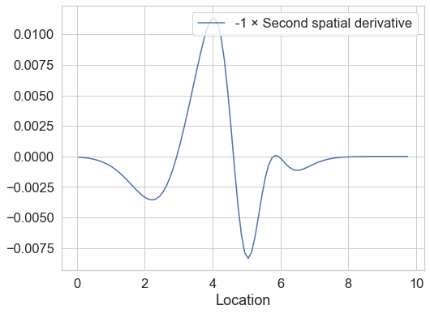
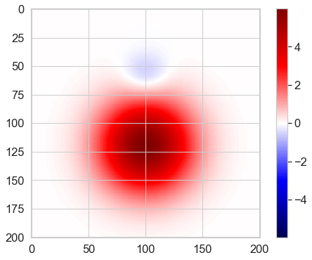
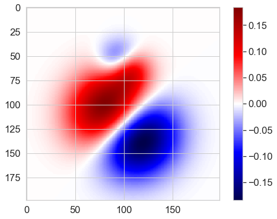
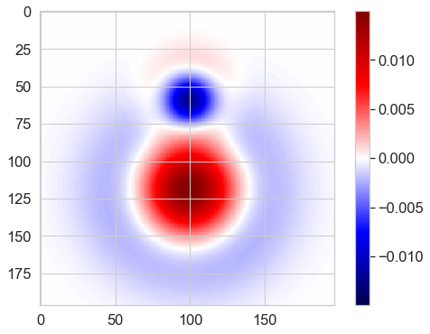

In some of our [recent work](https://www.biorxiv.org/content/10.1101/782813v1),
we use Surface Laplacians to estimate Current Source Density (CSD) from EEG data.


This transforms the data from a measure of electric potentials at the scalp
to an estimate of underlying current sources and sinks: the Current Source Density (CSD).
The Surface Laplacian can also be thought of as a spatial high-pass filter applied to the data,
which attenuates low-spatial-frequency signals that are broadly distributed across the scalp,
but preserves high-spatial-frequency signals that are more localised.

I've learned a lot about this approach from
- Mike X Cohen's excellent book, [*Analying Neural Time Series Data*](http://mikexcohen.com/#books) and the accompanying MATLAB code. 
  I also recommend his [videos lectures](http://mikexcohen.com/lectures.html)
- This [Python/MNE port of Cohen's code](https://github.com/alberto-ara/Surface-Laplacian)
-  Kayser & Tenke (2006). [*Principal components analysis of Laplacian waveforms as a generic method for identifying ERP generator patterns*](http://psychophysiology.cpmc.columbia.edu/pdf/kayser2005b.pdf). This is the method we use.
- Another classic book, Nunez & Srinivasan (2006). [*Electric fields of the brain: the neurophysics of EEG*](https://brainmaster.com/software/pubs/brain/Nunez%202ed.pdf)

However, despite these great resources, I wasn't happy with my intuitions about how this works.
In this post, I work through a toy example that helped me make sense of just why and how this method works.

> Disclaimer:
> I've written this post mostly to help me understand something myself.
> I'm not the expert here, and it may all be horribly wrong.
> No warranties.


```python
import numpy as np
import matplotlib.pyplot as plt
from scipy import stats
import seaborn as sns
sns.set(rc={'figure.figsize':(8, 6)},
        font_scale=1.5)
sns.set_style('whitegrid')

```

## The Surface Laplacian

To begin, let's pretend the world is two-dimensional,
because it makes things simple.

- A ***Laplacian*** is basically a spatial second-order derivative.

- A derivative is a number that indicates how quickly something changes.

- A spatial derivative indicates how much something changes from place to place. 
  If we measure elevation about sea level at two points 10 m apart
  and find the first is at +5 m while the second is at +15,
  the spatial derivative is the slope between the these two places.
  More formally, $\frac{\delta Elevation}{\delta Location}$ (change in elevation per change in location) = $\frac{10\ m}{10\ m} = 1$ meters per meter.
 
- A second derivative indicates how quickly the first derivate changes.
  Imagine a third point another 10 m further along that is 30 m above sea level.
  Remember, we're pretending everything is two-dimensional, 
  so all these points are along a line.
  The slope between points 1 and 2 is $\frac{10\ m}{10\ m} = 1$. 
  The slope between points 2 and 3 is $\frac{15\ m}{10\ m} = 1.5$.
  The difference in slopes is $0.5$.

Here's all of the above in plot form.


```python
delta_loc = 10
locs = np.array([0, 10, 20])
heights = np.array([5, 15, 30])
diff_height = np.diff(heights)
diff_diff_height = np.diff(diff_height)

diff_locs = locs[:-1] + .5*delta_loc   # Keep the x-axis properly aligned
diff_diff_locs = locs[:-2] + 1*delta_loc

plt.plot(locs, heights, '-o', label='Elevation (m)')
plt.plot(diff_locs, diff_height, '-o', label=u'Slope (δ Elevation)')
plt.plot(diff_diff_locs, diff_diff_height, '-o', label=u'δ Slope')
plt.hlines(0, *plt.xlim(), linestyle='dashed')
plt.xlabel('Location (m)')
plt.legend()
plt.show()
```





## EEG Laplacians

So why does calculating the second spatial derivative of the EEG signal help us?
To see, I simulate some one-dimensional data (pretend we only have electrodes on the midline)
illustrating a common issue in EEG:
our data contains a small, narrow negative component and a large, broad positive one.


```python
electrode_spacing = .1
space = np.arange(0, 10, electrode_spacing)
comp1 = 2 * stats.norm.pdf(space, loc=4, scale=1)
comp2 = -.25 * stats.norm.pdf(space, loc=5, scale=.5)

def do_label():
    plt.legend(loc='upper right')
    plt.xlabel('Location')
    plt.ylabel('')
    
fig_ground_truth = plt.figure()
for comp, label in zip([comp1, comp2], ['Positive', 'Negative']):
    plt.plot(space, comp, label=label)
do_label()
```





Of course, in our recordings both of these components are superimposed,
and the little one is obscured by the big one.
Poor little component.


```python

eeg_signal = comp1 + comp2
plt.plot(space, eeg_signal, label='EEG Signal')
do_label()
```





Where did our negative component go?
It's still there, as a wiggle on the right hand side of the positive component,
but good luck detecting this in noisy data.
Yes, I did tweak these parameters to make the effect particularly dramatic.

Next, we take the first spatial derivative of the EEG signal:
how much it changes between electrodes.
This doesn't tell us much by itself.


```python
first_derivative = np.diff(eeg_signal)
space_d1 = space[:-1] + .5 * electrode_spacing # Keep locations lined up with differenced data
plt.plot(space_d1, first_derivative, label='First spatial derivative')
do_label()
```





Next, we take the second spatial derivative: the derivative of the derivative.


```python
second_derivative = np.diff(first_derivative)
space_d2 = space[:-2] + .5 * electrode_spacing
plt.plot(space_d2, second_derivative, label='Second spatial derivative')
do_label()
```





...and multiply it by $-1$.


```python
plt.plot(space_d2, -1*second_derivative, label='-1 × Second spatial derivative')
do_label()
```





There it is!
Our positive component is narrower, but still has it's peak at $x=4$.
Our negative component can now be seen at $x=5$

For comparison, here are the original components again.


```python
fig_ground_truth
```


By calculating the Laplacian, we've squeezed the components into a narrower spatial range,
which make it possible to see the otherwise hidden negative component.
It looks like we've also introduced some other artifacts,
like the negative dip at around $x=2$.
However, this makes sense from an electrophysiological point of view:
if there is a positive current source at $x=4$, 
there must be corresponding negative sinks around it.
(I might be confusing sinks and sources here, but no matter).


## 2D Laplacians

OK, this works with one-dimensional data,
but EEG electrodes are located in three-dimensional space around the head.
Let's at least see how it works in the two-dimensional case.
We'll pretend the scalp is a flat square of 20 cm on each side.


```python
X = Y = np.arange(-10, 10.01, .1)
XY = np.array([(x, y) for x in X for y in Y])

def show(X):
    '''Plot an image from a 2D array'''
    mx = np.abs(X).max()
    im = plt.imshow(X, cmap='seismic', vmin=-mx, vmax=mx)
    plt.colorbar(im)
```


```python
locs = [(0, -4), (0, 2)]  # Center of each component
peaks = [-1, 6]           # Peak amplitudes
scales = [2, 8]           # Standard deviations
V = np.zeros(XY.shape[0]) # Voltages

for loc, peak, scale in zip(locs, peaks, scales):
    cov = np.eye(2) * scale
    thisV = stats.multivariate_normal.pdf(XY, mean=loc, cov=cov)
    gain = peak / thisV.max()
    V += thisV * gain
wV = V.reshape(len(X), len(X)).T # Voltage as a 2D grid
show(wV)
```





Again, where did that little guy go?

As before, we can look at the first derivatives, but again they don't tell us much.


```python
def combine(dx, dy):
    '''Combine two one-dimensional partial derivates to form a Laplacian
    Drops the last value in each dimension so the shapes match.
    Is this the right thing to do? 
    Wikipedia (https://en.wikipedia.org/wiki/Laplace_operator#Definition)
    says "the Laplacian of f is the sum of all the unmixed second partial
    derivatives in the Cartesian coordinates xi." I think this means yes.
    '''
    n = dx.shape[0]
    assert(dy.shape[1]==n)
    return dx[:n, :n] + dy[:n, :n]
```


```python
dv_dx = np.diff(wV, axis=0)[:-1, :] # Drop the last value on the appropriate axis to keep things symmetrical
dv_dy = np.diff(wV, axis=1)[:, :-1]
gradient = combine(dv_dx, dv_dy)
show(gradient)
```





The negative second derivatives - the Laplacian - on the other hand...


```python
ddv_ddx = np.diff(dv_dx, axis=0)[:-1, :]
ddv_ddy = np.diff(dv_dy, axis=1)[:, :-1]
laplacian = -combine(ddv_ddx, ddv_ddy)
show(laplacian)
```





There it is! 

This is the same effect as we saw in 1D space done in 2D.
As mentioned above, real EEG electrodes are located in 3D space, and they aren't evenly spaced,
which is why you can't calculate the Laplacian by looking at the difference between adjacent electrodes.
Instead, you need to use something complicated called spherical spline interpolation,
but I'm not going into that here.

I now get why calculating the second spatial derivative of an EEG signal is sensible thing to do.
Hopefully you do too!
