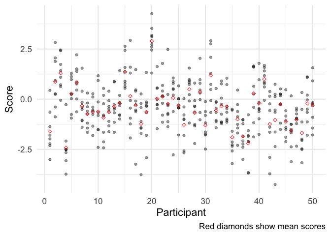
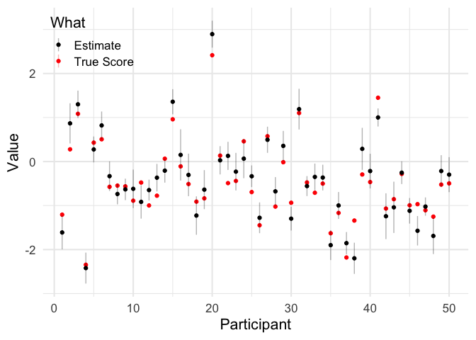
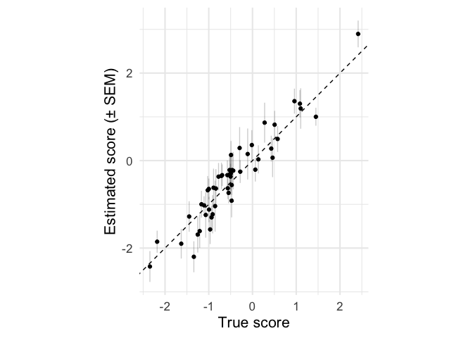
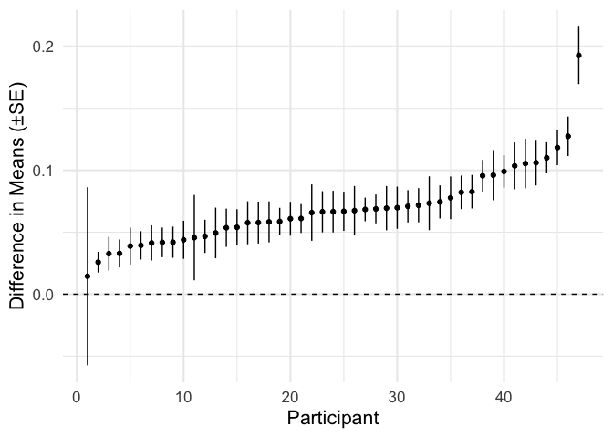
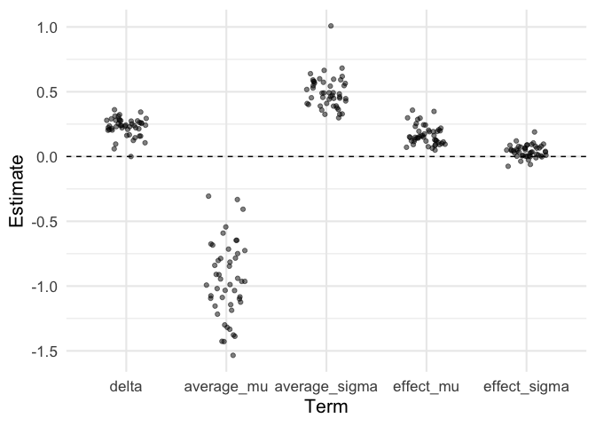
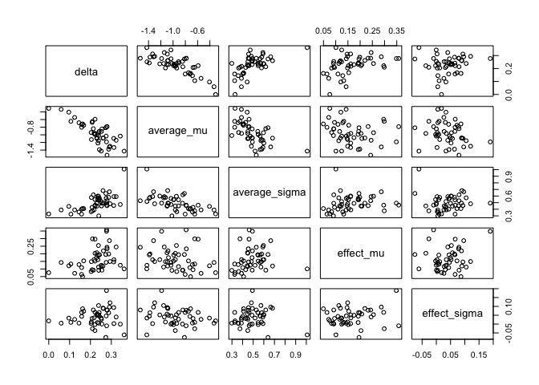
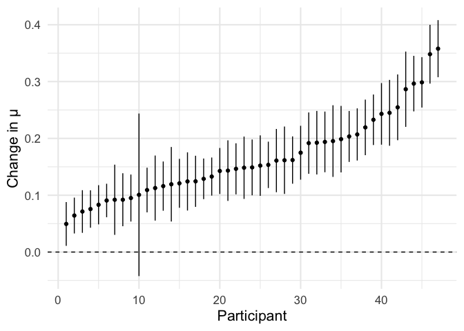

<aside>
<h3>Summary</h3>
If you can calculate standard errors, you can estimate reliability for maximum-likelihood estimates.
This means you don't necessarily need test-retest data.

<hr/>

This post is a bit rough around the edges, and there are plenty
of interesting ways it could be expanded on or improved.
However, I'm writing this in my spare time,
and I would rather get this out as it is now, warts and all,
than try to find the time to make it perfect.
If all of this proves to be a) useful, b) novel, and c) not wrong,
it might be worth tidying up and submitting as a paper,
but that's neither here nor there right now.
</aside>


There is increasing interest in the problem of whether
participant-specific parameters estimated
by fitting a model to behavioural data are reliable.
Most studies approach this using test-retest correlations:
asking participants to complete a task twice,
and seeing how consistent their parameter estimates are.

However, there's a pretty simple way of estimating reliability from a single session,
which can be applied any model that is fit to individual participants' data
using maximum likelihood.
I haven't seen this described in detail anywhere else, so I walk through it in this post.

I suspect, but haven't gotten around to showing, that the same principle
can be applied to parameters estimated using Bayesian methods,
or through multilevel modelling.

While this approach works for any situation in which parameters are estimated
by maximum likelihood, I illustrate it first using a simple example - estimating the mean
of a Normal distribution - so that it can be compared to the traditional Cronbach’s α estimate.

## Data

First, let's simulate data from 1000 participants.
Each participant $p$ has a trait, $\mu_p$,
and values $\mu_i$ are Normally distributed in the population,
$\mu_p \sim \text{Normal}(0, 1)$.
Each participant gives us $n$ trials,
$x$, also Normally distributed,
$x \sim \text{Normal}(\mu_i, 1)$.

A nice property of this example is that
error variance is just $\sigma^2_e = \frac{1}{n}$,
the standard error of measurement is the square root of this,
$\sigma_e = \frac{1}{\sqrt{n}}$,
and the true reliability is $\frac{1}{1 + \sigma^2_e} = \frac{n}{n + 1}$.


```r
library(tidyverse)
theme_set(theme_minimal(base_size = 16))
sem = function(x) sd(x) / sqrt(length(x))

lgnd = function(x, y){
    theme(legend.position = c(x, y),  legend.justification = c(x, y))
}
set.seed(1234)
```


```r
#' Simulate some data
generate_data = function(n_participants = 50,
                         n_trials = 10,
                         sd_participant = 1,
                         sd_trial = 1){
  true_scores = rnorm(n_participants, 0, sd_participant)
  data.frame(
    participant = rep(1:n_participants, each = n_trials),
    true_score  = rep(true_scores, each = n_trials),
    trial_nr    = rep(1:n_trials, times = n_participants)) %>%
    mutate(
      x = rnorm(n(), true_score, sd_trial)
    )
}
```


```r
n_participants = 50
n_trials = 8
sd_participant = 1
sd_trial = 1
data = generate_data(n_participants, n_trials,
                     sd_participant, sd_trial)
head(data)
```

<div data-pagedtable="false">
  <script data-pagedtable-source type="application/json">
{"columns":[{"label":[""],"name":["_rn_"],"type":[""],"align":["left"]},{"label":["participant"],"name":[1],"type":["int"],"align":["right"]},{"label":["true_score"],"name":[2],"type":["dbl"],"align":["right"]},{"label":["trial_nr"],"name":[3],"type":["int"],"align":["right"]},{"label":["x"],"name":[4],"type":["dbl"],"align":["right"]}],"data":[{"1":"1","2":"-1.207066","3":"1","4":"-3.0130970","_rn_":"1"},{"1":"1","2":"-1.207066","3":"2","4":"-1.7891417","_rn_":"2"},{"1":"1","2":"-1.207066","3":"3","4":"-2.3159554","_rn_":"3"},{"1":"1","2":"-1.207066","3":"4","4":"-2.2220278","_rn_":"4"},{"1":"1","2":"-1.207066","3":"5","4":"-1.3693753","_rn_":"5"},{"1":"1","2":"-1.207066","3":"6","4":"-0.6440099","_rn_":"6"}],"options":{"columns":{"min":{},"max":[10]},"rows":{"min":[10],"max":[10]},"pages":{}}}
  </script>
</div>

The expected reliability for these simulation parameters is

$$
\text{Reliability} = \frac{\sigma_p^2}{\sigma_p^2 + \sigma_e^2}
$$


```r
real_error_variance = sd_trial**2 / n_trials
real_true_score_variance = sd_participant^2
real_reliability = real_true_score_variance / (real_error_variance + real_true_score_variance)
real_reliability
```

```
## [1] 0.8888889
```


In the simple case where $\sigma_P = \sigma_{\epsilon} = 1$,
this similifies to $\frac{N}{N+1}$.


```r
if(sd_trial == 1 & sd_participant == 1){
  n_trials / (n_trials + 1)
}
```

```
## [1] 0.8888889
```

Let's start by aggregating our data...


```r
means = data %>%
  group_by(participant) %>%
  summarise(true_score = mean(true_score),
            estimate = mean(x),
            n = n(),
            sd(x),
            sem = sd(x) / sqrt(n()))
head(means)
```

<div data-pagedtable="false">
  <script data-pagedtable-source type="application/json">
{"columns":[{"label":["participant"],"name":[1],"type":["int"],"align":["right"]},{"label":["true_score"],"name":[2],"type":["dbl"],"align":["right"]},{"label":["estimate"],"name":[3],"type":["dbl"],"align":["right"]},{"label":["n"],"name":[4],"type":["int"],"align":["right"]},{"label":["sd(x)"],"name":[5],"type":["dbl"],"align":["right"]},{"label":["sem"],"name":[6],"type":["dbl"],"align":["right"]}],"data":[{"1":"1","2":"-1.2070657","3":"-1.6116593","4":"8","5":"1.0828225","6":"0.3828356"},{"1":"2","2":"0.2774292","3":"0.8672750","4":"8","5":"1.2913056","6":"0.4565455"},{"1":"3","2":"1.0844412","3":"1.3004966","4":"8","5":"0.8813148","6":"0.3115918"},{"1":"4","2":"-2.3456977","3":"-2.4211967","4":"8","5":"0.9963723","6":"0.3522708"},{"1":"5","2":"0.4291247","3":"0.2744866","4":"8","5":"0.8332346","6":"0.2945929"},{"1":"6","2":"0.5060559","3":"0.8201905","4":"8","5":"0.8962178","6":"0.3168608"}],"options":{"columns":{"min":{},"max":[10]},"rows":{"min":[10],"max":[10]},"pages":{}}}
  </script>
</div>

...and visualing it


```r
ggplot(data, aes(participant, x)) +
  geom_point(alpha = .4) +
  geom_point(data = means, mapping = aes(y = estimate), color = 'red', shape = 5) +
  labs(x = 'Participant', y = 'Score',
       caption = 'Red diamonds show mean scores')
```




```r
df = means %>%
  pivot_longer(c(true_score, estimate)) %>%
  mutate(sem = ifelse(name == 'true_score', NA, sem),
         what = ifelse(name == 'estimate', 'Estimate', 'True Score'))

ggplot(df, aes(participant, value, color = what,
               ymin = value - sem, ymax = value + sem)) +
  geom_point() +
  geom_linerange(alpha = .3) +
  scale_color_manual(values = c('black', 'red')) +
  labs(x = 'Participant', y = 'Value',
       color = 'What') +
  lgnd(0, 1)
```

```
## Warning: Removed 50 rows containing missing values (geom_segment).
```



```r
ggplot(means, aes(true_score, estimate,
                  ymin = estimate - sem,
                  ymax = estimate + sem)) +
  geom_point() +
  geom_linerange(alpha = .2) +
  geom_abline(linetype = 'dashed', intercept = 0, slope = 1) +
  coord_equal() +
  labs(x = 'True score',
       y = 'Estimated score (± SEM)')
```




# Cronbach's alpha

For this simple design, we can calculate α
by treating each trial as if it were a separate
item in a questionnaire.


```r
# Reshape data to have one row per participant, one column per trial
wide_data = data %>%
  select(participant, trial_nr, x) %>%
  pivot_wider(names_from = trial_nr, values_from = x) %>%
  select(-participant)
```


```r
#' A simpler implmentation than that provided by psych::alpha()
cronbach_alpha = function(X){
  p = ncol(X)
  sum_then_var <- var(rowSums(X))
  var_then_sum =  sum(apply(X, 2, var))
  (p/(p - 1)) * (1 - (var_then_sum/sum_then_var))
}

reliability_cronbach = cronbach_alpha(wide_data)
reliability_cronbach
```

```
## [1] 0.8721193
```

# Calculating Reliability from Standard Error

More generally, we can estimate reliability using standard errors.
This works because the standard error for each participant
is the square root of error variance for that participant,
and so the average squared standard error can be used as an estimate of $\sigma_e$.
Note also that the variance of our observed estimates, $\sigma_o$,
reflects both variance in true scores and error variance:
$\sigma_o = \sigma_p + \sigma_e$.
This approach is implemented in the function below.


```r
reliability_from_se = function(estimates, standard_errors){
  total_var = var(estimates)
  error_var = mean(standard_errors^2)
  true_var = total_var - error_var
  reliability = true_var / total_var
  return(reliability)
}
```


## Using Standard Error of the Mean

Since we're just using mean values as estimates here,
we can use the standard error of the mean here.


```r
# Reminder of how we calculated SEM
means = data %>%
  group_by(participant) %>%
  summarise(estimate = mean(x),
            n = n(),
            sd = sd(x),
            sem = sd / sqrt(n))
```


```r
reliability_from_se(means$estimate, means$sem)
```

```
## [1] 0.8715345
```

## Confidence Intervals for Reliability Estimates

We can easily obtain confidence intervals for these reliability estimates by bootstrapping.


```r
calculate_reliability = function(estimates, standard_errors,
                                 boostrap = TRUE, n_bootstraps = 500){
  r = reliability_from_se(estimates, standard_errors)
  if(bootstrap){
  .n = length(estimates)
  .indices = 1:.n
  func = function(i, estimate, ses){
    bootstrap_indices = sample(.indices, .n, replace = T)
    reliability_from_se(estimates[bootstrap_indices],
                        standard_errors[bootstrap_indices])
  }
  bootstrap_estimates = map_dbl(1:n_bootstraps, func)
  ci = quantile(bootstrap_estimates, c(.025, .975))
  output = data.frame(
    reliability = r,
    se = sd(bootstrap_estimates)) %>%
    mutate(ci.95.low = ci[1],
           ci.95.high = ci[2])
  return(output)
  } else {
    return(r)
  }
}

calculate_reliability(means$estimate, means$sem)
```

<div data-pagedtable="false">
  <script data-pagedtable-source type="application/json">
{"columns":[{"label":["reliability"],"name":[1],"type":["dbl"],"align":["right"]},{"label":["se"],"name":[2],"type":["dbl"],"align":["right"]},{"label":["ci.95.low"],"name":[3],"type":["dbl"],"align":["right"]},{"label":["ci.95.high"],"name":[4],"type":["dbl"],"align":["right"]}],"data":[{"1":"0.8715345","2":"0.03910192","3":"0.767262","4":"0.9177704","_row":"2.5%"}],"options":{"columns":{"min":{},"max":[10]},"rows":{"min":[10],"max":[10]},"pages":{}}}
  </script>
</div>


## Using Maximum Likelihood

If we're fitting a more complicated model for each participant
using maximum-likelihood estimation,
we can use Fisher information to estimate the standard error and error variance.
This method is completely general,
in that it can be applied to any model estimated by maximum likelihood.

> Note that this gives a very slightly different result
> than the standard error of measurement approach.
> This is because of a subtle quirk in that
> the maximum likelihood estimate of $\sigma_p$
> is not an unbiased estimator
> (explained [here](https://stats.stackexchange.com/q/563966/42952)),
> but it's not worth worrying about.


```r
# This is my general-purpose wrapper around R's optimisation routines,
# for maximum-likelihood estimation
fit_model = function(.data,
                     loglik_func,
                     par_names,
                     starting_values = NULL,
                     bounds = NULL){
  if(is.null(starting_values)){
    starting_values = rep(1, length(par_names))
  }
  if(!is.null(bounds)){
    # Bounded optimization with L-BFGS-B
    k = length(par_names)
    lower = rep(-Inf, k)
    upper = rep(Inf, k)
    for(p in names(bounds)){
      ix = match(p, par_names)
      lower[ix] = bounds[[p]][1]
      upper[ix] = bounds[[p]][2]
    }
    # Wrap loglik_func to avoid NA (needed for L-BFGS-B)
    .loglik_func = function(.data, pars){
      ll = loglik_func(.data, pars)
      ifelse(is.na(ll), -9e9, ll)
    }
    fit = optim(par = starting_values,
                fn = .loglik_func,
                control = list(fnscale = -1),
                .data = .data, hessian = T,
                lower = lower, upper = upper,
                method = 'L-BFGS-B')
  } else {
    fit = optim(par = starting_values,
                fn = loglik_func,
                control = list(fnscale = -1),
                .data = .data, hessian = T)
  }
  stopifnot(length(fit$par) == length(par_names))
  # Calculate standard error by inverting the Hessian and taking square root
  fisher_information = solve(-fit$hessian)
  se = sqrt(diag(fisher_information))
  output = data.frame(
    term = par_names,
    estimate = fit$par,
    se = se
  )
  return(output)
}
```


```r
#' Calculate likelihood of partcipant's data, given parameters mu and sigma
loglik_normal = function(.data, pars){
  mu = pars[1]
  sigma = pars[2]
  loglik = sum(dnorm(.data$x, mu, sigma, log = T))
  loglik
}

parameter_estimates = data %>%
  nest(dfs = -participant) %>%
  mutate(fits = map(dfs, fit_model,
                    loglik_func = loglik_normal,
                    par_names = c('mu', 'sigma'))) %>%
  unnest(fits) %>%
  select(-dfs)
```

```
## Warning in dnorm(.data$x, mu, sigma, log = T): NaNs produced
```

```r
head(parameter_estimates)
```

<div data-pagedtable="false">
  <script data-pagedtable-source type="application/json">
{"columns":[{"label":["participant"],"name":[1],"type":["int"],"align":["right"]},{"label":["term"],"name":[2],"type":["chr"],"align":["left"]},{"label":["estimate"],"name":[3],"type":["dbl"],"align":["right"]},{"label":["se"],"name":[4],"type":["dbl"],"align":["right"]}],"data":[{"1":"1","2":"mu","3":"-1.6117575","4":"0.3580530"},{"1":"1","2":"sigma","3":"1.0127269","4":"0.2531203"},{"1":"2","2":"mu","3":"0.8672487","4":"0.4270315"},{"1":"2","2":"sigma","3":"1.2078274","4":"0.3019266"},{"1":"3","2":"mu","3":"1.3004516","4":"0.2914542"},{"1":"3","2":"sigma","3":"0.8243570","4":"0.2060738"}],"options":{"columns":{"min":{},"max":[10]},"rows":{"min":[10],"max":[10]},"pages":{}}}
  </script>
</div>


```r
mu_estimates = filter(parameter_estimates, term == 'mu')
calculate_reliability(mu_estimates$estimate, mu_estimates$se)
```

<div data-pagedtable="false">
  <script data-pagedtable-source type="application/json">
{"columns":[{"label":["reliability"],"name":[1],"type":["dbl"],"align":["right"]},{"label":["se"],"name":[2],"type":["dbl"],"align":["right"]},{"label":["ci.95.low"],"name":[3],"type":["dbl"],"align":["right"]},{"label":["ci.95.high"],"name":[4],"type":["dbl"],"align":["right"]}],"data":[{"1":"0.8875926","2":"0.03402511","3":"0.7990706","4":"0.9296859","_row":"2.5%"}],"options":{"columns":{"min":{},"max":[10]},"rows":{"min":[10],"max":[10]},"pages":{}}}
  </script>
</div>

## Bayesian Estimation

Unfortunately, this approach doesn't work for parameters that are
estimated using Bayesian methods.
This is because the priors used for Bayesian estimation
reduce both $\sigma_p$ and $\sigma_e$, but not to the same degree.
There might prove to be some way of adapting this approach
to work with Bayesian estimation, but I don't kn ow what it would be.


# Linear Mixed Models

As a side note, it's also possible to estimate reliability using linear mixed models (LMMs)
where the parameter of interest varies between participants as a random effect.


```r
library(lme4)
mixed_model = lmer(x ~ 1 + (1|participant), data = data)
mixed_model_varcor = VarCorr(mixed_model) %>% data.frame()
mm_true_score_variance = mixed_model_varcor$vcov[1] # For later
summary(mixed_model)
```

```
## Linear mixed model fit by REML ['lmerMod']
## Formula: x ~ 1 + (1 | participant)
##    Data: data
##
## REML criterion at convergence: 1253.4
##
## Scaled residuals:
##     Min      1Q  Median      3Q     Max
## -3.2335 -0.5847  0.0095  0.5699  2.8027
##
## Random effects:
##  Groups      Name        Variance Std.Dev.
##  participant (Intercept) 0.8794   0.9378
##  Residual                1.0370   1.0183
## Number of obs: 400, groups:  participant, 50
##
## Fixed effects:
##             Estimate Std. Error t value
## (Intercept)  -0.4032     0.1421  -2.838
```

In a LMM, true score variance $\sigma_p$ is estimated directly,
and reported in the model summary (a value `0.8794` here).
Error variance can be extracted from the model as follows...


```r
rfx = ranef(mixed_model, condVar = T)
mm_error_variance = rfx$participant %>%
  attr('postVar') %>%
  c() %>%
  mean()
```

...or, more simply, using the `arm` package:


```r
mm_error_variance = mean(arm::se.ranef(mixed_model)$participant^2)
```

Reliability can then be calculated as before


```r
mm_true_score_variance / (mm_true_score_variance + mm_error_variance)
```

```
## [1] 0.8861591
```

# Real Data

To finish, here's the same approach applied to some real data:
the much-analysed Stroop task data from [Hedge, Powell and Sumner (2017)](https://pubmed.ncbi.nlm.nih.gov/28726177/)
(I'm using preprocesed data from <https://github.com/Nathaniel-Haines/Reliability_2020>).

<aside>
This is a good time for a caveat.
It should go without saying,
but if you haven't fit your models properly -
they've failed to converge for some participants -
feeding those parameter estimates and standard errors
into this formula will produce wrong results.
In general, if participants where the model doesn't converge
tend to end up with estimates that are outliers relative to the rest,
this would increase the apparent true score variance
but would not necessarily increase the apparent error variance,
leading to inflated estimates of reliability.
Make sure your models converge!
</aside>


```r
all_data = readRDS('data/long_format_all.rds')
stroop = all_data$`Study1-Stroop` %>%
  mutate(condition = factor(Condition, levels=0:2,
                            labels = c('Congruent', 'Neutral', 'Incongruent'))) %>%
  select(participant = subj_num,
         session = Time,
         block = Block,
         trial = Trial,
         condition,
         accuracy = Correct,
         rt = RT)
stroop1 = filter(stroop, session == 1)
```

First, we need to define our model:
a function that takes a participant's data and a set of parameters as inputs,
and returns the log-likelihood of that data for those parameters
under the model in question.
For illustration, I'm using a simple model where
scores are Normally distributed in each condition,
means differ between conditions, but standard deviations are the same
(e.g. a simple t-test or linear model that we could
have fit using the `lm()` function anyway).


```r
loglik_mean_shift = function(.data, pars){
  mu_congruent = pars[1]
  sigma = pars[2]
  d_mu = pars[3]
  ll1 = dnorm(.data$Congruent, mu_congruent, sigma, log=T) %>% sum()
  ll2 = dnorm(.data$Incongruent, mu_congruent + d_mu, sigma, log=T) %>% sum()
  ll1 + ll2
}

prepare_data = function(.subject_data){
  df = .subject_data %>% filter(accuracy == 1)
  split(df$rt, df$condition)
}

# Test model on single participant's data
.subject_data = filter(stroop1, participant == 1)
.data = prepare_data(.subject_data)
fit_model(.data, loglik_mean_shift,
          c('mu_congruent', 'sigma', 'd_mu'))
```

<div data-pagedtable="false">
  <script data-pagedtable-source type="application/json">
{"columns":[{"label":["term"],"name":[1],"type":["chr"],"align":["left"]},{"label":["estimate"],"name":[2],"type":["dbl"],"align":["right"]},{"label":["se"],"name":[3],"type":["dbl"],"align":["right"]}],"data":[{"1":"mu_congruent","2":"0.6504457","3":"0.013389284"},{"1":"sigma","2":"0.2039395","3":"0.006686797"},{"1":"d_mu","2":"0.0684239","3":"0.018914979"}],"options":{"columns":{"min":{},"max":[10]},"rows":{"min":[10],"max":[10]},"pages":{}}}
  </script>
</div>

Then, we can fit it to every participant
using a little bit of `purrr` magic for the preprocessing).
(Note that warnings are suppressed for the code block below)


```r
# Apply to all participants
participant_model_fits = stroop %>%
  nest(dfs = -c(participant)) %>%
  mutate(
    model_datas = map(dfs, prepare_data),
    model_fits = map(model_datas, fit_model,
                     loglik_func = loglik_mean_shift,
                     par_names = c('mu_congruent', 'sigma', 'd_mu')))

participant_estimates = participant_model_fits %>%
  select(participant, model_fits) %>%
  unnest(model_fits)
head(participant_estimates)
```

<div data-pagedtable="false">
  <script data-pagedtable-source type="application/json">
{"columns":[{"label":["participant"],"name":[1],"type":["int"],"align":["right"]},{"label":["term"],"name":[2],"type":["chr"],"align":["left"]},{"label":["estimate"],"name":[3],"type":["dbl"],"align":["right"]},{"label":["se"],"name":[4],"type":["dbl"],"align":["right"]}],"data":[{"1":"1","2":"mu_congruent","3":"0.62678917","4":"0.009502114"},{"1":"1","2":"sigma","3":"0.20446112","4":"0.004735583"},{"1":"1","2":"d_mu","3":"0.04672045","4":"0.013394971"},{"1":"2","2":"mu_congruent","3":"0.69581362","4":"0.009643386"},{"1":"2","2":"sigma","3":"0.20861834","4":"0.004816501"},{"1":"2","2":"d_mu","3":"0.03271531","4":"0.013623291"}],"options":{"columns":{"min":{},"max":[10]},"rows":{"min":[10],"max":[10]},"pages":{}}}
  </script>
</div>
...and extract out the difference in means, the effect we care about.


```r
participant_effects = participant_estimates %>% filter(term == 'd_mu')

plot_ascending = function(df, value_col, std_err_col){
  plot_df = df %>%
    arrange({{value_col}}) %>%
    mutate(.order = 1:n(),
           estimate = {{value_col}},
           low = {{value_col}} - {{std_err_col}},
           high = {{value_col}} + {{std_err_col}})

  ggplot(plot_df, aes(.order, estimate, ymin = low, ymax = high)) +
    geom_point() +
    geom_linerange() +
    geom_hline(linetype = 'dashed', yintercept = 0) +
    labs(x = 'Participant')
}

participant_effects %>%
  plot_ascending(estimate, se) +
  labs(y = 'Difference in Means (±SE)')
```




We can then plug these estimates into our function.


```r
calculate_reliability(participant_effects$estimate, participant_effects$se)
```

<div data-pagedtable="false">
  <script data-pagedtable-source type="application/json">
{"columns":[{"label":["reliability"],"name":[1],"type":["dbl"],"align":["right"]},{"label":["se"],"name":[2],"type":["dbl"],"align":["right"]},{"label":["ci.95.low"],"name":[3],"type":["dbl"],"align":["right"]},{"label":["ci.95.high"],"name":[4],"type":["dbl"],"align":["right"]}],"data":[{"1":"0.6148041","2":"0.188347","3":"0.1247628","4":"0.8103881","_row":"2.5%"}],"options":{"columns":{"min":{},"max":[10]},"rows":{"min":[10],"max":[10]},"pages":{}}}
  </script>
</div>

We end up with a reliability estimate of $0.614$,
very close to the estimate of $0.60$ Hedge et al (2017)
obtained by calculating intraclass correlations
across two sessions of this task.

While we're here, let's try a more complex model,the shifted lognormal,
which has close links to the Wald diffusion model.
This model is discussed in more detail by [Haines et al (2021)](https://psyarxiv.com/xr7y3/),
who fit it as part of a multilevel Bayesian model.
The simple form of this model has three parameters:
$\mu$ (`mu`), which we can think of as reflecting the average decision time (on the log scale),
$\sigma$, (`sigma`), reflecting the variability in decision time,
and $\delta$ (`delta`), reflecting constant non-decision time that is added to the response time.
We allow $\mu$ and $\sigma$ to differ between congruent and incongruent trials for each participant,
and use the difference in $\mu$ between conditions as our measure of (a lack of) inhibitory control.


```r
shiftlnorm_lpdf = function(x, delta, mu, sigma){
   -log((x - delta)*sigma*sqrt(2*pi)) - (log(x - delta) - mu)^2 / (2*sigma^2)
}


loglik_shiftlnorm = function(.data, pars) {
  # We parameterise mu and sigma in terms of their average,
  # and the difference of each condition from the average,
  # to prevent parameters from trading off against each other as much as possible
  delta = pars[1]
  average_mu = pars[2]
  average_sigma = pars[3]
  effect_mu = pars[4]
  effect_sigma = pars[5]
  mu1 = average_mu - .5 * effect_mu
  mu2 = average_mu + .5 * effect_mu
  sigma1 = average_sigma - .5 * effect_sigma
  sigma2 = average_sigma + .5 * effect_sigma
  loglik1 = shiftlnorm_lpdf(.data$Congruent, delta, mu1, sigma1) %>% suppressWarnings() %>% sum()
  loglik2 = shiftlnorm_lpdf(.data$Incongruent, delta, mu2, sigma2) %>% suppressWarnings() %>% sum()
  return(loglik1 + loglik2)
}
par_names = c('delta', 'average_mu', 'average_sigma', 'effect_mu', 'effect_sigma')
starting_values = c(0, 0, 1, 0, 0)
bounds = list(delta = c(0, Inf),
              average_sigma = c(0, Inf))
```

Test the model out with a single participant:


```r
fit_model(.data, loglik_shiftlnorm, par_names, starting_values, bounds = bounds)
```

<div data-pagedtable="false">
  <script data-pagedtable-source type="application/json">
{"columns":[{"label":["term"],"name":[1],"type":["chr"],"align":["left"]},{"label":["estimate"],"name":[2],"type":["dbl"],"align":["right"]},{"label":["se"],"name":[3],"type":["dbl"],"align":["right"]}],"data":[{"1":"delta","2":"0.144929710","3":"0.04947376"},{"1":"average_mu","2":"-0.683471480","3":"0.10603212"},{"1":"average_sigma","2":"0.358774242","3":"0.03935516"},{"1":"effect_mu","2":"0.128851963","3":"0.03574315"},{"1":"effect_sigma","2":"0.005485904","3":"0.02366214"}],"options":{"columns":{"min":{},"max":[10]},"rows":{"min":[10],"max":[10]},"pages":{}}}
  </script>
</div>

Fit to everyone:


```r
participant_model_fits2 = stroop1 %>%
  nest(dfs = -participant) %>%
  mutate(
    model_datas = map(dfs, prepare_data),
    model_fits = map(model_datas, fit_model,
                     loglik_func = loglik_shiftlnorm,
                     par_names = par_names,
                     starting_values = starting_values,
                     bounds = bounds))

participant_estimates2 = participant_model_fits2 %>%
  select(participant, model_fits) %>%
  unnest(model_fits)
head(participant_estimates2, 10)
```

<div data-pagedtable="false">
  <script data-pagedtable-source type="application/json">
{"columns":[{"label":["participant"],"name":[1],"type":["int"],"align":["right"]},{"label":["term"],"name":[2],"type":["chr"],"align":["left"]},{"label":["estimate"],"name":[3],"type":["dbl"],"align":["right"]},{"label":["se"],"name":[4],"type":["dbl"],"align":["right"]}],"data":[{"1":"1","2":"delta","3":"0.1449297098","4":"0.04947376"},{"1":"1","2":"average_mu","3":"-0.6834714804","4":"0.10603212"},{"1":"1","2":"average_sigma","3":"0.3587742420","4":"0.03935516"},{"1":"1","2":"effect_mu","3":"0.1288519633","4":"0.03574315"},{"1":"1","2":"effect_sigma","3":"0.0054859039","4":"0.02366214"},{"1":"2","2":"delta","3":"0.3431715541","4":"0.02662463"},{"1":"2","2":"average_mu","3":"-1.0346231452","4":"0.08674193"},{"1":"2","2":"average_sigma","3":"0.4722324804","4":"0.04255076"},{"1":"2","2":"effect_mu","3":"0.1244942815","4":"0.04497401"},{"1":"2","2":"effect_sigma","3":"-0.0003896472","4":"0.03129446"}],"options":{"columns":{"min":{},"max":[10]},"rows":{"min":[10],"max":[10]},"pages":{}}}
  </script>
</div>

Examine results:


```r
participant_estimates2 %>%
  mutate(term = factor(term, levels = par_names)) %>% # Change order
  ggplot(aes(term, estimate)) +
  geom_point(position = position_jitter(width = .2), alpha = .5) +
  geom_hline(yintercept = 0, linetype = 'dashed') +
  labs(x = 'Term', y = 'Estimate')
```



Check for parameter correlations...


```r
df = participant_estimates2 %>%
  select(participant, term, estimate) %>%
  pivot_wider(names_from = term, values_from = estimate) %>%
  select(-participant)
cor(df) %>% round(2)
```

```
##               delta average_mu average_sigma effect_mu effect_sigma
## delta          1.00      -0.78          0.62      0.38         0.10
## average_mu    -0.78       1.00         -0.60     -0.21        -0.23
## average_sigma  0.62      -0.60          1.00      0.16        -0.05
## effect_mu      0.38      -0.21          0.16      1.00         0.18
## effect_sigma   0.10      -0.23         -0.05      0.18         1.00
```


```r
plot(df)
```



We take the difference in $\mu$ parameters between conditions,
labelled `effect_mu`, as our parameter of interest.


```r
b_mu = participant_estimates2 %>% filter(term == 'effect_mu')

b_mu %>%
  plot_ascending(estimate, se) +
  labs(y = 'Change in μ')
```




```r
calculate_reliability(b_mu$estimate, b_mu$se)
```

<div data-pagedtable="false">
  <script data-pagedtable-source type="application/json">
{"columns":[{"label":["reliability"],"name":[1],"type":["dbl"],"align":["right"]},{"label":["se"],"name":[2],"type":["dbl"],"align":["right"]},{"label":["ci.95.low"],"name":[3],"type":["dbl"],"align":["right"]},{"label":["ci.95.high"],"name":[4],"type":["dbl"],"align":["right"]}],"data":[{"1":"0.4866793","2":"0.1579555","3":"0.07406562","4":"0.6607996","_row":"2.5%"}],"options":{"columns":{"min":{},"max":[10]},"rows":{"min":[10],"max":[10]},"pages":{}}}
  </script>
</div>

Reliability seems to be lower for this more complicated model.
This is perhaps not surprising, since models with more parameters
(5 per participant here, versus 3 above)
will in general have greater error variance.
However, this might still be a price worth paying if the parameter from this model
    is more closely aligned with the psychological construct we're trying to measure ---
that is, it is more *valid*.

# Next Steps

There are plenty of things that **could** be done next with all of this,
but I'm not promising to find time to do any of them soon.

## Calculate reliability for other tasks

There are plenty of other existing data sets where this approach could be applied:
for starters, everything included on
<https://github.com/Nathaniel-Haines/Reliability_2020>).
I also hope people might start using something like this approach
to estimate reliability for their own tasks.

## Figure out the Bayesian Solution

I feel there should be some way of applying this idea to parameters
estimated using Bayesian methods. Maybe someone better at maths than I am can figure that one out.

## Disattenuate Correlations

An effective approach
to exploring correlations between task-based model parameters
and questionnaire scores is to fit Bayesian hierarchical joint models
[Haines et al (2021)](https://psyarxiv.com/xr7y3/),
which automatically take reliability of parameter estimates into account.
Unfortunately, these models are difficult to implement,
and have ridiculous computational (and environmental) costs.

In principle, the same result could be achieved by estimating
model parameters by maximum likelihood,
estimating the reliability of everything,
calculating Pearson correlation coefficients,
and then simply adjusting --- "disattenuating" --- these correlations
to take reliability into account.
The advantage of this approach should be clear to anyone
who has ever left a Stan model running over the weekend
only to come back and find a tiny error.

## Parameter Recovery

I would like to see this approach verified,
particularly for more complicated models, through simulation.
This would involve simulating data for participants with known true parameter values,
fitting models and estimating reliability as done above,
and then verifying that the estimated reliability
approximately matches the actual squared correlations
between true parameter values and estimates.
I'm not sure, but ideally this might be worth doing for every model this approach is applied to.
