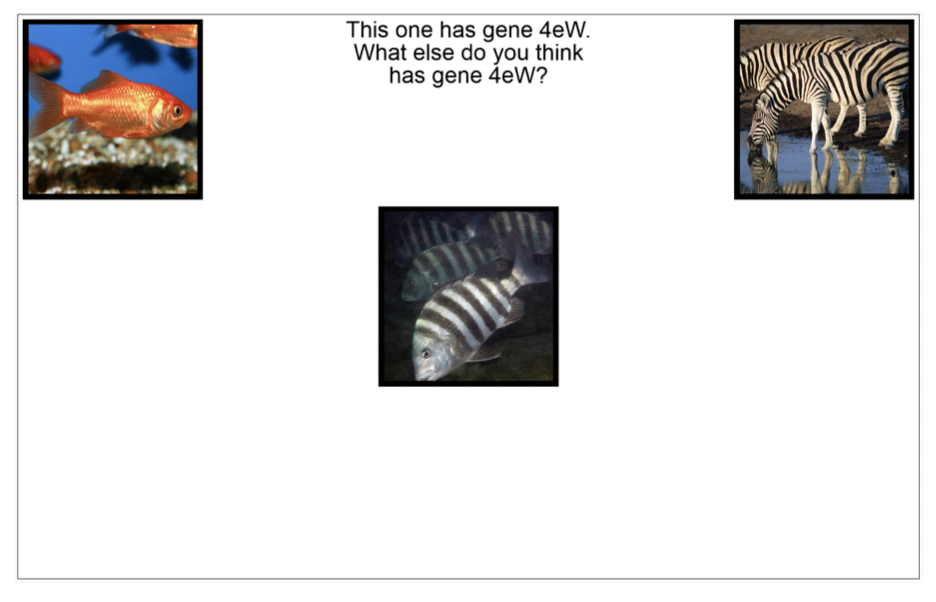

In 2020, after 11 years in and around academia (3 years undergrad, 3 years PhD, 5 years post-doc), I made the jump to the private sector. Like most people in my position, I'm haunted by a backlog of unfinished papers with my old colleagues, which I'll be working on in my spare time. I'm also haunted by a backlog of research ideas: experiments that I wanted to run at some point along the way, but didn't have the time, money, or resources. These are the experiments I will never get to run.

Most of these ideas probably aren't very good. Some might be great. At some point, I thought each one was good enough to write in my notebook, at least. I'm collating them here in part as a therapeutic exercise, and in part because there's a small chance someone might take something useful from these ideas. If by any chance you, dear reader, decide to take one of these ideas and run with it, great. I don't need to be a co-author, but I'm always happy to chat, and it would be nice to hear how you get on. To stop this turning into too much of a sprawling mess, I've kept this to five projects. There might be a part 2, someday.

# Experiments

## Response Dynamics and Deep Convolutional Models of Visual Processing

As part of my PhD, I used mouse-tracking to look at how people deal with conflict between perceptual similarity (zebra fish and zebras look alike) and conceptual knowledge (zebra fish and goldfish are both fish) in inductive reasoning, and found that early motor movements were driven by perceptual similarity, later movements and usually ultimate responses by conceptual knowledge.

Meanwhile, it has been shown that representations in the early layers of deep convolutional neural networks (DCNNs) trained for visual classification learn similar representations to the human early visual cortex, while deeper layers learn similar representations to the inferior temporal cortex, a higher-level semantic visual area.

Putting these together, I wondered whether the responses participants produce under time pressure in semantic tasks might be better predicted by representations found early in DCNNs, while responses produced without time pressure are better predicted by representations in later layers. This could be explored using a semantic triad task similar to my PhD studies. Participants are asked to match the target (the image in the centre) to whichever of the two options (the images in the corners) belongs to the same group/shares a particular property. It also lends itself nicely to a analysis where we calculate representational similarity between the target and each option, separately using representations at each level of the DCNN, and then see which level's representations best predict motor output (movement on the x-axis) at each point in time.

I have everything in place for collecting data on a task like this, but I never got the time to properly get up to speed with the inner workings of DCNNs, so this one never happened.

### Components of Unconscious Processing

Back in 2016, [Nick Shea, Chris Frith and I were working on unconscious learning](https://journals.sagepub.com/doi/abs/10.1080/17470218.2017.1373834), building on some of [Nick and Chris' ideas](https://academic.oup.com/nc/article/2016/1/niw005/2757125). We took a classic attentional cueing task, used backwards masking to present the cues subliminally, and looked at how this affected participants' ability to learn.  The reliability of the cues varied throughout this task, and we could see how participants were learning by seeing how much participants relied on the cues (were faster/more accurate when the cues were usually reliable, and slower/less accurate when they weren't) over time. The plan was to take a computational approach, fitting the [hierarchical Gaussian filter](https://academic.oup.com/cercor/article/24/6/1436/295093) to participants' data and checking how the parameters differed with subliminal cues, but in the end we didn't find any unconscious learning.

The problem with paradigms like this is that it's not clear what parts of the task were actually achieved by unconscious processing, and what parts were done consciously. Unfortunately, we only had six months for this project, but if I had the time, the next step would have been to try to build a task where we could manipulate several stages of the pipeline from perception to action to be either conscious or unconscious.

- The first stage is perception of the cue (**<<** or **>>**), which is what we manipulated with our backwards masking procedure: perception is conscious when the gap between the cue and the mask is long enough or there is no mask, and unconscious when the mask is shown quickly after the cue.
- The next stage is the adjustment of spatial attention left or right. I don't think we can fully render this conscious or unconscious, but we can manipulate whether participants are asked to explicitly indicate the likely location of the target, or just adjust their covert attention.
- After that comes the response to the target (**X**). In our studies, we used button presses (definitely conscious) and eye movements (probably conscious). Are there responses we could record that the participant isn't consciously aware they produced? We thought about things like more subtle eye movements, biofeedback (maybe pupil dilation), or even EEG neurofeedback here. Figuring out how to do this was probably the biggest challenge here.
- Finally, after the response, participants receive feedback, informing them whether or not they've responded correctly. This is done consciously, but it would be quite interesting to present the feedback subliminally (using backwards masking) and see what happens.

Ideally, we would manipulate these four factors independently, and see which ones are necessary for learning to occur, which ones modulated learning, and how they did so.

### Responses Dynamics of Unconscious Processing

As part of the same project, we ran a public engagement event at the Cheltenham science festival where we adapted this cueing task to work on a touchscreen, and used a [leap motion](https://www.ultraleap.com/) to track participants hand movements. This produced some pretty cool data (and was pretty fun as an engagement activity). We didn't have time to replicate in the lab, unfortunately, but I still have the code for all this, so if anyone has a leap motion and wants to have a go at running this, please get in touch!

### Transdiagnostics

There's been a lot of interest over the last few years, in my field largely spurred by [Gillan et al's (2016)](https://elifesciences.org/articles/11305) work (from which I've stolen the figure below), on the idea of *transdiagnostic* features of mental health problems. These are features, like *social withdrawal*, that occur across diagnostic categories and might reflect the underly etiology of these problems. (This isn't a great introduction to the topic, but that's not my job here).

One approach to this, exemplified by Gillan and co., has been to administer a whole lot of questionnaires designed to assess different disorders (anxiety, depression, eating disorders, OCD, etc.), and use exploratory factor analysis across all of the items to find questions that cluster together in underlying factors.

**Confirmatory Factor Analysis**

Now, one issue with this is that the factors identified seem to differ a bit from study to study, and as far as I know no one has systematically pooled the data across studies to see how consistent these factors actually are, across studies, populations, and time periods (especially post-2020). I haven't fully fleshed out how I would approach this, but I think it would involve getting the raw data from as many previous studies using this approach as possible, and using confirmatory factor analysis. It would also be useful to take a transfer approach here: split each study's data into training and test sets, fit factor analysis models to the training sets from each study, and evaluate them all on all of the test sets. This is similar to what [Kaplan et al. (2015)](https://www.frontiersin.org/articles/10.3389/fnhum.2015.00151/full) call multivariate cross-classification, and would tell us how well the factor structure estimated from one study fits the data from other studies, relative to how it fits data from it's own study.

**Redundancy versus Correlation**

Another interesting (to me, anyway) question is *why* questions from measures designed to assess different conditions are correlated. One possibility is that these measures are actually asking about exactly the same symptoms. Let's call this *redundancy*, or *shallow association*. The alternative is that these measures are asking different questions, but responses to these questions are correlated, possibly because they tap into the same underlying computational process.

The obvious way to check this is to go through each pair of correlated questions one-by-one (or two-by-two) and check if they're the same or not. This would produce a redundancy matrix, which could be subtracted from the correlation matrices from the original studies to see if any worthwhile factors are leftover once the fact that redundant items have been accounted for.

Unfortunatly, with the 209 items used by Gillan et al., that's (209 * 208 / 2) = 21,736 pairs of questions, and literally no one has time for that. An alternative would be to split the pairs into smaller partially overlapping batches of, say, 150 pairs each, and split them between a large number or participants. These could then be combined, using the overlapping questions to normalise any differences between participants, to obtain the redundancy matrix we need.

Maybe that's still too much data collection time. If we want to go full luxury, and high tech, we could collect some data as described above, and then tweak the parameters of a few machine learning language models (like [BERT](https://github.com/google-research/bert)) to find the one that best matches these human similarity/redundancy judgements. Once the best model is identified, it can be used to generate as many redundancy matrices as we like.

# Analyses

## Generalised metacognitive sensitivity (d') with probit regression

[Meta-d'](https://brianmaniscalco.org/wp-content/uploads/2018/10/Maniscalco-Lau-2012-Consc-Cog-corrected.pdf) ("d-prime") is a signal detection theoretic statistic used to measure metacognitive sensitivity. Roughly speaking, the idea is that if d' reflects an observer's sensitivity or quality of information when making a perceptual decision, in units of signal-to-noise, then meta-d' reflects the quality of information available when making a confidence judgement about that decision, in the same units.

The statistical model used to calculate d' is a special case of the model used in probit regression (which may be more familiar to some readers as "fitting a psychometric function"): it corresponds to the slope term β in the model $P(y = 1) = \text{probit}^{-1}(\alpha + \beta x)$, where $x = 1$ when the signal is present and $x = 0$ when it's absent. Now, probit regression is a lot more flexible than d', since it allows for graded levels of the signal, *x*, and can incorporate information about multiple cues, $x_1, x_2, \dots, x_p$. If we could generalise meta-d' in the same way, we would be able to a) assess metacognitive much more efficiently, using a continuous range of signals rather than a binary split, and b) properly explore the role of multiple cues or signals on metacognitive judgements.

I got part of the way towards this goal in our paper on [morphological biases in face perception](https://www.sciencedirect.com/science/article/abs/pii/S1053810019303423). In this, I was able to fit a probit regression model with two predictors, luminance and morphology, to participants' perceptual decision data, and use that model to predict how confident participants should be in each decision, given their sensitivity to the two cues. We could then test whether the same combination of cues was then used to guide their actual confidence judgements.

I haven't quite figured out the maths needed to turn this into a fully-fledged probit analogue to meta-d', but I think the idea is a good one, and I'm very happy to share my notes with anyone who fancies giving it a try.
