---
title: Robust Outlier Detection using the T Distribution
date: 2020-01-12
summary: "Please, don't just drop data 3 standard deviations from the mean."
source: jupyter
---


## TL:DR

Don't discard outliers that are more than $k$ standard deviations from the mean.
Fit a shifted, scaled Students' t distribution $t(m, s, \nu)$ to your data,
and discard points more than $k \times s$ (the scale parameter) from the mean,
using the function below.


```python
import numpy as np
from scipy import stats

def detect_outliers_t(x, k=3):
    '''Detect outliers by fitting t distribution to data.
    Args:
        x: np.array of data
        k: Exclude points within ±k×s of mean.
    Returns:
        is_outlier: np.array indicating whether each point is an outlier
        outlier_pars: dict of paramters of t distribution
    '''
    t_df, t_m, t_s = stats.t.fit(x)
    is_outlier = np.where(np.abs( x - t_m) > k * t_s, 1, 0)
    outlier_pars = {
        'm': t_m, 's': t_s, 'df': t_df, 'p_outlier': np.mean(is_outlier), 'k': k
    }
    return is_outlier, outlier_pars


xg = np.random.normal(0, 1, 100)    # Good data
xo = np.random.uniform(-10, 10, 10) # Outliers
X = np.concatenate([xg, xo])        # All data
is_outlier, outlier_pars = detect_outliers_t(X, k=3)
outlier_pars
```


    {'m': 0.060391208997211905,
     's': 0.8423186676444332,
     'df': 1.6611498274452596,
     'p_outlier': 0.1,
     'k': 3}


## Long Version

Real data, especially measurements of human behaviour, is messy.
Lapses in attention, slips of the hand, equipment malfunctions, 
and many other factors can contaminate data with *outliers*: 
data points that are generated by a different process than the one we wish to study.
To produce reliable results, we have to either account for the presence of these outliers,
or identify and exclude them from our datasets.

The most common way of excluding outliers is to
remove data points more than $k$ standard deviations from the sample mean.
In this post, I'll show some limitations of this approach,
and walk through a much more effective way filtering out these data points.

I'll begin with some simulated data.
Assume that the data of interest are sampled from a normal distribution
with mean $\mu$ and standard deviation $\sigma$.
Contaminant data points are sampled from some other overlapping distribution.
There are $N$ data points in total,
$N_{good}$ data of interest and $N_{bad}$ contaminants.
We'll begin by considering 
$N_{good} = 100$ data points 
with $\mu = 0$, $\sigma = 1$,
and $N_{bad} = 10$ contaminants
drawn from a uniform distribution
bounded between $\pm 10$.


```python
import numpy as np
import pandas as pd
from scipy import stats
import matplotlib as mpl
import matplotlib.pyplot as plt
import seaborn as sns
# %load_ext autoreload
# %autoreload 2
mpl.rcParams['figure.figsize'] = 8, 6
mpl.rcParams['font.size'] = 16
```


```python
## Simulations
n_good, n_outlier = 1000, 100
true_m, true_s = 0, 1 # Parameters of 'good data'
outlier_range = 10

def generate_data(n_good=1000, n_outlier=100, true_m=0, true_s=1, outlier_range=10):
    '''
    Returns:
        x: All data
        xg: Data of interest
        xo: Outlier data points
    '''
    xg = np.random.normal(true_m, true_s, n_good) # Good data
    xo = np.random.uniform(-outlier_range, outlier_range, n_outlier) # Outliers
    x = np.concatenate([xg, xo]) # All data
    return x, xg, xo

X, xg, xo = generate_data(1000, 100)
true_is_outlier = np.repeat([0, 1], [1000, 100])

def plot_data(x, true_is_outlier=true_is_outlier):
    xg = x[true_is_outlier==False]
    xo = x[true_is_outlier==True]
    plt.hist([xg, xo], bins=50, density=True, histtype='bar', stacked=True, label=['Data', 'Outliers']);
    plt.legend()
plot_data(X, true_is_outlier)
```


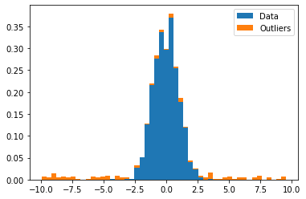


The standard approach in most psychology studies is to calculate 
the sample mean, $\hat \mu$ and sample standard deviation, $\hat \sigma$,
and to exclude points more than $k \times \hat \sigma$ from the mean as outliers.
An apparently attractive property of this approach is that 
if the data are normally distributed, we know 
what proportion of the it will be within $k$ standard deviations of the mean.[<sup>1</sup>](#fn1)

There are two main issues with this approach.
First, if the data of interested are normally distributed,
and the data set contains this data plus outliers,
the data as a whole will not be normally distributed.
This means that the sample SD $\hat \sigma$ 
is not a good estimate of the population SD $\sigma$,
and we don't know many good data points we're actually throwing away with the outliers.

This issue is illustrated below.
Green lines show the true distribution of the data of interest, 
with vertical lines showing thresholds at $\pm k \sigma$ from the mean, $k = 2$.
Red lines show the a Normal distribution estimated from the sample mean $\hat \mu$
and standard deviation $\hat \sigma$, and the corresponding vertical lines at 
$\pm k \hat \sigma$.
Clearly, the outliers have widened the estimate $\hat \sigma$ 
well beyond the standard deviation of the data we care about.


```python
def plot_gaussian(m, s, k=3, yl=.3, label=None, rng=10):
    '''Plot a Gaussian density, with bars '''
    _x = np.arange(-rng, rng, .01)
    d = stats.norm.pdf(_x, m, s)
    l = plt.plot(_x, d, label=label)
    c = l[0].get_color() # Threshold same colour as density
    if k is not None:
        thresholds = [m-k*s,m+k*s]
        plt.vlines(thresholds, 0, yl, color=c, linestyle='--')

sample_m, sample_s = np.mean(X), np.std(X)
plot_data(X)
plot_gaussian(0, 1, k=3, label='True dist.')
plot_gaussian(sample_m, sample_s, k=3, label='Estimate')
plt.legend()
plt.title('Estimating parameters from sample mean and SD')
plt.show()
```


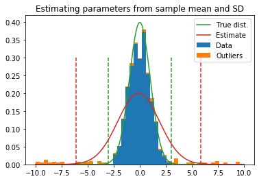


Second, why should we aim to exclude the same number of data points as outliers every time?
Clearly, some data sets will have almost no outliers, while others will be full of them.


## Mixture Models

Both of these issues can be avoided if we take a mixture modelling approach.
Our data is a mixture of two distributions:
a normal distribution for the data of interest, and some other distribution - 
uniform between $±10$ here - for the outliers.
In real life, we don't know the distribution of the outliers.
In this case, a good alternative is to fit the Normal distributions' heavy-tailed cousin:
the scaled, shifted, Student's t distribution.
This distribution has three parameters:
mean $m$, scale $s$ and degrees of freedom $\nu$.
If $\nu$ is high, the t distribution is indistinguishable from a normal distribution
with $\mu = m$, $\sigma = s$.
With values of $\nu$ closer to $1$, extreme values become more likely (see below).
[<sup>2</sup>](#fn1)


```python
def my_student_plot(low=-10, high=10, nus=[1, 4], log=False):
    _x = np.arange(low, high, .01)
    d = stats.norm.pdf(_x, 0, 1)
    if log:
        d = np.log(d)
    plt.plot(_x, d, label='Normal(0, 1)')
    for nu in nus:
        d = stats.t(df=nu).pdf(_x)
        if log:
            d = np.log(d)
        plt.plot(_x, d, label=u't(0, 1, ν = %i)' % nu)
    plt.legend()
    plt.xlim(low, high)
    if not log:
        plt.hlines(0, low, high, linestyle='dashed')
        plt.ylim(0, .45)

my_student_plot(-10, 10, [1, 4])
plt.show()
```


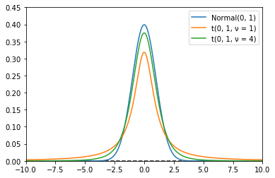


This means that if we fit a t distribution to our data set,
we'll end up with three paramters,
$m$, $s$, and $\nu$.


```python
t_df, t_m, t_s = stats.t.fit(X)
print(u't Estimates: m = %.2f, s = %.2f, ν = %.2f' % (t_m, t_s, t_df))
```

    t Estimates: m = -0.03, s = 0.89, ν = 2.14


Compare this to the true values, and to the sample mean and SD.


```python
print('True values: μ = %.2f, σ = %.2f' % (true_m, true_s))
print('Sample estimates: μ.hat = %.2f, σ.hat = %.2f' % (np.mean(X), np.std(X)))
```

    True values: μ = 0.00, σ = 1.00
    Sample estimates: μ.hat = -0.12, σ.hat = 1.99


In general, location and scale parameters $m$ and $s$ of the t distribution 
are a better estimate of the true mean and SD of the data of interest.

The number of data points within the interval $m \pm k \times s$ is not constant, but depends on $\nu$.
If the distribution is heavy-tailed (high $\nu$), 
a large number of values will fall outside of this interval
and be marked as outliers.
If it is light-tailed (low $\nu$, closer to Normal), 
fewer values will be marked as outliers.
Therefore, $\frac{1}{\nu}$ is an estimate of the amount of outliers in the data,
as demonstrated in the plot below.


```python
plot_data(X)
plot_gaussian(0, 1, k=2, label='True dist.')
plot_gaussian(t_m, t_s, k=2, label='Estimate from\nt distribution.')
plt.legend()
plt.title('Estimating parameters from t distribution')
plt.show()
```


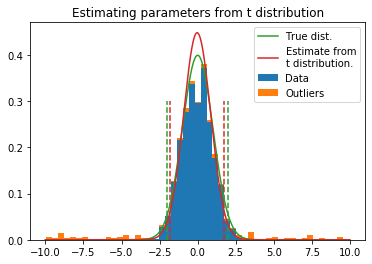


All of this can be wrapped in a simple python function.


```python
def detect_outliers_t(x, k=3):
    '''Detect outliers by fitting t distribution to data.
    Args:
        x: np.array of data
        k: Exclude points within ±k×s of mean.
    Returns:
        is_outlier: np.array indicating whether each point is an outlier
        outlier_pars: dict of paramters of t distribution
    '''
    t_df, t_m, t_s = stats.t.fit(x)
    is_outlier = np.where(np.abs( x - t_m) > (k * t_s), 1, 0)
    outlier_pars = {
        'm': t_m, 's': t_s, 'df': t_df, 'p_outlier': np.mean(is_outlier), 'k': k
    }
    return is_outlier, outlier_pars

detect_outliers_t(X, k=3)
```


    (array([0, 1, 0, ..., 1, 1, 1]),
     {'m': -0.034335614808078,
      's': 0.891039296484651,
      'df': 2.144786165514596,
      'p_outlier': 0.07363636363636364,
      'k': 3})


## Evaluation

I'm already convinced that this is better than the tradition mean ± SD approach, but you might not be.
Let's take a look at how it performs compared to the classic approach.

### Data points rejected depends on number of outliers in data

If we use the sample SD to exclude outliers,
SD skyrockets as the number of outliers in the data increases,
and so almost no values will be more than 3 SD from the mean.
On the other hand, when we use a t distribution 
the increased outliers are captured by changes in $\nu$,
the scale estimate and the outlier threshold remain the same,
and so the number of trials rejected as outliers increases as it should.

See the code below for simulation details.


```python
# For comparison
def detect_outliers_normal(x, k=2):
    '''Detect outliers using the sample mean and SD.
    Args:
        x: np.array of data
        k: Exclude points within ±k×s of mean.
    Returns:
        is_outlier: np.array indicating whether each point is an outlier
        outlier_pars: dict of paramters of t distribution
    '''
    m, s = np.mean(x), np.std(x)
    is_outlier = np.where(np.abs( x - m) > (k * s), 1, 0)
    outlier_pars = {
        'm': m, 's': s, 'p_outlier': np.mean(is_outlier), 'k': k
    }
    return is_outlier, outlier_pars

def do_sims(p_outlier, nsims=10, k=2):
    reject_normal = []
    reject_t = []
    for i in range(nsims):
        x, xg, xo = generate_data(n_good=1000, n_outlier=int(1000*p_outlier), outlier_range=10)
        _, t_pars = detect_outliers_t(x, k=k)
        _, normal_pars = detect_outliers_normal(x, k=k)
        reject_normal.append(normal_pars)
        reject_t.append(t_pars)
    dfs = [pd.DataFrame(vs) for vs in [reject_normal, reject_t]]
    for df in dfs:
        df['true_p_outlier'] = p_outlier
    dfs[0]['method'] = 'normal'
    dfs[1]['method'] = 'student'
    return dfs

p_outlier = np.array([.01, .05, .1, .2, .5])
results = [do_sims(p, k=3) for p in p_outlier]
results = pd.concat([pd.concat(r, sort=False) for r in results], sort=False)
```


```python
result_means = results.groupby(['method', 'true_p_outlier']).mean()
result_means.round(2)
```


<div>
<style scoped>
    .dataframe tbody tr th:only-of-type {
        vertical-align: middle;
    }

    .dataframe tbody tr th {
        vertical-align: top;
    }

    .dataframe thead th {
        text-align: right;
    }
</style>
<table border="1" class="dataframe">
  <thead>
    <tr style="text-align: right;">
      <th></th>
      <th></th>
      <th>m</th>
      <th>s</th>
      <th>p_outlier</th>
      <th>k</th>
      <th>df</th>
    </tr>
    <tr>
      <th>method</th>
      <th>true_p_outlier</th>
      <th></th>
      <th></th>
      <th></th>
      <th></th>
      <th></th>
    </tr>
  </thead>
  <tbody>
    <tr>
      <th rowspan="5" valign="top">normal</th>
      <th>0.01</th>
      <td>-0.00</td>
      <td>1.14</td>
      <td>0.01</td>
      <td>3</td>
      <td>NaN</td>
    </tr>
    <tr>
      <th>0.05</th>
      <td>-0.01</td>
      <td>1.59</td>
      <td>0.02</td>
      <td>3</td>
      <td>NaN</td>
    </tr>
    <tr>
      <th>0.10</th>
      <td>0.02</td>
      <td>2.01</td>
      <td>0.04</td>
      <td>3</td>
      <td>NaN</td>
    </tr>
    <tr>
      <th>0.20</th>
      <td>0.02</td>
      <td>2.51</td>
      <td>0.04</td>
      <td>3</td>
      <td>NaN</td>
    </tr>
    <tr>
      <th>0.50</th>
      <td>-0.02</td>
      <td>3.44</td>
      <td>0.00</td>
      <td>3</td>
      <td>NaN</td>
    </tr>
    <tr>
      <th rowspan="5" valign="top">student</th>
      <th>0.01</th>
      <td>-0.00</td>
      <td>0.90</td>
      <td>0.01</td>
      <td>3</td>
      <td>6.30</td>
    </tr>
    <tr>
      <th>0.05</th>
      <td>-0.00</td>
      <td>0.88</td>
      <td>0.04</td>
      <td>3</td>
      <td>2.90</td>
    </tr>
    <tr>
      <th>0.10</th>
      <td>0.01</td>
      <td>0.87</td>
      <td>0.08</td>
      <td>3</td>
      <td>2.08</td>
    </tr>
    <tr>
      <th>0.20</th>
      <td>-0.00</td>
      <td>0.93</td>
      <td>0.12</td>
      <td>3</td>
      <td>1.61</td>
    </tr>
    <tr>
      <th>0.50</th>
      <td>-0.00</td>
      <td>1.17</td>
      <td>0.22</td>
      <td>3</td>
      <td>1.25</td>
    </tr>
  </tbody>
</table>
</div>


```python
plt.figure(figsize=(6,6))
for method, df in results.groupby('method'):
    m = df.groupby('true_p_outlier')['p_outlier'].mean()
    plt.plot(m, '-o', label=method)
plt.legend(title='Method')
pm = results['true_p_outlier'].max() * 1.1
plt.plot([0, pm], [0, pm], 'k', linestyle='dotted')
plt.xlabel('True P(Outlier)'); plt.xlim(0, pm)
plt.ylabel('Estimated P(Outlier)');plt.ylim(0, pm);
```


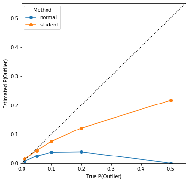


Note also that

- The mean $m$ is noisier - due to outliers - when estimating a Normal distribution
- The scale parameter $s$ if overestimated using a Normal distribution
- The estimated DF (A.K.A. $\nu$) decreases - the distribution becomes more heavy tailed - as the number of outliers increases


```python
cols = results.columns.values
cols = [col for col in cols if col not in ['method', 'true_p_outlier', 'k']]
fig, axes = plt.subplots(1, len(cols), figsize=(20, 4))
for col, ax in zip(cols, axes):
    plt.sca(ax)
    for method, df in results.groupby('method'):
        m = df.groupby('true_p_outlier')[col].mean()
        plt.plot(m, '-o', label=method)
    plt.legend(title='Method')
    pm = results['true_p_outlier'].max() * 1.1
    plt.xlabel('True P(Outlier)'); plt.xlim(0, pm)
    plt.title(col)
```


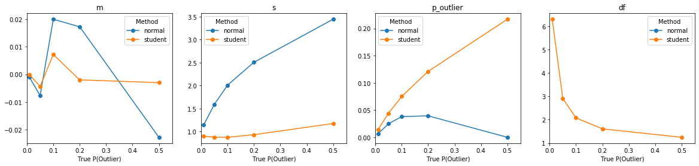


### Signal Detection Analysis

With simulated data, we can evaluate the performance of an outlier-rejection algorithm using Signal Detection Theory.
If you're still reading at this point, I'll assume you're familiar with SDT.
To do this, we classify the algorithm's decisions about each data point 
as a Hit (H), Miss (M), False Alarm (FA), or Correct Rejection (CR), using the table below.


```python
sdt = pd.DataFrame([['Hit', 'Miss'], ['False Alarm', 'Correct Rejection']], 
                   index=['Outlier', 'Not outlier'], 
                   columns=['Rejected', 'Not rejected'])
sdt
```


<div>
<style scoped>
    .dataframe tbody tr th:only-of-type {
        vertical-align: middle;
    }

    .dataframe tbody tr th {
        vertical-align: top;
    }

    .dataframe thead th {
        text-align: right;
    }
</style>
<table border="1" class="dataframe">
  <thead>
    <tr style="text-align: right;">
      <th></th>
      <th>Rejected</th>
      <th>Not rejected</th>
    </tr>
  </thead>
  <tbody>
    <tr>
      <th>Outlier</th>
      <td>Hit</td>
      <td>Miss</td>
    </tr>
    <tr>
      <th>Not outlier</th>
      <td>False Alarm</td>
      <td>Correct Rejection</td>
    </tr>
  </tbody>
</table>
</div>


To make the SDT model explicit,
the decision variable is $\dot x = abs(x - \mu)$,
and the decision threshold $\alpha = k \times \sigma$.
In the classic approach, $\mu$ and $\sigma$ are the sample mean and SD $\hat mu$ and $\hat \sigma$. 
In the Student t-based approach, $\mu$ and $\sigma$ are the location and scale parameters $m$ and $s$.
A data point is rejected as an outlier if $\dot x > \alpha$, and not rejected otherwise.


```python
xdot = np.abs(X - X.mean())
plot_data(xdot)
plt.vlines(3, 0, .7, linestyle='dashed', label=r'$\alpha = k \sigma;\ k=3$')
plt.legend()
plt.xlabel(r'Decision Variable $\dot x = abs(x - \mu)$')
plt.yticks([])
plt.xlim(0, 10)
plt.show()
```


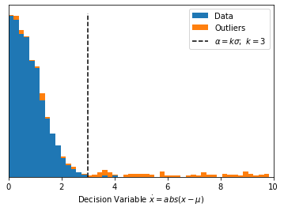


First, this means that the shape of the ROC curve depends only on $\mu$.
Assuming the data is normally distributed, Area Under the Curve (AUC)
should be greatest when $\mu$ is equal to the mean of the data of interest.
The location parameter of the t distribution is
much less affected by outliers than the sample mean,
and so is a more sensitive tool for excluding outliers.

The effect of errors in $\mu$ is illustrated in the plot below, which shows
the effect of using an estimate of $\mu$ that differs from the true value
by $\delta\mu \in [-2, -1, 0, 1, 2]$.


```python
from sklearn import metrics

def set_up_roc_plot(lim=.05, ax=None):
    if ax is None:
        fig, ax = plt.subplots()
    else:
        fig = ax.get_figure()
    plt.sca(ax)
    lims = (-lim, 1+lim)
    plt.plot(lims, lims, color='k', linestyle='dashed')
    plt.xlim(*lims)
    plt.ylim(*lims)
    plt.hlines([0, 1], *lims, linestyle='dotted')
    plt.vlines([0, 1], *lims, linestyle='dotted')
    plt.xlabel('P(False Alarm)')
    plt.ylabel('P(Hit)')
    # ax.set_aspect(1)
    return fig, ax


thresholds = np.arange(0, 10, .05)
mus = np.linspace(-2, 2, 5)
aucs = []
fig, ax = set_up_roc_plot()
for mu in mus:
    xdot = np.abs(X - mu - xg.mean())
    p_fa, p_hit, c = metrics.roc_curve(true_is_outlier, xdot)
    aucs.append(metrics.auc(p_fa, p_hit)) 
    plt.plot(p_fa, p_hit, label=r'$\delta\mu = %.2f$' % mu)
plt.legend()
ax.set_aspect(1)
plt.tight_layout()
```


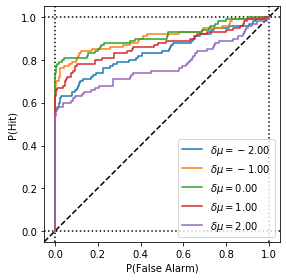


```python
pd.DataFrame([mus, aucs], index=['delta.mu', 'AUC']).T.round(2)
```


<div>
<style scoped>
    .dataframe tbody tr th:only-of-type {
        vertical-align: middle;
    }

    .dataframe tbody tr th {
        vertical-align: top;
    }

    .dataframe thead th {
        text-align: right;
    }
</style>
<table border="1" class="dataframe">
  <thead>
    <tr style="text-align: right;">
      <th></th>
      <th>delta.mu</th>
      <th>AUC</th>
    </tr>
  </thead>
  <tbody>
    <tr>
      <th>0</th>
      <td>-2.0</td>
      <td>0.84</td>
    </tr>
    <tr>
      <th>1</th>
      <td>-1.0</td>
      <td>0.90</td>
    </tr>
    <tr>
      <th>2</th>
      <td>0.0</td>
      <td>0.91</td>
    </tr>
    <tr>
      <th>3</th>
      <td>1.0</td>
      <td>0.87</td>
    </tr>
    <tr>
      <th>4</th>
      <td>2.0</td>
      <td>0.77</td>
    </tr>
  </tbody>
</table>
</div>


Second, for a given ROC curve and a fixed value of $k$,
the location of the threshold $\alpha$
depends only the scale parameter $\sigma$.
If we know the true
mean and standard deviation of the data of interest, $\mu$ and $\sigma$
we can use the properties of the Normal distribution
to find the value of $k$ that gives us a particular False Alarm Rate,
$\frac{P(FA)}{P(FA) + P(CR)}$[<sup>[1, again] </sup>](#fn1).

In a Normal distribution, 99.73% of data points are within $\pm 3 \sigma$ of the mean.
If we reject points outside of $\mu \pm 3\sigma$ as outliers,
we will misclassify 0.27% of the data of interest as outliers (False Alarms)
and correctly classify the remaining 99.73% as non-outliers (Correct Rejections).
This means that with $k = 3$ we obtain a False Alarm Rate of 
$\frac{0.27\%}{0.27\% + 99.73\%} = 0.0027$.
The probability of a false alarm as a function of k is plotted below,
showing that the probabilty reaches an asymptote around $k = 3$.


```python
ks = np.arange(0, 4.5, .1)
p_fa = 2*(1 - stats.norm.cdf(ks))
plt.plot(ks, p_fa)
plt.fill_between(ks, p_fa, alpha=.5)
plt.xlim(0, ks.max())
plt.ylim(0, 1)
plt.xlabel('k')
plt.ylabel('P(False Alarm)')
plt.tight_layout()
plt.title('False Alarms depend ')
plt.show()
```


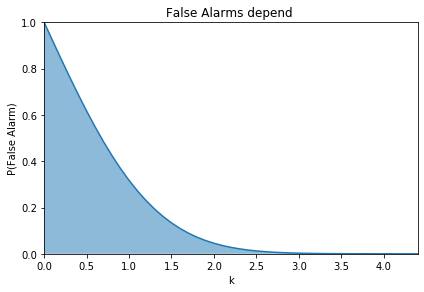


Our Hit Rate, $\frac{P(Hit)}{P(Hit) + P(Miss)}$,
depends on how the outliers are distributed,
specifically how many of them fall within $\mu \pm k\sigma$.
Since we don't know in advance how our outliers will be distributed,
the best we can do is to decide how much good data we're willing to discard
in order to avoid outliers,
or in other words, decide how high a False Alarm rate we're willing to accept.
As a rule of thumb, I would suggest 
using $\alpha = 3 \sigma$ as an aggressive threshold,
or $\alpha = 4 \sigma$ as a more conservative one (see ROC curves below).


```python
def calculate_roc(y_true, y_score, criteria):
    '''
    Same y_true and y_score parameters as sklearn.metrics.roc_curve,
    but allow us to use our own criteria
    '''
    assert(np.all(np.unique(y_true) == np.array([0, 1])))
    p_hit = np.array([np.mean(y_score[y_true==1] > c) for c in criteria])
    p_fa  = np.array([np.mean(y_score[y_true==0] > c) for c in criteria])
    return p_fa, p_hit

ks = [2, 3, 4]
colors = ['b', 'g', 'r']
_, t_pars = detect_outliers_t(X, k=3) # K doesn't matter here for this plot
xdot = np.abs((X - t_pars['m']) / t_pars['s'])
criteria = np.arange(0, 10.5, .25)
p_fa, p_hit = calculate_roc(true_is_outlier, xdot, criteria)
k_p_fa, k_p_hit = calculate_roc(true_is_outlier, xdot, ks)

```


```python
fig, axes = plt.subplots(1, 2, figsize=(10, 4))#, gridspec_kw={'width_ratios':[1,1]})

# ROC Curve
set_up_roc_plot(ax=axes[0])
plt.plot(p_fa, p_hit)
for _x, _y, k, c in zip(k_p_fa, k_p_hit, ks, colors):
    plt.scatter(_x, _y, color=c, label='k = %i' % k)
axes[0].set_aspect(1)
plt.legend()

plt.sca(axes[1])
plt.plot(criteria, p_hit, label='P(Hit)')
plt.plot(criteria, p_fa, label='P(False Alarm)')
plt.scatter(ks, k_p_fa, c=colors)
plt.scatter(ks, k_p_hit, c=colors)
plt.vlines([ks], 0, 1, color=colors, linestyle='dotted')
plt.xlim(0, 6)
plt.xlabel('k')
plt.legend()
plt.tight_layout(rect=(0, 0, 1, .9))
plt.suptitle('ROC Charachteristics.')
plt.show()
```


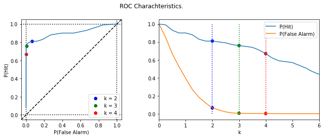


# Supplementary Stuff

<span id="fn1">
    <h2>
        <sup>1</sup>How many data points are within $\mu \pm \sigma$?
    </h2>
    
Assuming a normal distribution
the proportion of data points within $\pm k\sigma$ of the mean
is $1 - 2(1 - \Phi(k))$, or $2\Phi(k) - 1$,
where $\Phi(k)$ is the cumulative Normal distribution function.
If $k = 3$,
$1 - (2\Phi(k) - 1) \approx 1 - 0.9973 = 0.0027$ or $0.27\%$ of the data will be excluded as outliers.

Below is some code demonstrating this idea.
</span>


```python
Ks = [1, 2, 3]
_x = np.linspace(-3, 3, 100)
y = stats.norm.pdf(_x)
plt.plot(_x, y, color='k')
plt.vlines(0, *plt.ylim(), color='k', linestyle='dashed')
for k in Ks:
    mask = (_x > -k) & (_x < k)
    _kx = _x[mask]
    _ky = y[mask]
    _ky[0] = _ky[-1] = 0
    plt.fill(_kx, _ky, color='grey', alpha=.2)
xt = range(-3, 4)
xtl = [(u'%iσ' % i).replace('1', '') if i != 0  else '0' for i in xt]
plt.xticks(xt, xtl)
plt.ylim(0, .45)
plt.title(u'Data within ±kσ of the mean in a Normal distribution')
```


    Text(0.5, 1.0, 'Data within ±kσ of the mean in a Normal distribution')


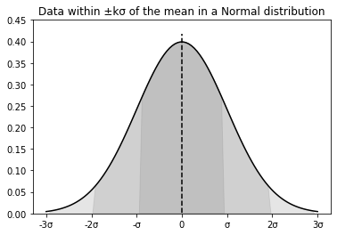


```python
K = np.array([1, 2, 3, 4])
p_within = 1 - 2*(1 - stats.norm.cdf(K))
pd.DataFrame([K, 100*p_within], index=['k', 'Pcnt. within ±kσ']).T.round(2)

```


<div>
<style scoped>
    .dataframe tbody tr th:only-of-type {
        vertical-align: middle;
    }

    .dataframe tbody tr th {
        vertical-align: top;
    }

    .dataframe thead th {
        text-align: right;
    }
</style>
<table border="1" class="dataframe">
  <thead>
    <tr style="text-align: right;">
      <th></th>
      <th>k</th>
      <th>Pcnt. within ±kσ</th>
    </tr>
  </thead>
  <tbody>
    <tr>
      <th>0</th>
      <td>1.0</td>
      <td>68.27</td>
    </tr>
    <tr>
      <th>1</th>
      <td>2.0</td>
      <td>95.45</td>
    </tr>
    <tr>
      <th>2</th>
      <td>3.0</td>
      <td>99.73</td>
    </tr>
    <tr>
      <th>3</th>
      <td>4.0</td>
      <td>99.99</td>
    </tr>
  </tbody>
</table>
</div>


<span id="fn2">
    <h2>
        <sup>2</sup>Effect of the limits of Uniform distribution
    </h2>
</span>

We might want to model our data as a mixture of a Normal (data of interest)
and a Uniform (outliers) distribution.
One issue is that because the Uniform PDF must integrate to 1,
it widening the limits of this distribution reduceds the likelihood of any individual data point.
In other words, with $Uniform(-1, 1)$, all values between $\pm1$ are equally likely,
but with $Uniform(-100, 100)$, all values between $\pm100$ are equally unlikely,


```python
def plot_uniform(low, high, label=None, rng=10):
    '''Plot a Uniform density, with bars '''
    scale = high - low
    _x = np.linspace(-rng, rng, 100)
    d = stats.uniform(loc=low, scale=scale).pdf(_x)
    l = plt.plot(_x, d, label=label)

fig, axes = plt.subplots(1, 3, figsize=(12, 4))
for ax, lim in zip(axes, [10, 20, 50]):
    plt.sca(ax)
    ## Note - We're plotting two independant distributions here, not a mixture of the two.
    ## The normalised density of the mixture is just .5 x the original density.
    plot_gaussian(0, 1, k=None, rng=lim)
    plot_uniform(-lim, lim, rng=lim)
    plt.ylim(0, .45)
    plt.title('Outliers ~ U(-%i, %i)' % (lim, lim))
```


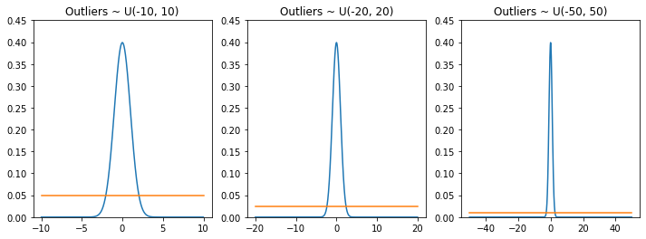


<span id="fn3">
    <h2>
        <sup>3</sup>More Plots of the T Distribution
    </h2>
</span>


```python
my_student_plot(-5, 5, [1, 4])
plt.show()
my_student_plot(0, 10, [1, 4])
plt.show()
```


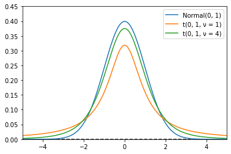


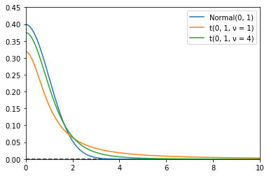


```python
my_student_plot(-5, 5, [1, 4], log=True)
plt.show()
my_student_plot(0, 10, [1, 4], log=True)
plt.show()
```


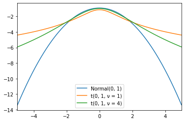


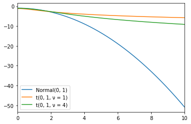

