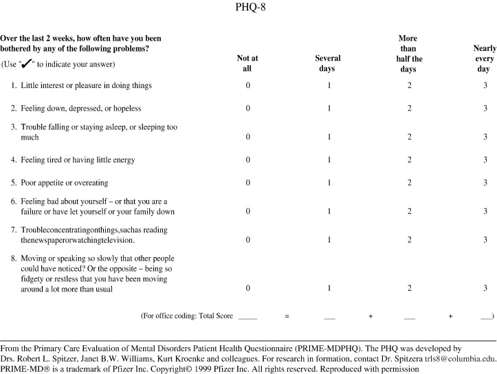
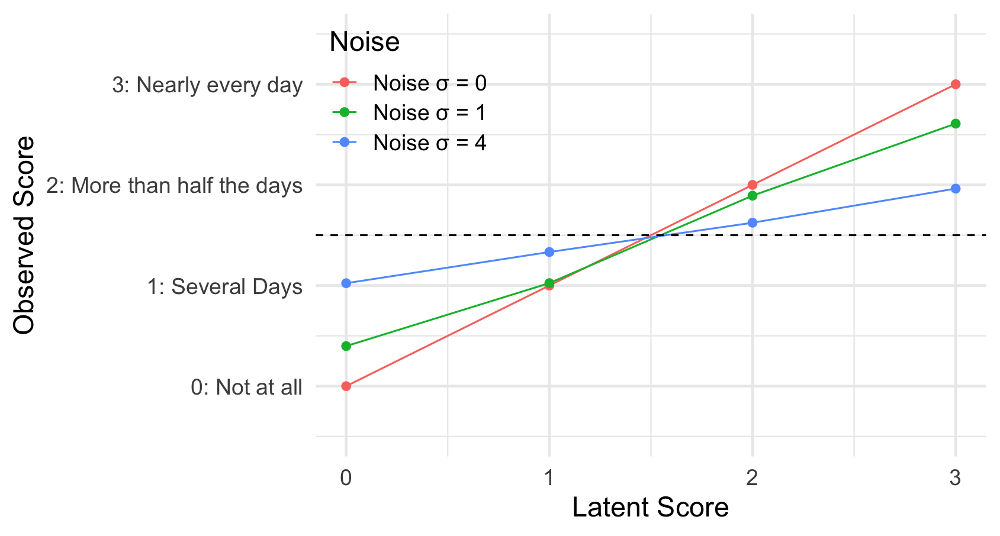
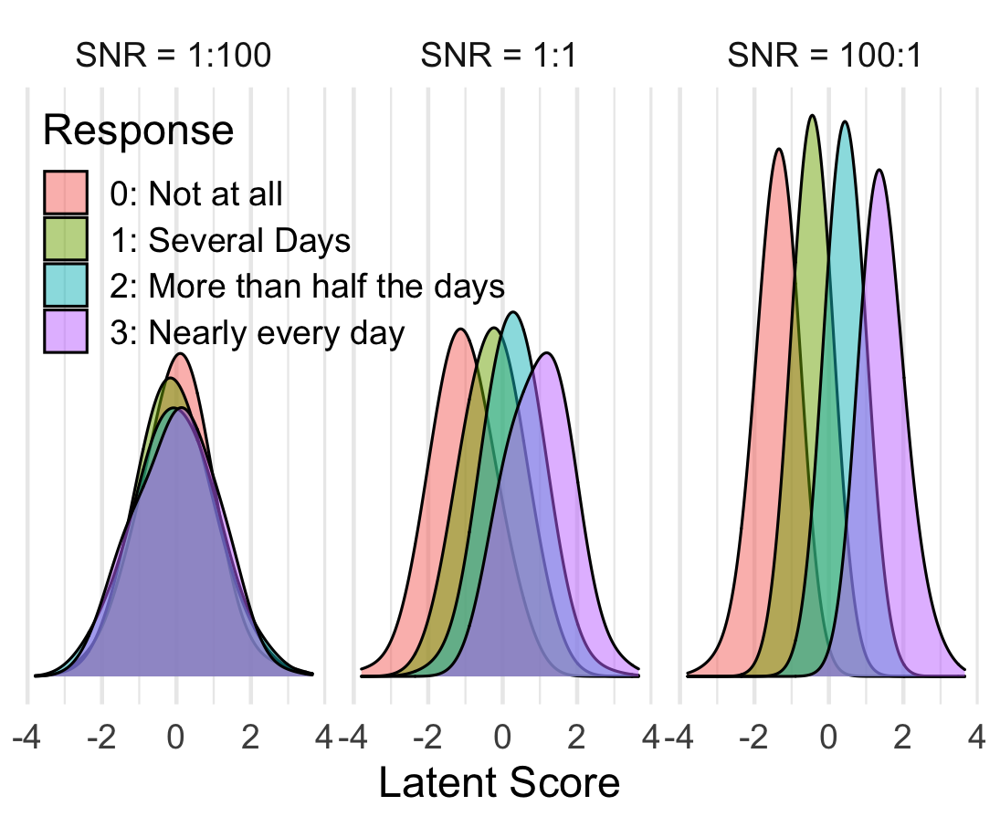
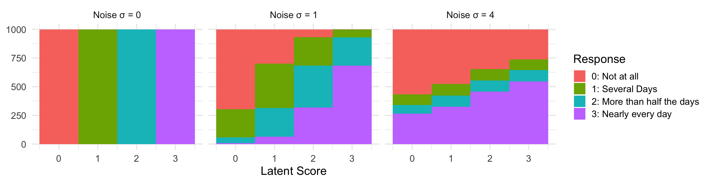

Between academic research moving online during lockdown, and the explosive growth of digital mental health, it's increasingly common to see clinical mental health measures, such as the PHQ-8 for depression or GAD-7 for anxiety, used online in studies of the general population. In this post, I want to talk about a danger of using these measures online that I haven't seen discussed.

The short version is this. **Due to available response options, if participants respond at random, or even just don't pay attention when completing these questionnaires, they can end up with scores that indicate severe mental health issues.**

The long version takes a little more explanation, but takes in a few interesting topics along the way. Before I get started, though, I would like to get a disclaimer in. This is a blog post, sketching out some thoughts I've had on the topic recently. I haven't done my homework: I haven't read all the relevant papers, or checked all the appropriate figures. This is rough work. Take it or leave it. Now, back to the questionnaires.

### Outline

1. A closer look at PHQ-8
2. Noisy bounded scales are biased towards their midpoint
(and the midpoint for PHQ-8 is "moderate depressive symptoms")
3. Bayesian principles tell us that a bias towards the population average prior is good
4. PHQ-8's bias makes sense for patients, but not for the general population
5. What we can do

## A closer look at PHQ-8

I'll focus on the PHQ-8, but the points I make apply to many scales intended for clinical use. The PHQ (Patient Health Questionnaire) is designed to be completed by primary care patients, and PHQ-9 is a subscale of nine items commonly used by clinicians to help identify cases of clinical depression and assess severity. PHQ-8 is an eight-item measure without the suicide/self-harm question, and is therefore usually more appropriate for use online, where asking about suicide could be dangerous or irresponsible.



Scores are calculated by adding up the numeric values for each question. A total score of 0 to 4 represents no significant depressive symptoms. A total score of 5 to 9 represents mild depressive symptoms; 10 to 14, moderate; 15 to 19, moderately severe; and 20 to 24, severe. (Kroenke et al., 2001)

There are plenty of papers on the PHQ-8 already, so we don't need to know any more details here. One thing that jumps out, though, is that the expected score for a participant selecting responses at random on the PHQ-8 is $1.5 \times 8 = 12$, which would be classed as moderate depression.

## Aside: Classical Test Theory

It's useful to introduce some of the terms that people use when talking about measurement. When someone completes a measure, we call the result they get their *observed score*. The observed score reflects two things: their *true score*, which is the latent thing we're trying to measure (level of depression, in the case of PHQ-8), and the *error*: **Observed Score  = True Score + Error**. We can further break down the *error* into *noise* - random variations in the observed score that tend to cancel out - and *bias* - systematic errors in either direction that don't cancel out. **Error = Noise + Bias.**

This is, of course, a simplification, and there are a whole range of ways this can be sliced up, but this is enough for current purposes. The crucial points here are that a) when I say *true score*, I mean the score we would get from an imaginary perfect measure, with no noise or bias, and b) noise and bias are two separate sources of errors.

## Noisy bounded scales are biased towards their midpoint

If a measure is noisy, and the response options are bounded (e.g. only four options for PHQ-8), there is a natural bias towards the middle of the scale. Consider a person who would, without noise, give the lowest response (*Not at all*) for every question. Due to noise, this person will sometimes select a higher option, but cannot select a lower option, and so their observed score will be higher than their true score. In the same way, someone who would, without noise, always give the highest response will end up biased to lower observed scores. This kind of bias affects everyone (unless their true score is right in the middle of the scale), but gets stronger the closer they are to the ends of the scale.

We can show this with a quick simulation (although explaining exactly what is going on here is beyond the scope of this post).



Importantly, responses collected online will be on average noisier than responses collected as part of PHQ-8's validation (trust me on this) or collected in the clinic (I assume). Online responses will also be more variable in terms of how noisy is data from individual participants: some people will pay attention, some won't. The former means that online data will be miscalibrated, compared to the clinical validation data. The latter means that individual differences analyses of online data will be more confounded than analyses of clinical data (thanks to Marcos Economides for pointing out this link was missing).

> In a recent preprint, [Zorowitz, Niv, and Bennett](https://psyarxiv.com/rynhk) point out that some additional problems can arise when you're looking at correlations between multiple questionnaires with this kind of bias, or questionnaires and other measures where not paying attention affects scores. If, for example, participants who don't pay attention end up with inflated depression scores, and also with poor performance on a task, this could give the false impression that people with depression struggle with this task.

It's worth thinking about what this means for the validity and reliability of these measures. Clearly, this bias is a blow to the validity of measures like PHQ-8 in online samples. Rather than being a pure(ish) measure of depression, PHQ-8 in this context is a measure of both depression and inattention. As Jon Roiser and Alex Pike have pointed out (unfortunately, I can't remember who said it first), this is complicated by the fact that depression can lead to inattention, so it's hard to cleanly pull things apart. Suprisingly, though, the bias should actually boost the reliabilitiy of our measures. Reliability is, roughly speaking, the ratio of *individual differences* to *individual differences plus measurement error*. A measure that picks up on individual differences in two constructs, depression and inattention, will therefore be more reliable than one that picks up on only one of those constructs (assuming that they don't cancel each out, which they don't here).

## PHQ-8's bias makes sense for patients, but not for the general population

A natural question to ask, then, is *what should the middle of the scale be?* To answer this, we can use Bayesian inference.

If you come across a randomly-chosen person, and have no information about them whatsoever, what is your best guess as to what their PHQ-8 true score would be, and how certain are you? The best guess you can make (under certain technical definitions of the word *best*, which I won't go into) is to presume this person is whatever the average PHQ-8 score is for the population that this person was random chosen from. Your confidence depends on how variable these scores are in that population: if 95% of people score between 0 and 9, you can be 95% sure that this person will have a score in that range (these values have been found for various populations, but this is just a blog post, so I'm not going to look them up). This information is known as a **prior** in Bayesian inference: it reflects what you know before learning anything about this specific person.

Now, what if you asked this person to complete the PHQ-8, and we assume that they pay full attention, and the measure is totally reliable (that there's no noise or randomness involved, so that the score someone gets reflects their *true score*)? It's pretty clear that your best guess is just whatever score they actually received.

The more interesting case is when someone completes the PHQ-8, but the measure isn't totally reliable (no measure is), and the person doesn't pay perfect attention (no one does). Clearly, their recorded score won't be totally accurate. If this was just a case of noise, you might think your best guess would still be whatever score they recorded.  However, the key point of Bayesian inference is that your data isn't totally reliable (there's noise) your best guess is somewhere between what you would believe if you had no data at all (the prior) and what you would believe if you had perfectly reliable data (the observed score). In other words, if your measure is noisy, it's a good idea to be biased towards the population mean, since that's your prior belief before taking the measurement. Bayesian inference also gives us a formula to calculate exactly where in between these two values your best guess is, depending on the spread of the prior and the reliability of the test, but that's too much maths for this blog post.

## Different Populations, Different Priors

So, we know two things. We know that when responses are noisy, and scales are bounded, the measure is biased towards its midpoint. And we know that it's a good idea for a scale to be biased to some degree towards the average true score of the population it is being used with. Now let's think about the populations PHQ-8 can be used with.

PHQ-8 and other measures like it were designed for use with primary care patients. For reasons that should be obvious enough, primary care patients are quite likely to be suffering from mild or moderate depression. As a result, this bias towards a score of 12, reflecting moderate depression, isn't such a big problem: if someone isn't paying attention when completing the measure, their data will be less reliable, and so their score will be biased towards a value that you might have expected even before administering the questions.

When these measures are administered to a non-clinical population, however, this becomes more of an issue. Mental health problems exist on a continuum, so everyone will have some symptoms of depression to some degree at some point, but the PHQ-8 isn't designed to pick up on these subtle symptoms, and so most people in the general population will end up with PHQ-8 scores close to 0. This is where a bias towards a score of 12 becomes an issue. Again, I don't have the actual population norms to hand, and the actual average PHQ-8 score for primary care patients may well be less than 12, but I think it's safe to assume they're in this ballpark.

An additional point that we haven't mentioned is that scales intended for clinical use will also show floor effects when used with the general population. I think this point is obvious enough, and doesn't need any further explanation.

## What we should do

### Use something else

The most obvious solution is to just not use measures designed for clinical use when running studies with a general population, unless it has been shown that they are valid for this purpose. This means no PHQ-8, and no Beck Depression Inventory (BDI, a 21-item questionnaire similar to PHQ-8). Fortunately, there are some other options. Despite the name, the PROMIS (Patient-Reported Outcomes Measurement Information System) depression subscale ([search for 'depression' here](https://www.healthmeasures.net/search-view-measures?task=Search.search)) has been extensively validated for use with the general population, and includes items that pick up on milder symptoms, e.g. *"In the past 7 days, I felt pessimistic".* Similarly, the Center for Epidemiologic Studies - Depression Scale ([CES-D](https://www.midss.org/content/center-epidemiologic-studies-depression-scale-ces-d)) has been also been designed and validated for the general population (although maybe isn't as reliable as PHQ in a clinical setting - there are always trade-offs).

### Carry on

The alternative is to carry on as you where, and keep using PHQ-8 (or BDI). I don't think this is a terrible thing to do for correlational studies, but you should be aware that a) you can't really interpret the scores in absolute terms, b) you're confounding depression with inattention, so that participants who pay less attention will appear more depressed, and c) you're going to get a floor effect.

# Appendix: Item Response Theory Simulations

Below are some simulations I put together to help me think through this topic.

```r
library(tidyverse)
theme_set(theme_minimal(base_size = 16))
n_subjects = 1000
# Scores < -1 say 'Not at all'. Scores > -1 and < 0 say 'Several days', etc
# Scores > 2 say 'Nearly every day'
response_labels = c('0: Not at all', '1: Several Days',
                    '2: More than half the days', '3: Nearly every day')

# Some helper functions

#' Get numeric response code from noisy latent score and a list of thresholds
compare_to_thresholds = function(x, thresholds){
  n = length(thresholds)
  if(x > thresholds[n]) {
    n # The highest response
  } else {
    which.min(x > thresholds)
  }
}

responses_to_text = function(responses){
  map_chr(responses, ~response_labels[[.+1]])
}
to_ratio = function(vals){
  map_chr(vals,
          function(x) {
            case_when(
              x == 1 ~ '1:1',
              x > 1 ~ paste0(x, ':1'),
              x < 1 ~ paste0('1:', 1/x)
            )
          })
}
```

Simulating with normally distributed true/latent scores.

```r
simulate_data_normal = function(thresholds, snr){
  # snr = Signal-to-noise ratio
  latent_scores = rnorm(n_subjects, 0, 1)
  noise_sd = 1 / snr
  noisy_latent_scores = latent_scores + rnorm(length(latent_scores), 0, noise_sd)
  noisy_latent_scores = noisy_latent_scores / sd(noisy_latent_scores)
  responses = map_dbl(noisy_latent_scores, compare_to_thresholds, thresholds = thresholds)
  responses = responses - 1 # So that lowest response is coded '0'

  data = data.frame(latent=latent_scores,
                    response=responses) %>%
    mutate(
      snr = snr,
      text_response = responses_to_text(response))
  data
}

snrs = c(1/100, 1, 100)
full_data = map_df(snrs,
                   simulate_data_normal,
                   thresholds = thresholds) %>%
  mutate(
    snr_label = paste('SNR =', to_ratio(snr)),
    snr_label = fct_reorder(snr_label, snr)
  )

ggplot(full_data, aes(latent, fill = text_response)) +
  facet_wrap(~snr_label) +
  geom_density(alpha = .5, bw = .5) +
  scale_y_continuous(breaks = NULL) +
  labs(x = 'Latent Score', y = NULL, fill = 'Response') +
  theme(legend.position = c(0, 1),
        legend.justification = c(0,1))
```

---



Simulation where latent scores are exactly 0, 1, 2, or 3.

```r
simulate_data_discrete = function(thresholds, noise_sd){
  latent_scores = rep(c(0, 1, 2, 3), 1000)
  noisy_latent_scores = latent_scores + rnorm(length(latent_scores), 0, noise_sd)
  responses = map_dbl(noisy_latent_scores, compare_to_thresholds, thresholds = thresholds)
  responses = responses - 1 # So that lowest response is coded '0'

  data = data.frame(latent=latent_scores,
                    response=responses) %>%
    mutate(
      noise_sd = noise_sd,
      text_response = responses_to_text(response))
  data
}

thresholds = c(.5, 1.5, 2.5, 3.5)
noise_sds = c(0, 1, 4)
full_data = map_df(noise_sds,
                   simulate_data_discrete,
                   thresholds = thresholds) %>%
  mutate(noise = paste('Noise σ =', noise_sd))

full_data %>%
  ggplot(aes(latent, response, color = noise)) +
  stat_summary(fun = mean, geom = 'path') +
  stat_summary(fun = mean, geom = 'point', size=2) +
  scale_y_continuous(breaks = 0:3, labels = response_labels,
                     limits = c(-.5, 3.5)) +
  geom_hline(linetype = 'dashed', yintercept = 1.5) +
  labs(x = 'Latent Score', y = 'Observed Score', color = 'Noise') +
  theme(legend.position = c(0, 1),
        legend.justification = c(0,1))
```


```r
ggplot(full_data, aes(latent, fill = text_response)) +
  facet_wrap(~noise) +
  geom_histogram(position = 'stack', bins = 4) +
  labs(x = 'Latent Score', y = NULL, fill = 'Response')
```


