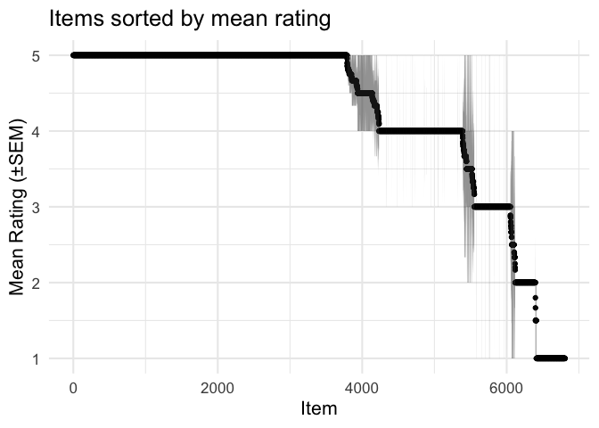
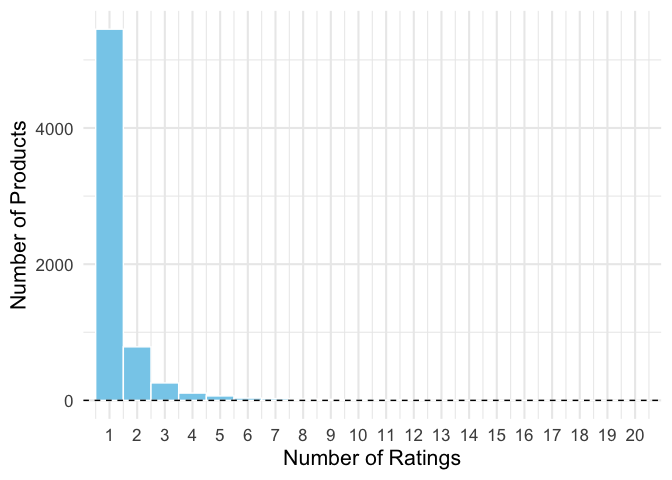
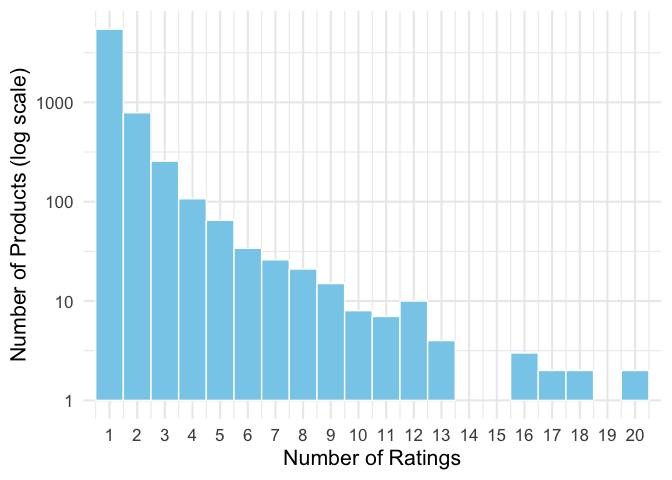
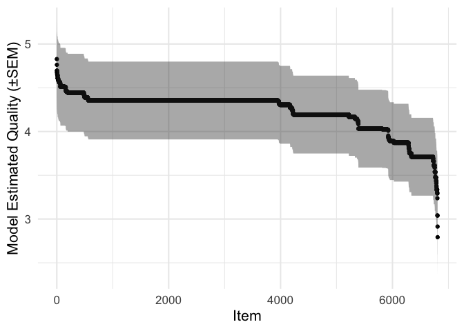
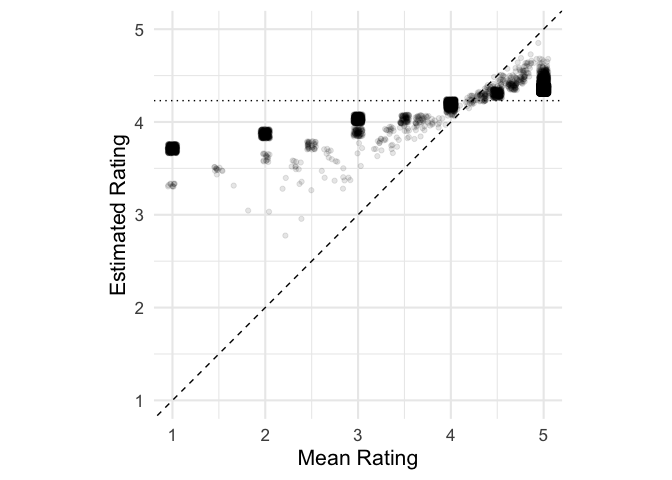
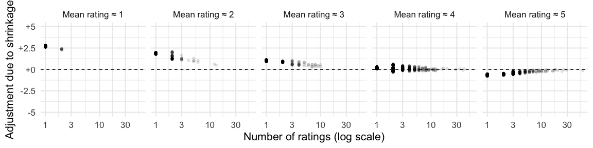
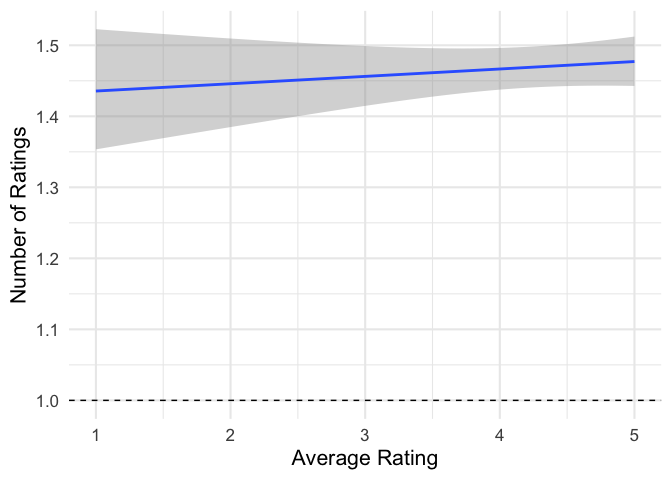

Ranking objects - users, products, content, etc. - by some metric is a
common task faced by data scientists. In real-world data, this can be
tricky, because it’s often the case that some objects have very little
data. The classic example of this is a new restaurant with a single
5-star review. Should it rank above or below a competitor with 4.5 stars
from 5 review? What about a competitor with 4.5 stars from 500 review?

Multilevel models provide a natural solution to this problem. To explain
how they do this, I need to first talk about *priors*. In Bayesian
statistics, your prior about a number represents what you believe that
number is likely to be before seeing any evidence. For example, if a new
product is launched on an online marketplace, and you only know the
product category (e.g. “musical instruments”), what kind of review score
do you think that product will eventually have? Your best guess is
whatever the average review score is for existing products in that
category, and your certainty depends on how variable the existing review
scores are: if 95% of existing products have scores of between 3 and 4,
you’re probably 95% certain that the new product will also be in this
range.

What if the product has a single review? Well, if that review is below
average, chances are the reviews yet to come will be a little better. If
the first review is above average, chances are the next reviews will be
a little worse. This is what we call *regression to the mean*. Your best
guess is now somewhere between average of the existing reviews (your
prior) and the single review score. As more and more reviews come in,
you have more information about the product, so your best guess gets
closer to what the reviews actually say, and is less and less influenced
by the prior. This is the principle behind optimal Bayesian
decision-making.

Our task is a little different. We have a whole collection of products,
some of which have lots of reviews, and some have only a few or a single
review (setting aside the products with no reviews at all). We want to
figure out what our best estimates are for the quality of every product,
based on the reviews we have, taking into account the different number
of reviews per product.

Let’s get started. First, let’s import our R packages, download some
example data, and set up a few utility functions.

```

```r
library(tidyverse)
library(lme4)
theme_set(theme_minimal(base_size = 16))
DOWNLOAD = FALSE

# Some handy functions
round_df = function(df, digits = 2) mutate_if(df, is.numeric, round, digits = digits)
scale_signed = function(x) paste0(ifelse(x >= 0, "+", ""), x)

if(DOWNLOAD){
  curl::curl_download('http://snap.stanford.edu/data/amazon/productGraph/categoryFiles/ratings_Musical_Instruments.csv',
                      'data/reviews.csv')
}
```

Next, we load the data, and because things take a while to run with 500K
rows, select 10K at random to analyse.

```r
full_data = read_csv('data/reviews.csv',
                     col_types = cols(),
                     col_names = c('user', 'item', 'rating', 'timestamp'))
data = sample_n(full_data, 10000)
glimpse(full_data)
## Rows: 500,176
## Columns: 4
## $ user      <chr> "A1YS9MDZP93857", "A3TS466QBAWB9D", "A3BUDYITWUSIS7", "A19K1…
## $ item      <chr> "0006428320", "0014072149", "0041291905", "0041913574", "020…
## $ rating    <dbl> 3, 5, 5, 5, 1, 5, 3, 2, 1, 5, 2, 2, 5, 5, 2, 2, 1, 5, 5, 1, …
## $ timestamp <dbl> 1394496000, 1370476800, 1381708800, 1285200000, 1350432000, …
```

We’ll start with the naive approach: for each product, calculate the
average rating, the standard deviation (SD), along with the number of
ratings, and the standard error of measurement (SD),
$\\text{SEM} = \\frac{\\text{SD}{\\sqrt(N)}$. For products with only a
single rating, the SD and SEM are undefined. We also calculate the
rating ± SEM, useful for plotting.

> Since these reviews can only be integers from 1 to 5, we’re already
> bending some statistical rules by treating them like continuous
> numbers can calculating means, SDs, and SEMs. For example, if a
> product has three reviews of exactly 4/5, this would be impressive
> consistency if reviews of 3.6 or 4.4 were possible, but not so
> impressive since people have to round to the nearest digit. I return
> to this below.


```r
item_ratings = data %>%
  group_by(item) %>%
  summarise(mean = mean(rating),
            n = n(),
            sd = sd(rating)) %>%
  mutate(sem = sd/sqrt(n),
         low = mean - sem,
         high = mean + sem) %>%
  rename(rating = mean)
```

Unsurprisingly, there are plenty of products with 5-star reviews,
but most of these only have a single review.

```r
item_ratings %>%
  arrange(-rating) %>%
  head(10)
## # A tibble: 10 x 7
##    item       rating     n    sd   sem   low  high
##    <chr>       <dbl> <int> <dbl> <dbl> <dbl> <dbl>
##  1 0739046500      5     2     0     0     5     5
##  2 0976615355      5     1    NA    NA    NA    NA
##  3 0977875652      5     2     0     0     5     5
##  4 6305838534      5     1    NA    NA    NA    NA
##  5 B000000906      5     1    NA    NA    NA    NA
##  6 B000000A8E      5     1    NA    NA    NA    NA
##  7 B000000EI6      5     1    NA    NA    NA    NA
##  8 B000000J4J      5     1    NA    NA    NA    NA
##  9 B0000014FR      5     1    NA    NA    NA    NA
## 10 B0000016BZ      5     1    NA    NA    NA    NA
```

```r
item_ratings %>%
  arrange(-rating) %>%
  mutate(ix = 1:n()) %>%
  ggplot(aes(ix, rating, ymin=low, ymax=high)) +
  geom_point() +
  geom_ribbon(alpha = .5) +
  labs(x = 'Item', y = 'Mean Rating (±SEM)',
       title = 'Items sorted by mean rating')
```



One crude solution here is to just look at products with a minimum
number of reviews.

```r
max_n = 20
g = ggplot(item_ratings, aes(n)) +
  geom_histogram(fill = 'skyblue', color = 'white',
                 breaks = seq(.5, max_n+.5)) +
  coord_cartesian(xlim = c(1, max_n)) +
  scale_x_continuous(breaks = 1:max_n) +
  labs(x = 'Number of Ratings',
       y = 'Number of Products')
g + geom_hline(linetype = 'dashed', yintercept = 0)
```



```{r warning=FALSE}
g + scale_y_log10() +
  labs(y = 'Number of Products (log scale)')
```



```r
item_ratings %>%
  filter(n > 5) %>%
  arrange(-rating) %>%
  head(10)
## # A tibble: 10 x 7
##    item       rating     n    sd    sem   low  high
##    <chr>       <dbl> <int> <dbl>  <dbl> <dbl> <dbl>
##  1 B0009RHAT8   5        6 0     0       5        5
##  2 B000B6FBA2   5        8 0     0       5        5
##  3 B000RKL8R2   5        6 0     0       5        5
##  4 B0013MS0RE   5        6 0     0       5        5
##  5 B001PGXHX0   5        8 0     0       5        5
##  6 B006KSM7ZM   5        7 0     0       5        5
##  7 B000SKO0OY   4.96    24 0.204 0.0417  4.92     5
##  8 B000068NW5   4.9     10 0.316 0.1     4.8      5
##  9 B0002KZAKS   4.89     9 0.333 0.111   4.78     5
## 10 B0002F59UE   4.86     7 0.378 0.143   4.71     5
```


## Multilevel Model

The simplest multilevel model for this problem looks as follows:

-   Let *θ*<sub>*i*</sub> be the quality of each individual product *i*.
-   The quality of the products in this category follows a normal
    distribution, with mean *μ* and standard deviation is *σ*:
    *θ*<sub>*i*</sub> ∼ Normal(*μ*, *σ*)
-   Each product *i* has *n* reviews,
    *y*<sub>*i*, 1</sub>, *y*<sub>*i*, 2</sub>, …, *y*<sub>*i*, *n*</sub>,
    where *n* differs for each product.
-   These reviews follow a normal distribution, with mean
    *θ*<sub>*i*</sub> and standard deviation *γ*,
    *y*<sub>*i*</sub> ∼ Normal(*θ*<sub>*i*</sub>, *γ*). We assume the
    standard deviation *γ* is the same for all products.

Let’s go ahead and fit the model, and then we can work through what it’s
doing.

```r
fit = lmer(rating ~ 1 + (1|item), data = data)
summary(fit)
## Linear mixed model fit by REML ['lmerMod']
## Formula: rating ~ 1 + (1 | item)
##    Data: data
##
## REML criterion at convergence: 32037.7
##
## Scaled residuals:
##     Min      1Q  Median      3Q     Max
## -3.2554 -0.1746  0.5013  0.5819  1.8805
##
## Random effects:
##  Groups   Name        Variance Std.Dev.
##  item     (Intercept) 0.2357   0.4855
##  Residual             1.2309   1.1094
## Number of obs: 10000, groups:  item, 6807
##
## Fixed effects:
##             Estimate Std. Error t value
## (Intercept)  4.23080    0.01319   320.7
```

```r
fit_coefs = broom.mixed::tidy(fit) %>% round_df(2)
fit_coefs
## # A tibble: 3 x 6
##   effect   group    term            estimate std.error statistic
##   <chr>    <chr>    <chr>              <dbl>     <dbl>     <dbl>
## 1 fixed    <NA>     (Intercept)         4.23      0.01      321.
## 2 ran_pars item     sd__(Intercept)     0.49     NA          NA
## 3 ran_pars Residual sd__Observation     1.11     NA          NA
```


The main parameters were as follows:

```{r results = 'asis'}
walk2(fit_coefs$estimate, c('μ', 'σ', 'γ'), function(est, term){
  sprintf('\n- %s = %.2f', term, est) %>% cat()
})
```

-   μ = 4.23
-   σ = 0.49
-   γ = 1.11

From the model fit, we can extract out the estimates of *θ* for each
product.

```r
# The average quality, mu
overall_estimate = fixef(fit)[[1]]
# How much each product differs from average
item_estimate_diffs = ranef(fit)$item
item_estimates = overall_estimate + item_estimate_diffs

# We can extract the standard errors for each product.
# This is VERY slow with the full data set, we only use it for plotting,
# and varies very little across products thanks to partial pooling,
# so let's skip it if using the full data set.
if(nrow(item_estimates) > 10000){
  item_sems = rep(.4, nrow(item_estimates))
} else {
  item_sems = arm::se.ranef(fit)$item %>% unname()
}

# Combine this into a data.frame
mlm_item_estimates = data.frame(
  item = rownames(item_estimates),
  model_rating = item_estimates[[1]],
  model_sem = item_sems[[1]]) %>%
  mutate(
    model_low  = model_rating - model_sem,
    model_high = model_rating + model_sem
  )
mlm_item_estimates %>% head() %>% round_df(2)

##         item model_rating model_sem model_low model_high
## 1 0739045067         3.71      0.44      3.27       4.16
## 2 0739046500         4.44      0.44      4.00       4.89
## 3 0739079883         4.31      0.44      3.86       4.75
## 4 0767851013         4.51      0.44      4.06       4.95
## 5 0976615355         4.35      0.44      3.91       4.80
## 6 0977875652         4.44      0.44      4.00       4.89
```

```r
combined_item_ratings = item_ratings %>%
  inner_join(mlm_item_estimates, by = 'item')
combined_item_ratings %>% head() %>% round_df(2)

## # A tibble: 6 x 11
##   item     rating     n    sd   sem   low  high model_rating model_sem model_low
##   <chr>     <dbl> <dbl> <dbl> <dbl> <dbl> <dbl>        <dbl>     <dbl>     <dbl>
## 1 0739045…    1       1 NA     NA    NA      NA         3.71      0.44      3.27
## 2 0739046…    5       2  0      0     5       5         4.44      0.44      4
## 3 0739079…    4.5     2  0.71   0.5   4       5         4.31      0.44      3.86
## 4 0767851…    4.8     5  0.45   0.2   4.6     5         4.51      0.44      4.06
## 5 0976615…    5       1 NA     NA    NA      NA         4.35      0.44      3.91
## 6 0977875…    5       2  0      0     5       5         4.44      0.44      4
## # … with 1 more variable: model_high <dbl>
```

We can see that the range of estimated quality ratings is a lot
narrower, and no items have an estimate of five stars.

```r
combined_item_ratings %>%
  arrange(-model_rating) %>%
  mutate(ix = 1:n()) %>%
  ggplot(aes(ix, model_rating, ymin=model_low, ymax=model_high)) +
  geom_point() +
  geom_ribbon(alpha = .4) +
  labs(x = 'Item', y = 'Model Estimated Quality (±SEM)')
```



These estimates provide a more robust way of ranking the products, and
can be used directly as they are.
```r
combined_item_ratings %>%
  arrange(-model_rating) %>%
  head(10) %>%
  select(item, model_rating, everything()) %>%
  round_df(2)

## # A tibble: 10 x 11
##    item    model_rating rating     n    sd   sem   low  high model_sem model_low
##    <chr>          <dbl>  <dbl> <dbl> <dbl> <dbl> <dbl> <dbl>     <dbl>     <dbl>
##  1 B000SK…         4.83   4.96    24  0.2   0.04  4.92  5         0.44      4.38
##  2 B000UL…         4.76   4.81    58  0.58  0.08  4.73  4.89      0.44      4.32
##  3 B000B6…         4.7    5        8  0     0     5     5         0.44      4.25
##  4 B001PG…         4.7    5        8  0     0     5     5         0.44      4.25
##  5 B00FPP…         4.68   4.76    29  0.58  0.11  4.65  4.87      0.44      4.23
##  6 B006KS…         4.67   5        7  0     0     5     5         0.44      4.23
##  7 B00006…         4.67   4.9     10  0.32  0.1   4.8   5         0.44      4.23
##  8 B0002F…         4.65   4.83    12  0.58  0.17  4.67  5         0.44      4.21
##  9 B000KW…         4.65   4.83    12  0.39  0.11  4.72  4.95      0.44      4.21
## 10 B0002K…         4.65   4.89     9  0.33  0.11  4.78  5         0.44      4.2
## # … with 1 more variable: model_high <dbl>
```

What have we done? Let’s compare the mean ratings and the estimates from
the model for each product. Since so many products only have a single
rating, and so are identical in this plot, I’ve slightly jittered the
points to make them visible.

```r
ggplot(combined_item_ratings, aes(rating, model_rating)) +
  geom_point(alpha = .1,
             position = position_jitter(width = .05,
                                        height = .05)) +
  geom_abline(linetype = 'dashed', intercept = 0, slope = 1) +
  coord_equal(xlim = c(1, 5),
              ylim = c(1, 5)) +
  labs(x = 'Mean Rating', y = 'Estimated Rating') +
  geom_hline(linetype = 'dotted', yintercept = fit_coefs$estimate[1])
```


We can see that in line with the Bayesian idea discussed above, if the
mean rating for a product was less than *μ* = 4.23,
the estimate for that product is shifted upwards (points above the
diagonal line), while if the mean rating is above this value, the
estimate is shifted lower. This adjustment is known as *shrinkage*: the
estimates are *shrunk* towards the group mean.

By how much the estimate is shifted depends on how reliable each
product’s data is, which here depends on the number of ratings, and to a
lesser extent on the variability of those ratings. The less reliable an
average rating is, and the further it is from the average, the more it
is adjusted towards the average.

```r
combined_item_ratings %>%
  mutate(shrinkage = model_rating - rating,
         binned_rating = sprintf('Mean rating ≈ %i', round(rating))) %>%
  ggplot(aes(n, shrinkage)) +
  facet_wrap(~binned_rating, ncol = 5) +
  geom_point(alpha = .1,
             position = position_jitter(height=.1, width=0)) +
  geom_hline(linetype = 'dashed', yintercept = 0) +
  scale_x_log10() +
  scale_y_continuous(labels = scale_signed) +
  coord_cartesian(ylim = c(-5, 5)) +
  labs(x = 'Number of ratings (log scale)', y = 'Adjustment due to shrinkage')
```



## Further Considerations

The analysis above is a big improvement on just using the average
ratings, but there is still room for improvement. I’ll finish by
discussing a few ways this approach could be improved upon.

### Discrete Ratings

As mentioned above, these ratings aren’t on a proper interval scale:
reviewers can only select a digit from 1 to 5, and we can’t be sure that
the difference between 1 and 2, for instance, is really the same as the
difference between 4 and 5. This is an issue for our naive analysis,
where we calculate simple means and SDs, and for our multilevel model.

Fortunately, this can be addressed by using an *ordinal logistic*
multilevel model, which treats the five response options as ordered
categories rather than continuous numbers. See
[here](https://stats.stackexchange.com/a/238675) for tools that allow
you to fit these models in R.

### Missing Data

We only have some ratings, by some users, of some products. We assume in
the analyses above that the number of reviews a product gets is
completely random, and doesn’t depend on the quality of the product. Is
this assumption reasonable? Let’s check.

```r
ggplot(item_ratings, aes(rating, n)) +
  # Fit a poisson regression
  stat_smooth(formula = y ~ x, method = 'glm',
              method.args = list(family = 'poisson')) +
  geom_hline(linetype = 'dashed', yintercept = 1) +
  labs(x = 'Average Rating', y = 'Number of Ratings')
```


It looks like produces with more positive average rating (better
products?) also get reviewed more often. This makes sense, if you think
that people are more likely to buy, and so go on to review, highly-rated
products.

This will bias our estimate of the average product quality, for fairly
complicated reasons: high quality products receive more reviews, so
their ratings are more reliable, and so they play a bigger role in
estimating *μ*. There are lots of methods in the literature for dealing
with systematic missing data like this, but few of them are simple.

Fortunately, this does not affect the relative ranking of each product,
so our main results are safe.
