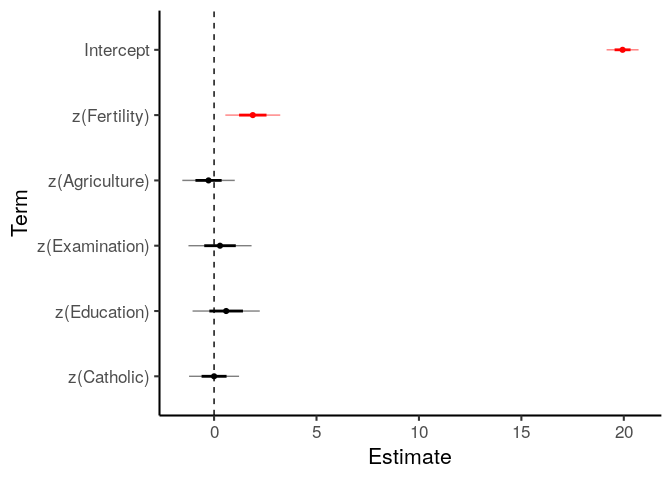
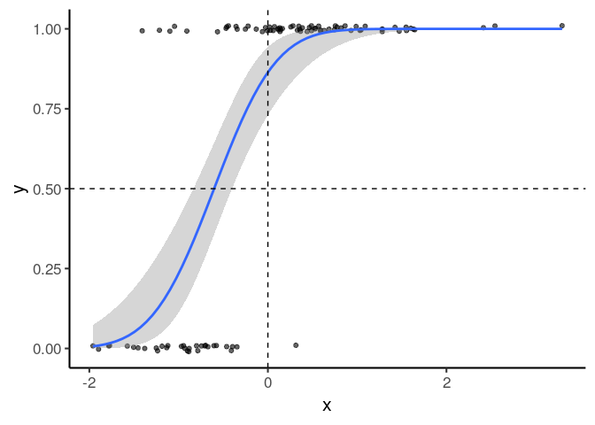
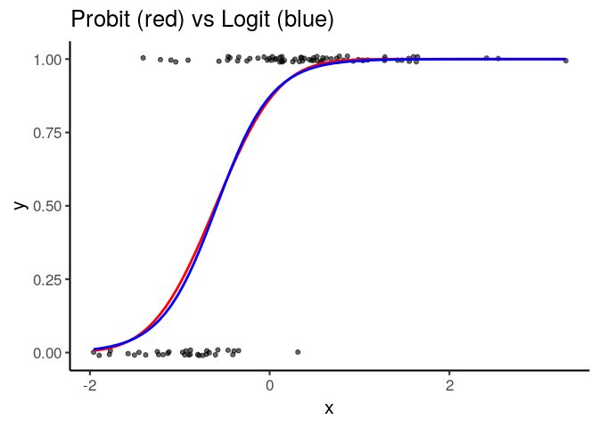
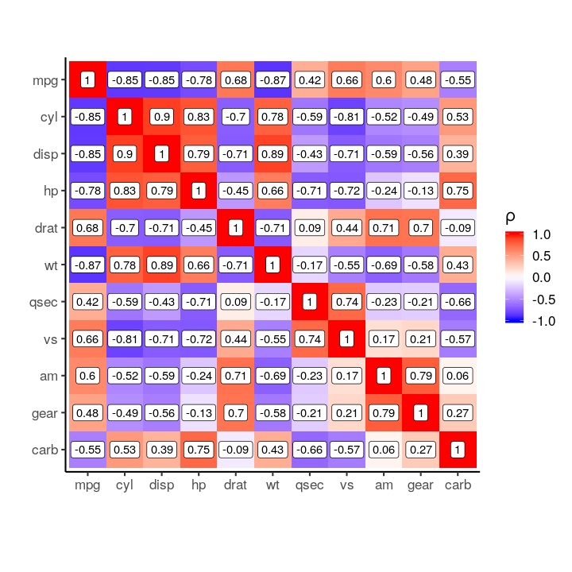
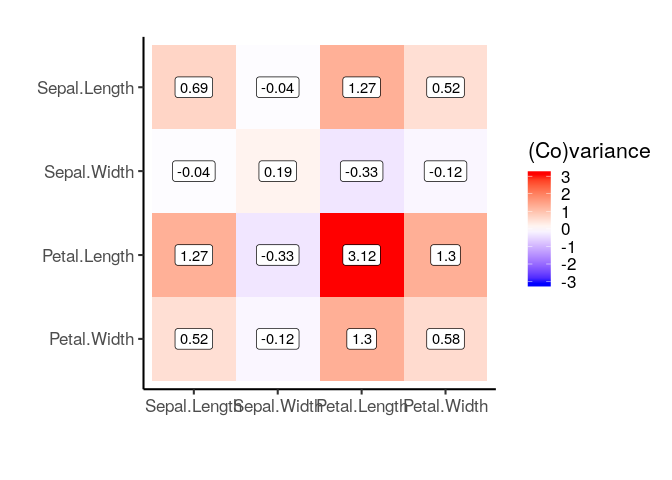
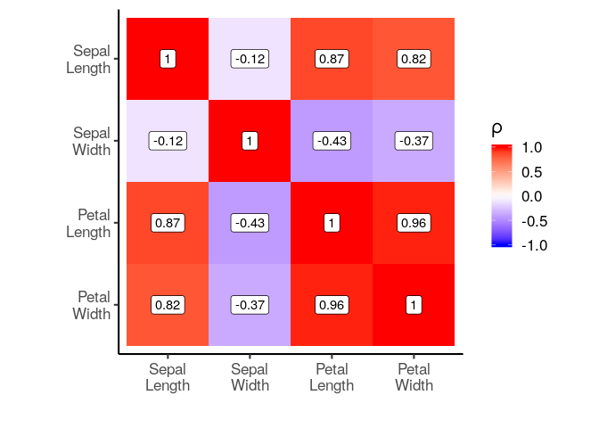
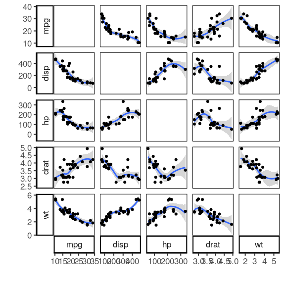
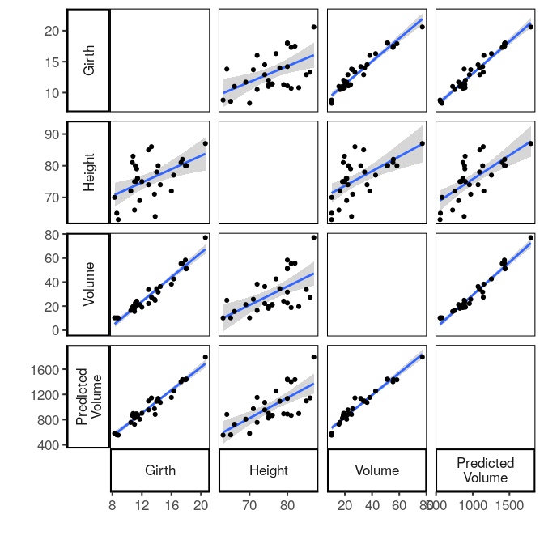

Over the years, I’ve put together a pretty big file of R functions,
called ‘eoin.R’, that I’m in the habit of `source()`ing for every
anlysis. Right now, I’m in the process of working through the [R
Packages](https://r-pkgs.org/) book and packaging up this code as a
proper, fully fledged package.

I’m taking a break from this to show off some of the ggplot-oriented
functions that have grown up in this file. These functions, or improved
versions of them, will eventually be available in my package, but if
there’s anything you like the look of, go right ahead and copy, paste,
and tweak.

``` r
library(tidyverse)
```

    ## ── Attaching packages ─────────────────────────────────────── tidyverse 1.2.1 ──

    ## ✔ ggplot2 3.2.1     ✔ purrr   0.3.3
    ## ✔ tibble  2.1.3     ✔ dplyr   0.8.3
    ## ✔ tidyr   1.0.0     ✔ stringr 1.4.0
    ## ✔ readr   1.3.1     ✔ forcats 0.4.0

    ## ── Conflicts ────────────────────────────────────────── tidyverse_conflicts() ──
    ## ✖ dplyr::filter() masks stats::filter()
    ## ✖ dplyr::lag()    masks stats::lag()

``` r
theme_set(theme_classic(base_size = 16))
```

First, this block contains functions that are’t very interesting
themselves, but necessary for some of the other stuff to work.

``` r
center  = function(x) x - mean(x, na.rm = T)
z = function(x){
  cx = center(x)
  cx / sd(cx, na.rm = T)
}

#' Replace values if a substitute is defined
#' 
#' @param x Vector of strings
#' @param sub_list A named list of substitutes
#' @return A modified vector
#' 
#' @examples 
#' x = c('ugly', 'something else')
#' sub_list = list('ugly'='Pretty', 'Nasty'='Nice')
#' replace_if_found(x, sub_list)
#' @export
replace_if_found = function(x, sub_list){
  .can.replace = x %in% names(sub_list)
  x[.can.replace] = purrr::map_chr(x[.can.replace], ~sub_list[[.]])
  x
}

#' Round numeric columns
#'
#' @param df Input data.frame
#' @param digits Digits to round to
#' @return Rounded data.frame
#' @export
round_df <- function(df, digits) {
  dplyr::mutate_if(df, is.numeric, round, digits=digits)
}


#' Gathers a matrix into a long data frame
#' @export
gather_matrix = function(mat) {
  mat %>%
    data.frame() %>%
    tibble::rownames_to_column('var1') %>%
    gather(var2, value, -var1)
}

#' Gather data into very long data.frame of pairwise comparisons
#' 
#' @description 
#' Gather data into very long data.frame of pairwise comparisons,
#' with columns c(xvar, yvar, x, y).
#' If input has n rows, m columns, output has n * (m^2 - m) rows (and 4 columns).
#' 
#' @param df Data frame to gather
#' @return Data frame with one row per pairwise comparison
#'         
#' @export
gather_pairwise = function(df){
  order = names(df)
  f = function(df, .xvar){
    df %>% gather(yvar, y, -.xvar) %>%
      rename(x=.xvar) %>% mutate(xvar=.xvar) %>%
      select(xvar, yvar, x, y) %>%
      return()
  }
  res = names(df) %>% map_df(f, df=df) %>%
    mutate(xvar = factor(xvar, levels = order),
           yvar = factor(yvar, levels = order))
  res
}
```

Coefficient Plots
=================

`coef_table` produces a data frame of coefficients from a model fit with
`lm`, `glm`, `lmer`, or `glmer`.

``` r
#' Coefficient table of model coefficients/fixed effects
#' @param model A model object
#' @param digits Number of digits to round to (default 2)
#' @param ci Calculate 95\% confidence intervals? (defualt FALSE)
#' @return data.frame, with one row per term, which can be passed to further functions
#' @examples
#' m = lm(Sepal.Width ~ Sepal.Length, data=iris)
#' coef_table(m, ci=TRUE)
#' @export
coef_table = function(model, digits=2, ci=FALSE){
  .nicer.col.names = list('Estimate'='b', 'Std..Error'='se',
                          'Pr...t..'='p.value', 'Pr...z..'='p.value')
  res = model %>%
    summary() %>%
    coef() %>%
    data.frame() %>%
    tibble::rownames_to_column('term')
  if(ci){
    conf.intervals = confint(model, method='Wald') %>%
      data.frame() %>% tibble::rownames_to_column('term')
    colnames(conf.intervals) = c('term', 'CI_low', 'CI_high')
    res = dplyr::left_join(res, conf.intervals, by='term')
  }
  colnames(res) = replace_if_found(colnames(res), .nicer.col.names)
  res %>%
    dplyr::mutate(term = stringr::str_replace(term, '\\(Intercept\\)', 'Intercept')) %>%
    round_df(digits)
}
```

``` r
m_linear = lm(Infant.Mortality ~ 
                z(Fertility) + z(Agriculture) + 
                z(Examination) + z(Education) + z(Catholic), 
              data=swiss)
coef_table(m_linear, ci=TRUE)
```

    ##             term     b   se t.value p.value CI_low CI_high
    ## 1      Intercept 19.94 0.39   50.96    0.00  19.15   20.73
    ## 2   z(Fertility)  1.89 0.67    2.82    0.01   0.54    3.24
    ## 3 z(Agriculture) -0.27 0.64   -0.42    0.68  -1.56    1.02
    ## 4 z(Examination)  0.29 0.77    0.38    0.70  -1.25    1.84
    ## 5   z(Education)  0.59 0.82    0.72    0.48  -1.06    2.23
    ## 6    z(Catholic)  0.00 0.61    0.00    1.00  -1.22    1.23

`plot_coefs` takes the output of `coef_table` and plots it, with error
bars of one and two standard errors (two SE approximately corresponds to
the 95% confidence interval).

``` r
plot_coefs = function(table_of_coefs, mark_sig=FALSE){
  # Ensure plotting is in order given
  table_of_coefs$term = factor(table_of_coefs$term, levels=rev(table_of_coefs$term)) 
  if(mark_sig){
    table_of_coefs$sig = table_of_coefs$p.value < .05
    g = ggplot(table_of_coefs, aes(term, y=b, color=sig)) +
      scale_color_manual(values=c('black', 'red')) +
      theme(legend.position = 'none')
  } else {
    g = ggplot(table_of_coefs, aes(term, y=b))
  }
  g = g + geom_point() + 
    geom_linerange(mapping=aes(ymin=b-se, ymax=b+se), size=1) +       # ±1SE with thick line
    geom_linerange(mapping=aes(ymin=b-2*se, ymax=b+2*se), alpha=.5) + # ±2SE with thin line
    geom_hline(yintercept=0, linetype='dashed') +
    coord_flip() +
    labs(x='Term', y='Estimate')
  g
}
```

``` r
m_linear %>%
  coef_table() %>%
  plot_coefs(mark_sig = TRUE)
```



Sophisticated plots can be created by preprocessing the data before
passing it to `coef_plot`.

``` r
# A more complicated model
model_interactions = lm(Infant.Mortality ~ 
                          z(Fertility) * z(Agriculture) *
                          z(Examination) * z(Education) * z(Catholic), 
                        data=swiss)

model_interactions %>% 
  coef_table() %>% 
  filter(term != 'Intercept') %>%  # Don't show the intercept
  mutate(term = term %>%
           str_remove_all('[z\\(\\)]') %>% # Remove brackets and opening 'z'
           str_replace_all(':', ' × '),    # Pretty interaction terms
         # Sort by term order: 0 for main effects, 1 for first-order interactions, etc.
         term.order = str_count(term, '×')) %>%
  arrange(term.order, term) %>% # Sort by 
  plot_coefs(mark_sig = TRUE)
```


If you want to modify the function code to produce your own custom
plots, the simplified version is below. Copy, paste, and edit as needed.

``` r
table_of_coefs = coef_table(m_linear)

# Ensure terms are in the order given
table_of_coefs$term = factor(table_of_coefs$term, levels=rev(table_of_coefs$term)) 
table_of_coefs$sig = table_of_coefs$p.value < .05
ggplot(table_of_coefs, aes(term, y=b, color=sig)) +
  geom_point() +
  geom_linerange(mapping=aes(ymin=b-se, ymax=b+se), size=1) +       # ±1SE with thick line
  geom_linerange(mapping=aes(ymin=b-2*se, ymax=b+2*se), alpha=.5) + # ±2SE with thin line
  scale_color_manual(values=c('black', 'red')) +
  geom_hline(yintercept=0, linetype='dashed') +
  coord_flip() +
  theme(legend.position = 'none') +
  labs(x='Term', y='Estimate')
```


Binomial Smooth
===============

`ggplot2::stat_smooth()` let’s you fit a straight line or a loess wiggle
to your data. The new `binomial_smooth()` function lets you do the same
for logistic models or probit psychometric curves.

I don’t know good built-in data for this, so let’s simulate some.

``` r
n = 100
bias = .5
slope = 2
x = rnorm(n)
xhat = x + rnorm(n, 0, 1/slope)
y = ifelse(xhat > -bias, 1, 0)
df = data.frame(x, y)
```

``` r
#' Fit and plot a GLM (e.g. probit regression) to the data
#' 
#' @description 
#' This is a drop-in replacement for ggplot2::geom_smooth, and any 
#' additional arguments will be passed to that function.
#' 
#' Default's to probit regression, AKA the psychometric function.
#' 
#' @param link Link function to use. Tested with 'probit' and 'logit'
#' @export

binomial_smooth = function(link='probit', ...){
  geom_smooth(method = 'glm', 
              method.args = list(family=binomial(link=link)), ...)
}

ggplot(df, aes(x, y)) +
  geom_point(position = position_jitter(height=.01), alpha=.6) +
  binomial_smooth() +
  geom_hline(yintercept=.5, linetype='dashed') +
  geom_vline(xintercept=0, linetype='dashed')
```



``` r
ggplot(df, aes(x, y)) +
  geom_point(position = position_jitter(height=.01), alpha=.6) +
  binomial_smooth('probit', color='red', se=FALSE) +
  binomial_smooth('logit', color='blue', se=FALSE) +
  labs(title='Probit (red) vs Logit (blue)')
```



Correlation/Covariance Matrices
===============================

``` r
#' Plot matrix as heatmap
#' @description 
#' `plot_covariance_matrix()` adds an appropriate `fill_label`
#' `plot_correlation_matrix()` also sets limits to ±1
#' 
#' @param mat Matrix to plot
#' @param labeller Function or list used to rename rows/cols
#' @param digits Digits to round values to (default 2)
#' @param limit Limit (±) of colour scale. Defaults to `abs(max(value))`
#' @param fill_label Label to use for colourscale
#' @param fill_gradient Optional custom fill gradient (default blue-white-red)
#' 
#' @examples 
#' iris %>%
#'   select_if(is.numeric) %>% 
#'   cor() %>%
#'   plot_correlation_matrix()
#'
#' @export
plot_matrix = function(mat, labeller=NULL, 
                       digits=2, limit=NULL, fill_label=NULL,
                       fill_gradient=NULL) {
  var_order = colnames(mat)
  df = gather_matrix(mat) %>%
    mutate(var1 = factor(var1, levels=var_order),
           var2 = factor(var2, levels=rev(var_order)))
  if(is.null(limit)){
    limit = abs(max(df$value))
  }
  # Handle labels
  if(is.function(labeller)){
    levels(df$var1) = labeller(levels(df$var1))
    levels(df$var2) = labeller(levels(df$var2))
  } else if (is.list(labeller)){
    levels(df$var1) = replace_if_found(levels(df$var1), labeller)
    levels(df$var2) = replace_if_found(levels(df$var2), labeller)
  }
  g = df %>%
    ggplot(aes(var1, var2, fill=value, label=round(value, digits))) +
    geom_tile() +
    geom_label(fill='white') +
    coord_fixed() +
    labs(x='', y='', fill=fill_label)
  # Use default gradient (blue-white-red), or apply custom one.
  if(is.null(fill_gradient)){
    g = g + scale_fill_gradient2(low='blue', mid='white', high='red', 
                                 limits=c(-limit, limit))
  } else {
    g = g + fill_gradient
  }
  g
}
#' @rdname plot_matrix
#' @export
plot_covariance_matrix = function(cov_mat, ...){
  plot_matrix(cov_mat, fill_label='(Co)variance', ...)
}

#' @rdname plot_matrix
#' @export
plot_correlation_matrix = function(cor_mat, ...){
  plot_matrix(cor_mat, limit=1, fill_label='ρ', ...)
}
```

``` r
mtcars %>%
  cor() %>%
  plot_correlation_matrix()
```



``` r
cov_matrix = iris %>%
  select_if(is.numeric) %>% cov()
plot_covariance_matrix(cov_matrix)
```



``` r
# Same as
# plot_matrix(cov_matrix, fill_label='(Co)variance')
```

``` r
cor_matrix = iris %>% select_if(is.numeric) %>% cor()
# Use custom labelling function
labeller = function(x) str_replace(x, '\\.', '\n')
plot_correlation_matrix(cor_matrix, labeller = labeller)
```



``` r
# We can also provide a list of labels
label_list = list('Petal.Width'='W(Petal)', 
                  'Petal.Length'='L(Petal)',
                  'Sepal.Width'='W(Sepal)', 
                  'Sepal.Length'='L(Sepal)')
plot_correlation_matrix(cor_matrix, labeller = label_list)
```


Pairwise plots
==============

``` r
plot_pairwise = function(df, smooth='loess'){
  res = gather_pairwise(df)
  g = ggplot(res, aes(x, y)) +
    facet_grid(yvar~xvar, scales='free', margins=F, switch='both', shrink=F)
  if(!is.null(smooth)){
    g = g + stat_smooth(method=smooth)
  }
  g = g +
    geom_point() +
    labs(x='', y='') +
    theme(panel.border = element_rect(colour = "black", fill=NA))
  g
}
```

``` r
mtcars %>% select(mpg, disp, hp, drat, wt) %>% plot_pairwise()
```



``` r
iris %>% select(-Species) %>% plot_pairwise(smooth=NULL)
```


``` r
trees %>%
  mutate(`Predicted\nVolume` = Height*Girth) %>%
  plot_pairwise(smooth='lm')
```


