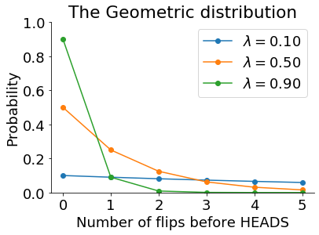
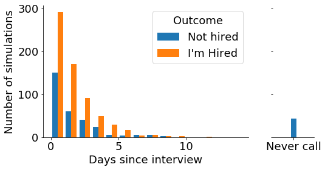
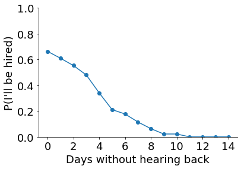
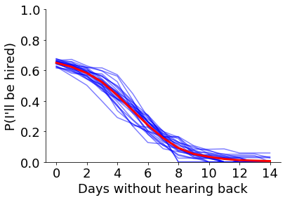
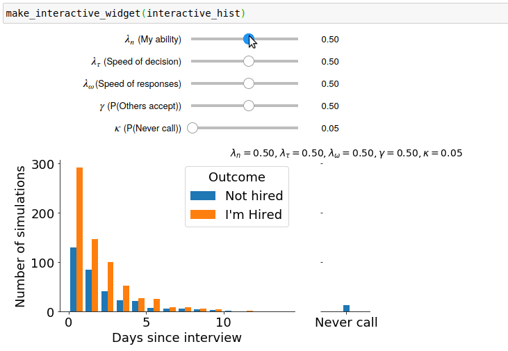
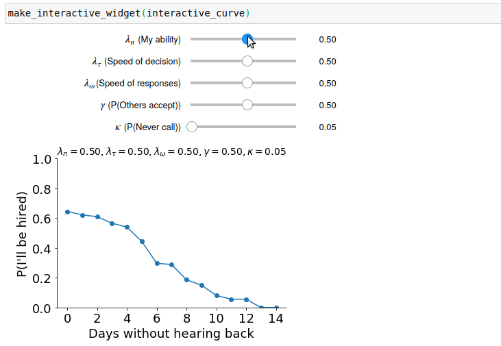

> Click the button below to run an interactive version of this post in Google Colab.
> There are some nice interactive widgets here that run on Colab, but have been replaced by GIFs 
> on this blog. If you're not playing with the widgets yourself, you're missing out.

[](https://colab.research.google.com/drive/1t4zWK_xfoNRxMtzS3b5qQ-8bavBGAnkT?usp=sharing)

Not too long ago, I interviewed for a job that I  was quite keen on getting.
It's now been $d$ days, and I haven't heard back.
Are they going to phone me?
Most people in this situation would try not to worry about it too much.
Unlike most people, however, I know *Monte Carlo methods*!
In this post, 
I use a *Bayesian Monte Carlo* approach
to estimate the probability that they're going to phone and offer me a job.
Here goes.

## Monte Carlo Methods

In Monte Carlo methods, we use simulations to estimate quantities that are difficult to otherwise calculate.
I've written a little more about Monte Carlo methods [here](eointravers.com/post/montecarlo/).
In this case, we're going to simulate how companies hire people after an interview.
To do this, we're going to assume a particular model of how this works,
and we're going to make some assumptions about the parameters of this model.
For example, we're going to make assumptions about the likelihood that other candidates better than me,
the number of days it takes for a company to make a decision,
and the probability of someone turning down the job if offered it.
We want to combine this information with our single data point -
how many days have passed without me hearing from them -
and use this combined knowledge to make predictions about the world.

In Bayesian terms, we can say we're assuming 
a particular model $\mathcal{M}$,
with prior estimates $P(\theta)$ for our model parameters $\theta$.
to make predictions about some other quantity,
$P(y | \theta, x)$.
If this isn't clear, don't stress,
as we'll be working through a concrete example.


## How do companies hire?

Let's imagine a simple model of how hiring works.
We'll assume

- Of the interview candidates, $n$ were better than me.
  If $n=0$, I'm the first choice. $n=1$ means I'm the second preference, and so on.
  We don't know the value of $n$, but we can make some weak assumptions.
  Since this is a Bayesian analysis, we can use a prior distribution to encode
  what values of $n$ we think are likely. 
  For now, we'll call this prior distribution $P(n)$.
  We can flesh out these distributions later.
- It takes a company $\tau$ days to make a decision. 
  We'll call our prior distribution for this $P(\tau)$.
- If someone who isn't me is offered the job,
  there probability that they'll accept is $\gamma$.
  We'll assume a single value of $\gamma$, 
  but explore the effects of varying this  value.
- It takes someone $\omega$ days to decide 
  whether or not to accept the job and to let the company know.
  Again, we'll assume a prior distribution $P(\omega)$.
- Finally, there is some probability, $\kappa$,
  that the company just never phones me back.
  I originally left this part of the model out,
  but without it the model produces some weird predictions 
  after long intervals.
  


What do our prior distributions look like?
In this problem, the **[geometric distribution](https://en.wikipedia.org/wiki/Geometric_distribution)** is a nice option for all three of our priors:
$P(n)$, $P(\tau)$, and $P(\omega)$.
The easiest way to think of the geometric distribution
is that it describes the number of coin tosses 
you would expect to come up tails before one comes up heads.
It has only one parameter, which we'll call $\lambda$,
which is the probability of each individual toss coming up heads.
With different values of $\lambda$, it looks like this:


```python
# Import stuff
import numpy as np
from scipy import stats
import pandas as pd
import matplotlib.pyplot as plt
from matplotlib import rcParams
import seaborn as sns
# Set up plots defaults
rcParams['figure.figsize'] = (6, 4)
rcParams['font.size'] = 18
rcParams['axes.spines.top'] = False
rcParams['axes.spines.right'] = False
```


```python
n_flips = np.arange(6)
lambdas = [.1, .5, .9]
for l in lambdas:
    # Calculate mass for n_flips + 1 to get 
    # number of tails before first heads
    # See https://en.wikipedia.org/wiki/Geometric_distribution
    d = stats.geom.pmf(n_flips + 1, p=l)
    plt.plot(n_flips, d, '-o',
             label='$\lambda = %.2f$' % l)
plt.legend()
plt.xlabel('Number of flips before HEADS')
plt.ylabel('Probability')
plt.ylim(0, 1)
plt.title('The Geometric distribution');
```





Our prior distributions are

$$
\begin{align}
n      &\sim \text{Geom}(\lambda_n)\newline
\tau   &\sim \text{Geom}(\lambda_{\tau})\newline
\omega &\sim \text{Geom}(\lambda_{\omega})\newline
\end{align}
$$

$\lambda_{\tau}$ and $\lambda_{\omega}$ have simple interpretations
as the probability that the company will reach a decision ($\tau$)
and the probability that a candidate will decide whether to take the job ($\omega$)
with each day that does by.
$\lambda_n$ isn't as easy to interpret,
and we might wish to consider other parameterisations,
but this works well enough for a half-serious blog post.
Lower values of $\lambda_n$ reflect higher probabilities
than I'm the best candidate. With higher values, it becomes
increasingly likely that there will be several candidates better than me.

For our other two parameters, $\gamma$ and $\kappa$, we're going to
just assume a single value as our prior. Recall that $\gamma$ is the
probability that someone will take the job if offered it, while
$\kappa$ is the probability that the company forgets to contact me if
I don't get the job.

All of this leaves us with just four prior parameters we need to set:
$\theta = [\lambda_n, \lambda_{\tau}, \lambda_{\omega}, \gamma, \kappa]$.

> I'm referring to these quantitites as *priors*:
> Infomation we know in advance, before seeing the current data.
> In Bayesian inference, we often want to update our prior beliefs in light of new evidence,
> for example by expecting decisions to be made quickly 
> at future interviews if a decision is made quickly here.
> In this case, we only want to make a prediction about the current scenario.

This model specifies what data we'll see under different circumstances.

- If I'm the best candidate ($n = 0$),
  I'll be offered the job after $\tau$ days,
  where $\tau \sim P(\tau)$
  (the decision time is drawn randomly from the prior distribution of likely decision times).
- If $n$ candidates are better than me,
  and the $m$th candidate accepts the job,
  I'll be told the bad news after $\tau + \omega_1 + \omega_2 + \dots + \omega_m$ days,
  where $\omega \sim P(\omega)$
  (the times taken for each candidate to make up their minds
  is drawn randomly from the prior distribution of likely times).
- If $n$ candidates are better than me,
  but they all turn down the job,
  I'll be offered the job after $\tau + \omega_1 + \omega_2 + \dots + \omega_n$ days,
  where $\omega \sim P(\omega)$.
- In simulations where I'm not offered a job, $\kappa$ is the probability 
  that I'll never hear from them (which the model captures as an infinite waiting time).


## Simulating the world

To begin, let's write a function that runs a single simulation.
This code will be slow, but relatively easy to understand.


```python
def do_simulation(theta: list):
    '''Run one simulation of the hiring process.
    `theta` is a list/array of [lambda_n, lambda_tau, lambda_omega, gamma, kappa]
    Returns (n, tau, days_to_call, job_for_me)
    '''
    lambda_n, lambda_tau, lambda_omega, gamma, kappa = theta
    # Sample one value of n and tau from their priors
    n = stats.geom(lambda_n).rvs() - 1      # Candidates ahead of me
    tau = stats.geom(lambda_tau).rvs() - 1  # Days to make initial decision
    job_for_me = True     # Set to False if someone else gets it first
    total_omega = 0
    for m in range(n):
        omega = stats.geom(lambda_omega).rvs() - 1  # Time taken for them to respond
        total_omega += omega
        they_take_job = stats.binom(p=gamma, n=1).rvs()
        if they_take_job:
            job_for_me = False
            if stats.binom(p=kappa, n=1).rvs():
                # They never call
                total_omega = np.inf
            break
    days_to_call = tau + total_omega
    return n, tau, total_omega, days_to_call, job_for_me
```


```python
# Let's run it a few times to make sure it works.
theta = [.5, .5, .5, .5, .1]
for i in range(5):
    print(do_simulation(theta))
```

```txt    
(3, 0, 1, 1, False)
(0, 0, 0, 0, True)
(2, 2, 0, 2, True)
(0, 0, 0, 0, True)
(1, 0, inf, inf, False)
```

This is all very good, but our code is slow.
Let's try to run 1000 simulations.


```python
def do_slow_simulations(theta: list, nsims=1000):
    sims = [do_simulation(theta)
            for i in range(nsims)]
    return pd.DataFrame(sims, columns=['n', 'tau', 'total_omega', 'days_to_call', 'job_for_me'])

%time slow_sims = do_slow_simulations(theta, nsims=1000)
```

```txt
CPU times: user 2.71 s, sys: 30.7 ms, total: 2.74 s
Wall time: 2.76 s
```

Since we'll want to run lots of simulations with different parameters,
it's worth rewriting our code in a way that's a little harder to follow,
but much faster to run.
Since we've written the clean, slow code, 
we can always compare the results to make sure we've not doing anything stupid in our faster version.


```python
def do_simulations(theta: list, nsims=1000):
    '''Simulation hiring process `nsims` times.
    `theta` is a list/array of [lambda_n, lambda_tau, lambda_omega, gamma]
    Returns pd.DataFrame with columns ['job_for_me', 'days_before_call']
    '''
    lambda_n, lambda_tau, lambda_omega, gamma, kappa = theta
    # Days to make initial decision.
    tau = stats.geom(lambda_tau).rvs(nsims) - 1
    # Candidates ahead of me.
    n = stats.geom(lambda_n).rvs(nsims) - 1
    # N candidates who turn down the job before one accepts it.
    m = stats.geom(gamma).rvs(nsims) - 1
    n_called_before_me = np.where(n < m, n, m)
    # I get the job if everyone ahead of me turns it down.
    job_for_me = np.where(m >= n, 1, 0)
    # Vector of response times for every candidate
    _omega = stats.geom(lambda_omega).rvs(m.sum() * nsims) - 1
    # Total response times for all candidates ahead of me in each simulation
    total_omega = np.array([np.sum(_omega[i:i+_n]) 
                            for i, _n in enumerate(n_called_before_me)])
    # Some chance they'll never call
    never_call = stats.binom(p=kappa, n=1).rvs(nsims)
    # But only in cases where I don't get the job
    never_call = np.where(job_for_me, 0, never_call)
    days_to_call = np.where(never_call==0,
                            # Decision time plus response time of people ahead of me
                            tau + total_omega,
                            np.inf)
    result = pd.DataFrame([n, tau, total_omega, days_to_call, job_for_me], 
                          index=['n', 'tau', 'total_omega', 'days_to_call', 'job_for_me']).T
    return result
```


```python
%time sims = do_simulations(theta, nsims=1000)
sims.head(5)
```

```txt
CPU times: user 120 ms, sys: 1.05 ms, total: 121 ms
Wall time: 123 ms
```


<div>
<style scoped>
    .dataframe tbody tr th:only-of-type {
        vertical-align: middle;
    }

    .dataframe tbody tr th {
        vertical-align: top;
    }

    .dataframe thead th {
        text-align: right;
    }
</style>
<table border="1" class="dataframe">
  <thead>
    <tr style="text-align: right;">
      <th></th>
      <th>n</th>
      <th>tau</th>
      <th>total_omega</th>
      <th>days_to_call</th>
      <th>job_for_me</th>
    </tr>
  </thead>
  <tbody>
    <tr>
      <th>0</th>
      <td>0.0</td>
      <td>0.0</td>
      <td>0.0</td>
      <td>0.0</td>
      <td>1.0</td>
    </tr>
    <tr>
      <th>1</th>
      <td>0.0</td>
      <td>2.0</td>
      <td>0.0</td>
      <td>2.0</td>
      <td>1.0</td>
    </tr>
    <tr>
      <th>2</th>
      <td>2.0</td>
      <td>0.0</td>
      <td>0.0</td>
      <td>0.0</td>
      <td>0.0</td>
    </tr>
    <tr>
      <th>3</th>
      <td>0.0</td>
      <td>3.0</td>
      <td>0.0</td>
      <td>3.0</td>
      <td>1.0</td>
    </tr>
    <tr>
      <th>4</th>
      <td>1.0</td>
      <td>0.0</td>
      <td>0.0</td>
      <td>inf</td>
      <td>0.0</td>
    </tr>
  </tbody>
</table>
</div>


```python
# Let's take a look at our simulations
def plot_sims_hist(sims: pd.DataFrame):
    '''Plot simulated outcomes as a histogram'''
    days = [df['days_to_call'].values for days, df in sims.groupby('job_for_me')]
    fig, axes = plt.subplots(1, 2, figsize=(8, 4), sharey=True,
                             gridspec_kw={'width_ratios': [5, 1]})
    plt.sca(axes[0])
    bins = np.arange(0, 15, 1)
    plt.hist(days, label=["Not hired", "I'm Hired"], bins=bins)
    plt.legend(title='Outcome')
    plt.xlabel('Days since interview')
    plt.ylabel('Number of simulations')
    plt.sca(axes[1])
    plt.bar(0, np.sum(days[0]==np.inf), width=.25)
    plt.xlim(-1, 1)
    axes[1].spines['left'].set_visible(False)
    plt.xticks([0], ['Never call'])
    return fig, axes

plot_sims_hist(sims);
```





# Have I got the job?

With these simulation parameters, the estimated probability that I will be offered the job eventually 
is just the proportion of simulations in which I'm offered the job.


```python
sims['job_for_me'].mean()
```

```txt
0.662
```

However, $d$ days have already passed without me hearing back.
What is the probability I'll be offered the job now?
To find out, we just have to check on what proportion of simulations
*where I haven't heard back by day $d$* 
do I go on to be offered the job.


```python
d = 7  # Let's say I haven't heard back in 7 days.
sims[sims['days_to_call'] > d]['job_for_me'].mean()
```

```txt
0.11538461538461539
```


We can repeat this over a range of days to see how the probability 
changes with each day that goes by.


```python
def plot_curve(sims):
    '''Plot prob. I've got the job after d days'''
    days = np.arange(0, 15)
    conditional_outcomes = [sims[sims['days_to_call'] > d]['job_for_me'] for d in days]
    prob = np.array([x.mean() for x in conditional_outcomes])
    plt.plot(days, prob, '-o')
    plt.xlabel('Days without hearing back')
    plt.ylabel("P(I'll be hired)")
    plt.ylim(0, 1)
    plt.xticks(days[::2]);
    
plot_curve(sims)
```





The curve is a little noisy due to the random nature of the simulations,
but clearly shows that the chance of being hired drops over time.
We can see how noisy the results are by repeating the simulations a few times.
**This isn't the same thing as "sampling from the posterior" in Bayesian stats.
This variability only occurs because we're running a limited number of simulations.
With an infinite number of simulations, we would get the same curve every time.**


```python
def plot_repeated_curve(theta, nsims=1000, nreps=25):
    '''Plot repeated simulation curves. 
    Note that input is parameter list theta,
    and not simulation results as in the other plotting functions.'''
    days = np.arange(0, 15)
    all_probs = []
    for i in range(nreps):
        sims = do_simulations(theta, nsims=nsims)
        conditional_outcomes = [sims[sims['days_to_call'] > d]['job_for_me'] for d in days]
        prob = np.array([x.mean() for x in conditional_outcomes])
        all_probs.append(prob)
        plt.plot(days, prob, alpha=.5, color='b')
    mean_prob = np.array(all_probs).mean(0)
    plt.plot(days, mean_prob, color='r', linewidth=3)
    plt.xlabel('Days without hearing back')
    plt.ylabel("P(I'll be hired)")
    plt.ylim(0, 1)
    plt.xticks(days[::2])
    
plot_repeated_curve(theta, nreps=25)
```





# Different Priors

Of course, these predictions depend on the prior parameters we enter.
Our next step is to see how our predictions change as we change these parameters.
We could do this manually, by changing the code above and rerunning it with various parameter settings.
Happily, there's an easier way, using the `ipywidgets` package.

`ipywidgets` let's us quickly create interactive widgets within Jupyter notebooks.
In this case, we're going to create widgets the plot the results of our simulations,
with sliders to control the value of each parameter.
If you're running this code on your own computer or on **Binder**,
you can try this for yourself.
If you're just reading the blog post,
you'll have to settle for the gifs I recorded if the widgets in action.

First, let's create the histogram of simulations with different parameters.


```python
from ipywidgets import interact, FloatSlider
def fs(value, min, max, step, description=None):
    '''Shorthand for ipywidgets.FloatSlider'''
    return FloatSlider(value=value, min=min, 
                       max=max, step=step, 
                       description=description, 
                       continuous_update=False,
                       style={'description_width': '250px'},
                       layout={'width': '500px'})

def make_interactive_widget(func):
    '''Wrapper to ipywidgets.interact
    Arguments to `func` must be:
        lambda_n, lambda_tau, lambda_omega, gamma, kappa'''
    interact(func, 
             lambda_n = fs(.5, .05, .95, .05, '$\lambda_n$ (My ability)'),
             lambda_tau = fs(.5, .05, .95, .05, '$\lambda_{\\tau}$ (Speed of decision)'),
             lambda_omega = fs(.5, .05, .95, .05, '$\lambda_{\omega}$(Speed of responses)'),
             gamma = fs(.5, .05, .95, .05, '$\gamma$ (P(Others accept))'),
             kappa = fs(.05, .05, .95, .05, '$\kappa$ (P(Never call))'));
    
def make_title(lambda_n, lambda_tau, lambda_omega, gamma, kappa):
    return ('$\lambda_n = %.2f, \lambda_{\\tau} = %.2f, \lambda_{\\omega} = %.2f, \gamma = %.2f, \kappa = %.2f$' %
            (lambda_n, lambda_tau, lambda_omega, gamma, kappa))
    
def interactive_hist(lambda_n, lambda_tau, lambda_omega, gamma, kappa):
    '''Create a histogram of simulations with these parameters'''
    theta = [lambda_n, lambda_tau, lambda_omega, gamma, kappa]
    sims = do_simulations(theta, nsims=1000)
    plot_sims_hist(sims)
    plt.title(make_title(lambda_n, lambda_tau, lambda_omega, gamma, kappa), fontdict={'size':14})
```


```python
make_interactive_widget(interactive_hist)
```



> ↑↑↑ This is a GIF of the widget generated by the code above.
> To try it yourself, click the button below.

> [](https://colab.research.google.com/drive/1t4zWK_xfoNRxMtzS3b5qQ-8bavBGAnkT?usp=sharing)

Then we can do the same for the probability curve.


```python
def interactive_curve(lambda_n, lambda_tau, lambda_omega, gamma, kappa):
    theta = [lambda_n, lambda_tau, lambda_omega, gamma, kappa]
    sims = do_simulations(theta, nsims=2000)
    plot_curve(sims)
    plt.title(make_title(lambda_n, lambda_tau, lambda_omega, gamma, kappa), fontdict={'size':14})

make_interactive_widget(interactive_curve)
```





Finally, we can do the same with the repeated simulation curve.
This takes longer to run, so is less snappy when used interactively.


```python
def interactive_repeated_curve(lambda_n, lambda_tau, 
                               lambda_omega, gamma, kappa):
    plot_repeated_curve([lambda_n, lambda_tau, 
                         lambda_omega, gamma, kappa], nreps=25, nsims=500)
    plt.title(make_title(lambda_n, lambda_tau, lambda_omega, gamma, kappa), fontdict={'size':14})

make_interactive_widget(interactive_repeated_curve)
```

> [No GIF here, sorry]
