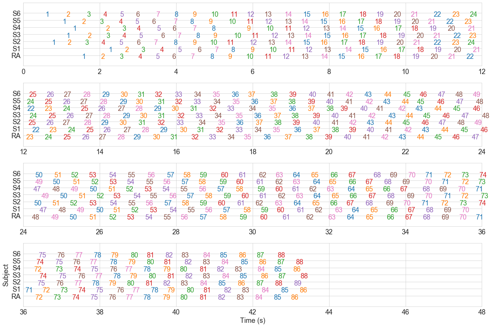
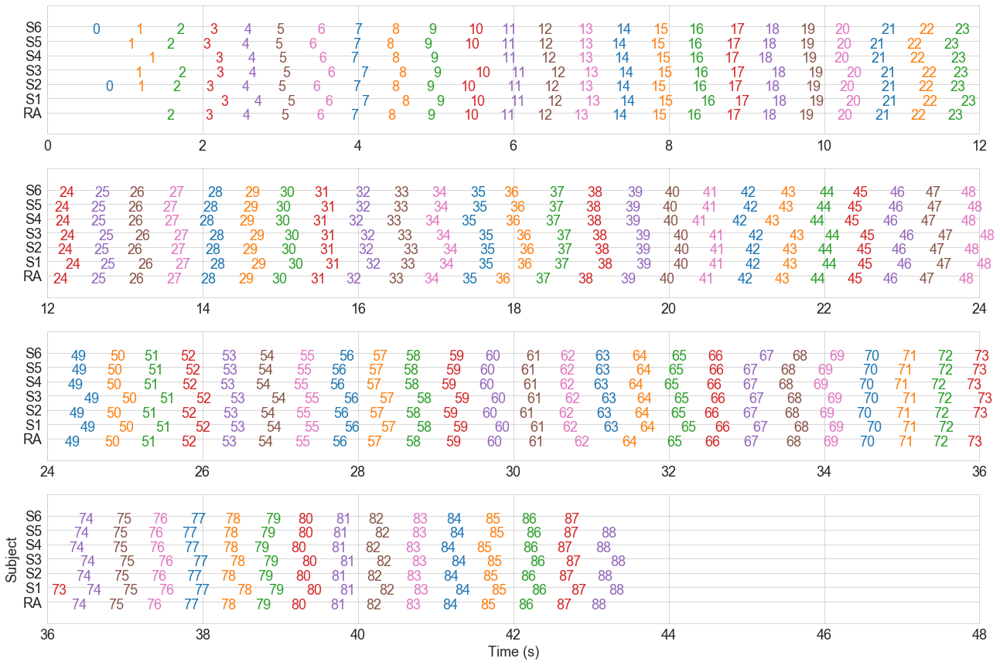

In a pretty cool experiment run at Tate Modern last year,
we put visitors to the gallery into groups of 7, blindfolded them, 
and asked to to march in time at a given tempo.
We're using this data to explore how people coordinate with each other in groups.

One problem, however, is that people don't always keep perfect time.
Often, they would skip a few beats, step more than once in a single beat, or start late.
The challange was to find a way to automatically *cluster* the data,
so we can say *this footstep and this footstep belong to this beat, 
while this other other footstep belongs to a different beat*.
In this post, I outline how I achieved this using python's 
[`scikit-learn`](scikit-learn.org/).


# The Data

First, let's take a look at the raw data.


```python
import numpy as np
import pandas as pd
import matplotlib.pyplot as plt
import matplotlib as mpl
import seaborn as sns
from sklearn import cluster as skcluster

# Plot settinngs
sns.set_style('whitegrid')
mpl.rcParams['figure.figsize'] = (8, 6)
mpl.rcParams['font.size'] = 18
```


```python
all_data = pd.read_csv('data/raw.csv')
all_data.head()
```


<div>
<style scoped>
    .dataframe tbody tr th:only-of-type {
        vertical-align: middle;
    }

    .dataframe tbody tr th {
        vertical-align: top;
    }

    .dataframe thead th {
        text-align: right;
    }
</style>
<table border="1" class="dataframe">
  <thead>
    <tr style="text-align: right;">
      <th></th>
      <th>group</th>
      <th>block</th>
      <th>camera</th>
      <th>subject</th>
      <th>step</th>
      <th>time</th>
      <th>isi</th>
    </tr>
  </thead>
  <tbody>
    <tr>
      <th>0</th>
      <td>1</td>
      <td>1</td>
      <td>A</td>
      <td>RA</td>
      <td>1</td>
      <td>1.534</td>
      <td>NaN</td>
    </tr>
    <tr>
      <th>1</th>
      <td>1</td>
      <td>1</td>
      <td>A</td>
      <td>RA</td>
      <td>2</td>
      <td>2.037</td>
      <td>0.503</td>
    </tr>
    <tr>
      <th>2</th>
      <td>1</td>
      <td>1</td>
      <td>A</td>
      <td>RA</td>
      <td>3</td>
      <td>2.519</td>
      <td>0.482</td>
    </tr>
    <tr>
      <th>3</th>
      <td>1</td>
      <td>1</td>
      <td>A</td>
      <td>RA</td>
      <td>4</td>
      <td>3.012</td>
      <td>0.493</td>
    </tr>
    <tr>
      <th>4</th>
      <td>1</td>
      <td>1</td>
      <td>A</td>
      <td>RA</td>
      <td>5</td>
      <td>3.467</td>
      <td>0.455</td>
    </tr>
  </tbody>
</table>
</div>


```python
print('We have %i rows, and %i columns.\n' % all_data.shape)

print('Unique values (of index columns):')
for col in ['group', 'block', 'camera', 'subject']:
    print('- "%s"\n   %s' % (col, str(all_data[col].unique())))
```

    We have 30805 rows, and 7 columns.
    
    Unique values (of index columns):
    - "group"
       [ 1  2  3  4  5  6  8  9 10 11 12 13 14 15 16 17 18 19 20 21 22 23 24 25
     26 27  7]
    - "block"
       [1 2]
    - "camera"
       ['A' 'B']
    - "subject"
       ['RA' 'S2' 'S4' 'S5' 'S6' 'S1' 'S3']


We have data from 27 groups, who each completed two blocks.
Each group consisted of 7 people (6 subjects, and  research assistant).
For each step by each person, 
we have coded the `time` since the start of the recording (in seconds),
and the `step` number (step 1, 2, 3, etc., for that person, in that recording).

## Checking Alignment

Next, let's extract data from group 1, block 1, 
and represent it using a *wide* (participant × step) data frame of step times.


```python
def select_wide_data(all_data: pd.DataFrame, 
                     group: int, block: int) -> pd.DataFrame:
    '''Get wide data for this group, in this block'''
    mask = (all_data['group']==group) & (all_data['block']==block)
    df = all_data[mask] # Long format
    dfx = df.pivot_table(index='subject', columns='step', values='time') # Wide format
    return dfx

group = 1
block = 1
dfx = select_wide_data(all_data, group, block)
dfx
```


<div>
<style scoped>
    .dataframe tbody tr th:only-of-type {
        vertical-align: middle;
    }

    .dataframe tbody tr th {
        vertical-align: top;
    }

    .dataframe thead th {
        text-align: right;
    }
</style>
<table border="1" class="dataframe">
  <thead>
    <tr style="text-align: right;">
      <th>step</th>
      <th>1</th>
      <th>2</th>
      <th>3</th>
      <th>4</th>
      <th>5</th>
      <th>6</th>
      <th>7</th>
      <th>8</th>
      <th>9</th>
      <th>10</th>
      <th>...</th>
      <th>80</th>
      <th>81</th>
      <th>82</th>
      <th>83</th>
      <th>84</th>
      <th>85</th>
      <th>86</th>
      <th>87</th>
      <th>88</th>
      <th>89</th>
    </tr>
    <tr>
      <th>subject</th>
      <th></th>
      <th></th>
      <th></th>
      <th></th>
      <th></th>
      <th></th>
      <th></th>
      <th></th>
      <th></th>
      <th></th>
      <th></th>
      <th></th>
      <th></th>
      <th></th>
      <th></th>
      <th></th>
      <th></th>
      <th></th>
      <th></th>
      <th></th>
      <th></th>
    </tr>
  </thead>
  <tbody>
    <tr>
      <th>RA</th>
      <td>1.534</td>
      <td>2.037</td>
      <td>2.519</td>
      <td>3.012</td>
      <td>3.467</td>
      <td>3.899</td>
      <td>4.382</td>
      <td>4.890</td>
      <td>5.354</td>
      <td>5.823</td>
      <td>...</td>
      <td>40.102</td>
      <td>40.607</td>
      <td>41.088</td>
      <td>41.577</td>
      <td>42.061</td>
      <td>42.549</td>
      <td>43.004</td>
      <td>NaN</td>
      <td>NaN</td>
      <td>NaN</td>
    </tr>
    <tr>
      <th>S1</th>
      <td>2.229</td>
      <td>2.666</td>
      <td>3.087</td>
      <td>3.578</td>
      <td>4.045</td>
      <td>4.558</td>
      <td>5.007</td>
      <td>5.439</td>
      <td>5.950</td>
      <td>6.433</td>
      <td>...</td>
      <td>40.269</td>
      <td>40.706</td>
      <td>41.247</td>
      <td>41.721</td>
      <td>42.231</td>
      <td>42.744</td>
      <td>43.226</td>
      <td>NaN</td>
      <td>NaN</td>
      <td>NaN</td>
    </tr>
    <tr>
      <th>S2</th>
      <td>0.751</td>
      <td>1.158</td>
      <td>1.619</td>
      <td>2.046</td>
      <td>2.509</td>
      <td>2.973</td>
      <td>3.418</td>
      <td>3.938</td>
      <td>4.437</td>
      <td>4.879</td>
      <td>...</td>
      <td>38.713</td>
      <td>39.197</td>
      <td>39.660</td>
      <td>40.118</td>
      <td>40.619</td>
      <td>41.097</td>
      <td>41.610</td>
      <td>42.095</td>
      <td>42.583</td>
      <td>43.082</td>
    </tr>
    <tr>
      <th>S3</th>
      <td>1.120</td>
      <td>1.683</td>
      <td>2.173</td>
      <td>2.598</td>
      <td>3.027</td>
      <td>3.610</td>
      <td>4.028</td>
      <td>4.523</td>
      <td>4.969</td>
      <td>5.503</td>
      <td>...</td>
      <td>39.273</td>
      <td>39.767</td>
      <td>40.236</td>
      <td>40.688</td>
      <td>41.198</td>
      <td>41.657</td>
      <td>42.219</td>
      <td>42.671</td>
      <td>43.253</td>
      <td>NaN</td>
    </tr>
    <tr>
      <th>S4</th>
      <td>1.293</td>
      <td>2.166</td>
      <td>2.586</td>
      <td>2.976</td>
      <td>3.500</td>
      <td>3.906</td>
      <td>4.431</td>
      <td>4.926</td>
      <td>5.843</td>
      <td>6.355</td>
      <td>...</td>
      <td>40.093</td>
      <td>40.613</td>
      <td>41.062</td>
      <td>41.524</td>
      <td>42.120</td>
      <td>42.565</td>
      <td>43.062</td>
      <td>NaN</td>
      <td>NaN</td>
      <td>NaN</td>
    </tr>
    <tr>
      <th>S5</th>
      <td>1.027</td>
      <td>1.536</td>
      <td>2.007</td>
      <td>2.508</td>
      <td>2.933</td>
      <td>3.370</td>
      <td>3.929</td>
      <td>4.366</td>
      <td>4.855</td>
      <td>5.362</td>
      <td>...</td>
      <td>39.227</td>
      <td>39.675</td>
      <td>40.214</td>
      <td>40.692</td>
      <td>41.181</td>
      <td>41.684</td>
      <td>42.168</td>
      <td>42.645</td>
      <td>43.127</td>
      <td>NaN</td>
    </tr>
    <tr>
      <th>S6</th>
      <td>0.582</td>
      <td>1.131</td>
      <td>1.666</td>
      <td>2.096</td>
      <td>2.534</td>
      <td>2.952</td>
      <td>3.480</td>
      <td>3.954</td>
      <td>4.432</td>
      <td>4.910</td>
      <td>...</td>
      <td>38.807</td>
      <td>39.230</td>
      <td>39.716</td>
      <td>40.130</td>
      <td>40.696</td>
      <td>41.137</td>
      <td>41.641</td>
      <td>42.103</td>
      <td>42.655</td>
      <td>NaN</td>
    </tr>
  </tbody>
</table>
<p>7 rows × 89 columns</p>
</div>


Which steps belong to which beat clusters?
We'll start by assuming that everyone was perfectly coordinated,
so that step $n$ for every participant
belongs to cluster $n$.
This is encoded in the participant × step *cluster matrix*, below.


```python
n_subjects, n_times = dfx.shape
steps = np.arange(n_times)
subjects = np.arange(n_subjects)

cluster_ids = dfx.columns.values
initial_cluster_matrix = np.repeat(cluster_ids, n_subjects).reshape((n_times, n_subjects)).T
initial_cluster_matrix
```


    array([[ 1,  2,  3,  4,  5,  6,  7,  8,  9, 10, 11, 12, 13, 14, 15, 16,
            17, 18, 19, 20, 21, 22, 23, 24, 25, 26, 27, 28, 29, 30, 31, 32,
            33, 34, 35, 36, 37, 38, 39, 40, 41, 42, 43, 44, 45, 46, 47, 48,
            49, 50, 51, 52, 53, 54, 55, 56, 57, 58, 59, 60, 61, 62, 63, 64,
            65, 66, 67, 68, 69, 70, 71, 72, 73, 74, 75, 76, 77, 78, 79, 80,
            81, 82, 83, 84, 85, 86, 87, 88, 89],
           [ 1,  2,  3,  4,  5,  6,  7,  8,  9, 10, 11, 12, 13, 14, 15, 16,
            17, 18, 19, 20, 21, 22, 23, 24, 25, 26, 27, 28, 29, 30, 31, 32,
            33, 34, 35, 36, 37, 38, 39, 40, 41, 42, 43, 44, 45, 46, 47, 48,
            49, 50, 51, 52, 53, 54, 55, 56, 57, 58, 59, 60, 61, 62, 63, 64,
            65, 66, 67, 68, 69, 70, 71, 72, 73, 74, 75, 76, 77, 78, 79, 80,
            81, 82, 83, 84, 85, 86, 87, 88, 89],
           [ 1,  2,  3,  4,  5,  6,  7,  8,  9, 10, 11, 12, 13, 14, 15, 16,
            17, 18, 19, 20, 21, 22, 23, 24, 25, 26, 27, 28, 29, 30, 31, 32,
            33, 34, 35, 36, 37, 38, 39, 40, 41, 42, 43, 44, 45, 46, 47, 48,
            49, 50, 51, 52, 53, 54, 55, 56, 57, 58, 59, 60, 61, 62, 63, 64,
            65, 66, 67, 68, 69, 70, 71, 72, 73, 74, 75, 76, 77, 78, 79, 80,
            81, 82, 83, 84, 85, 86, 87, 88, 89],
           [ 1,  2,  3,  4,  5,  6,  7,  8,  9, 10, 11, 12, 13, 14, 15, 16,
            17, 18, 19, 20, 21, 22, 23, 24, 25, 26, 27, 28, 29, 30, 31, 32,
            33, 34, 35, 36, 37, 38, 39, 40, 41, 42, 43, 44, 45, 46, 47, 48,
            49, 50, 51, 52, 53, 54, 55, 56, 57, 58, 59, 60, 61, 62, 63, 64,
            65, 66, 67, 68, 69, 70, 71, 72, 73, 74, 75, 76, 77, 78, 79, 80,
            81, 82, 83, 84, 85, 86, 87, 88, 89],
           [ 1,  2,  3,  4,  5,  6,  7,  8,  9, 10, 11, 12, 13, 14, 15, 16,
            17, 18, 19, 20, 21, 22, 23, 24, 25, 26, 27, 28, 29, 30, 31, 32,
            33, 34, 35, 36, 37, 38, 39, 40, 41, 42, 43, 44, 45, 46, 47, 48,
            49, 50, 51, 52, 53, 54, 55, 56, 57, 58, 59, 60, 61, 62, 63, 64,
            65, 66, 67, 68, 69, 70, 71, 72, 73, 74, 75, 76, 77, 78, 79, 80,
            81, 82, 83, 84, 85, 86, 87, 88, 89],
           [ 1,  2,  3,  4,  5,  6,  7,  8,  9, 10, 11, 12, 13, 14, 15, 16,
            17, 18, 19, 20, 21, 22, 23, 24, 25, 26, 27, 28, 29, 30, 31, 32,
            33, 34, 35, 36, 37, 38, 39, 40, 41, 42, 43, 44, 45, 46, 47, 48,
            49, 50, 51, 52, 53, 54, 55, 56, 57, 58, 59, 60, 61, 62, 63, 64,
            65, 66, 67, 68, 69, 70, 71, 72, 73, 74, 75, 76, 77, 78, 79, 80,
            81, 82, 83, 84, 85, 86, 87, 88, 89],
           [ 1,  2,  3,  4,  5,  6,  7,  8,  9, 10, 11, 12, 13, 14, 15, 16,
            17, 18, 19, 20, 21, 22, 23, 24, 25, 26, 27, 28, 29, 30, 31, 32,
            33, 34, 35, 36, 37, 38, 39, 40, 41, 42, 43, 44, 45, 46, 47, 48,
            49, 50, 51, 52, 53, 54, 55, 56, 57, 58, 59, 60, 61, 62, 63, 64,
            65, 66, 67, 68, 69, 70, 71, 72, 73, 74, 75, 76, 77, 78, 79, 80,
            81, 82, 83, 84, 85, 86, 87, 88, 89]])


To see how sensible this clustering is, let's produce a *raster plot* 
of all the data from this block.
This shows the time of every step for every participant,
along with the cluster that step is assigned to (colour-coded, and with numeric labels).


```python
def raster_plot(cluster_matrix: np.ndarray, dfx: pd.DataFrame, text=True):
    '''Produce a raster plot, showing the time of each participants' steps
    and the cluster they've been assigned to.
    
    
    '''
    fig, axes = plt.subplots(4, 1, figsize=(18, 12))
    for i, start in enumerate([0, 12, 24, 36]):
        raster_plot_row(cluster_matrix, dfx, start=start, stop=start+12, ax=axes[i], text=text)
    plt.tight_layout()
    plt.ylabel('Subject')
    plt.xlabel('Time (s)')

def raster_plot_row(cluster_matrix, dfx, start=0, stop=90, text=True, ax=None):
    '''Plot a single row of our raster plot, in the time window provided'''
    if ax is None:
        plt.figure(figsize=(18, 3))
        plt.ylabel('Subject')
        plt.xlabel('Time (s)')
    else:
        plt.sca(ax)
    pal = sns.palettes.color_palette(n_colors=7)
    from itertools import cycle
    pal = cycle(pal)
    X = dfx.values
    subjects = dfx.index.values
    subject_ix = np.arange(len(subjects))
    steps = np.unique(cluster_matrix)
    steps = steps[~np.isnan(steps)]
    for step in steps:
        color = next(pal)
        for sx, subject in enumerate(subjects):
            cm = cluster_matrix[sx]
            t = X[sx, cm==step] # subject cluster times
            t = t[(t >= start) & (t <= stop)]
            n = len(t)
            if n > 0:
                if text:
                    for v in t:
                        plt.text(v, sx, int(step), color=color)
                else:
                    plt.plot(t, np.repeat(sx, n), 'o', color=color)
    plt.ylim(-1, len(subjects)+1)
    plt.yticks(subject_ix+.5, subjects)
    plt.xlim(start, stop)


```


```python
raster_plot(initial_cluster_matrix, dfx)
```





Clearly, the clusters are wrong.
If we  look at 6 seconds in, for instance,
we see that all 7 people step at around the same time,
but this is step 10 for the RA, step 9 for subject 1,
step 12 for subject 2, and so on.

# Automatic Clustering

To address this, I use an automatic [clustering](https://scikit-learn.org/stable/modules/clustering.html#clustering) algorithm from `scikit-learn`
to group the steps into temporal clusters.
There are a number of clustering algorithms available,
making different assumptions about the nature of the clusters you're looking for,
and with different parameters to be tuned.

Some algorithms such as [*k-means*](https://scikit-learn.org/stable/modules/clustering.html#k-means)
and [*Gaussian mixture models*](https://scikit-learn.org/stable/modules/mixture.html#mixture)
require that you specify how many clusters you're looking for.
This is problematic here, since different groups end up with 
different numbers of beat clusters, and it's not even clear
even to us how many clusters there should be.
For example, how many beats occur in the first two seconds of the plot above?
It is possible to use model selection techniques to find the optimal number of clusters
for some algorithms, such as Guassian mixture modelling,
but this is time-consuming and complicated.
K-means also assumes that all clusters have the same variance, which doesn't work here
since cluster variance goes up whenever people go out of time.

Other algorithms automatically figure out how many clusters to create,
based on some other criterion.
I found good results using the [*Mean Shift*](https://scikit-learn.org/stable/modules/clustering.html#mean-shift)
algorithm,
which requires that you set a bandwidth parameter
dictating how broad individual clusters should be.
Results were best with `bandwidth=0.25`, 
which seems consistent with the fact that particpants
were supposed to be stepping at 120 BPM, or once every 0.5 seconds.


```python
# Step times as column vector, excluding NaNs
X = dfx.values
step_times = X[~np.isnan(X)].flatten().reshape(-1, 1)
# Fit model
model = skcluster.MeanShift(bandwidth=.25).fit(step_times)
```


```python
# Cluster labels are not in order
# To reorder them, we generate a dict that maps
# the original labels to new, ordered ones.
labels = model.predict(model.cluster_centers_)
ordered_labels = model.predict(np.sort(model.cluster_centers_, 0))
label_dict = dict(zip(ordered_labels, labels))
label_dict[np.nan] = np.nan
print(label_dict)
```

    {88: 0, 86: 1, 87: 2, 82: 3, 81: 4, 80: 5, 79: 6, 78: 7, 77: 8, 76: 9, 85: 10, 75: 11, 74: 12, 73: 13, 72: 14, 71: 15, 70: 16, 69: 17, 68: 18, 67: 19, 66: 20, 65: 21, 64: 22, 63: 23, 62: 24, 61: 25, 60: 26, 59: 27, 58: 28, 57: 29, 56: 30, 55: 31, 54: 32, 53: 33, 52: 34, 51: 35, 50: 36, 49: 37, 48: 38, 47: 39, 46: 40, 45: 41, 44: 42, 43: 43, 42: 44, 41: 45, 40: 46, 39: 47, 38: 48, 37: 49, 36: 50, 35: 51, 34: 52, 33: 53, 32: 54, 31: 55, 30: 56, 29: 57, 28: 58, 27: 59, 26: 60, 25: 61, 24: 62, 84: 63, 23: 64, 22: 65, 21: 66, 20: 67, 19: 68, 18: 69, 17: 70, 16: 71, 15: 72, 14: 73, 13: 74, 12: 75, 11: 76, 10: 77, 9: 78, 8: 79, 7: 80, 6: 81, 5: 82, 4: 83, 3: 84, 2: 85, 1: 86, 0: 87, 83: 88, nan: nan}


```python
# Generate a matrix of ordered cluster labels from the clustering model
cluster_matrix = np.zeros_like(X)
for i in subjects:
    for j in range(n_times):
        x = X[i, j]
        if not np.isnan(x):
            label = model.predict(x.reshape(-1, 1))[0]
            cluster_matrix[i, j] = label_dict[label]
        else:
            cluster_matrix[i, j] = np.nan
print(cluster_matrix)
```

    [[ 2.  3.  4.  5.  6.  7.  8.  9. 10. 11. 12. 13. 14. 15. 16. 17. 18. 19.
      20. 21. 22. 23. 24. 25. 26. 27. 28. 29. 30. 31. 32. 33. 34. 35. 36. 37.
      38. 39. 40. 41. 42. 43. 44. 45. 46. 47. 48. 49. 50. 51. 52. 53. 54. 55.
      56. 57. 58. 59. 60. 61. 62. 64. 65. 66. 67. 68. 69. 70. 71. 72. 73. 74.
      75. 76. 77. 78. 79. 80. 81. 82. 83. 84. 85. 86. 87. 88. nan nan nan]
     [ 3.  4.  5.  6.  7.  8.  9. 10. 11. 12. 13. 14. 15. 16. 17. 18. 19. 20.
      21. 22. 23. 24. 25. 26. 27. 28. 29. 30. 31. 32. 33. 34. 35. 36. 37. 38.
      39. 40. 41. 42. 43. 44. 45. 46. 47. 48. 49. 50. 51. 52. 53. 54. 55. 56.
      57. 58. 59. 60. 61. 62. 63. 64. 65. 66. 67. 68. 69. 70. 71. 72. 73. 74.
      75. 76. 77. 78. 79. 80. 81. 82. 83. 84. 85. 86. 87. 88. nan nan nan]
     [ 0.  1.  2.  3.  4.  5.  6.  7.  8.  9. 10. 11. 12. 13. 14. 15. 16. 17.
      18. 19. 20. 21. 22. 23. 24. 25. 26. 27. 28. 29. 30. 31. 32. 33. 34. 35.
      36. 37. 38. 39. 40. 41. 42. 43. 44. 45. 46. 47. 48. 49. 50. 51. 52. 53.
      54. 55. 56. 57. 58. 59. 60. 61. 62. 63. 64. 65. 66. 67. 68. 69. 70. 71.
      72. 73. 74. 75. 76. 77. 78. 79. 80. 81. 82. 83. 84. 85. 86. 87. 88.]
     [ 1.  2.  3.  4.  5.  6.  7.  8.  9. 10. 11. 12. 13. 14. 15. 16. 17. 18.
      19. 20. 21. 22. 23. 24. 25. 26. 27. 28. 29. 30. 31. 32. 33. 34. 35. 36.
      37. 38. 39. 40. 41. 42. 43. 44. 45. 46. 47. 48. 49. 50. 51. 52. 53. 54.
      55. 56. 57. 58. 59. 60. 61. 62. 63. 64. 65. 66. 67. 68. 69. 70. 71. 72.
      73. 74. 75. 76. 77. 78. 79. 80. 81. 82. 83. 84. 85. 86. 87. 88. nan]
     [ 1.  3.  4.  5.  6.  7.  8.  9. 11. 12. 13. 14. 15. 16. 17. 18. 19. 20.
      21. 22. 23. 24. 25. 26. 27. 28. 29. 30. 31. 32. 33. 34. 35. 36. 37. 38.
      39. 40. 41. 42. 43. 44. 45. 46. 47. 48. 49. 50. 51. 52. 53. 54. 55. 56.
      57. 58. 59. 60. 61. 62. 63. 64. 65. 66. 67. 68. 69. 70. 71. 72. 73. 74.
      75. 76. 77. 78. 79. 80. 81. 82. 83. 84. 85. 86. 87. 88. nan nan nan]
     [ 1.  2.  3.  4.  5.  6.  7.  8.  9. 10. 11. 12. 13. 14. 15. 16. 17. 18.
      19. 20. 21. 22. 23. 24. 25. 26. 27. 28. 29. 30. 31. 32. 33. 34. 35. 36.
      37. 38. 39. 40. 41. 42. 43. 44. 45. 46. 47. 48. 49. 50. 51. 52. 53. 54.
      55. 56. 57. 58. 59. 60. 61. 62. 63. 64. 65. 66. 67. 68. 69. 70. 71. 72.
      73. 74. 75. 76. 77. 78. 79. 80. 81. 82. 83. 84. 85. 86. 87. 88. nan]
     [ 0.  1.  2.  3.  4.  5.  6.  7.  8.  9. 10. 11. 12. 13. 14. 15. 16. 17.
      18. 19. 20. 21. 22. 23. 24. 25. 26. 27. 28. 29. 30. 31. 32. 33. 34. 35.
      36. 37. 38. 39. 40. 41. 42. 43. 44. 45. 46. 47. 48. 49. 50. 51. 52. 53.
      54. 55. 56. 57. 58. 59. 60. 61. 62. 63. 64. 65. 66. 67. 68. 69. 70. 71.
      72. 73. 74. 75. 76. 77. 78. 79. 80. 81. 82. 83. 84. 85. 86. 87. nan]]


```python
# Here's a function that does the same thing
def fit_meanshift_clusters(dfx: pd.DataFrame, bandwidth=.25) -> np.ndarray:
    '''Cluster the step times using the MeanShift algorithm.
    Returns  participant × step cluster matrix'''
    # Step times as column vector, excluding NaNs
    X = dfx.values
    step_times = X[~np.isnan(X)].flatten().reshape(-1, 1)
    # Fit model
    model = skcluster.MeanShift(bandwidth=.25).fit(step_times)
    # Cluster labels are not in order
    # To reorder them, we generate a dict that maps
    # the original labels to new, ordered ones.
    labels = model.predict(model.cluster_centers_)
    ordered_labels = model.predict(np.sort(model.cluster_centers_, 0))
    label_dict = dict(zip(ordered_labels, labels))
    label_dict[np.nan] = np.nan
    # Generate a matrix of ordered cluster labels from the clustering model
    cluster_matrix = np.zeros_like(X)
    n_subjects, n_times = X.shape
    for i in range(n_subjects):
        for j in range(n_times):
            x = X[i, j]
            if not np.isnan(x):
                label = model.predict(x.reshape(-1, 1))[0]
                cluster_matrix[i, j] = label_dict[label]
            else:
                cluster_matrix[i, j] = np.nan
    return cluster_matrix
```


```python
raster_plot(cluster_matrix, dfx)
```





Better. Steps that occur at around the same time are now part of the same cluster.

Finally, we convert the step times and cluster labels back to format, 
and save them to file.


```python
%mkdir -p data/clustered
step_df = dfx.reset_index().melt(id_vars='subject', value_name='time')
cluster_dfx = pd.DataFrame(cluster_matrix, index=dfx.index, columns=dfx.columns)
cluster_df = (cluster_dfx.reset_index()
              .melt(id_vars='subject')
              .rename({'value':'cluster'}, axis=1)
              .sort_values(['step', 'subject']))
result = pd.merge(step_df, cluster_df, 
                  on=['subject', 'step'], how='left')
result.to_csv('data/clustered/group%i_block%i.csv' % (group, block),
              index=False)
result.head()
```

# Edge Cases

Although it works very well for the vast majority of our data
(27 groups, two blocks each), this approach isn't perfect.
There are still some cases that aren't clustered as we would expect.
Here's the worst example.


```python
group, block = 2, 2
dfx = select_wide_data(all_data, group, block)
cluster_matrix = fit_meanshift_clusters(dfx)
raster_plot(cluster_matrix, dfx)
```

Cluster 25 contains steps that should really be split across two clusters,
clusters 50 and 51 should probably be a single cluster.
There are a few other issues, for example around cluster 68.
Several of these issues arise because the clustering algorithm 
isn't constrained to have only one step per person per cluster.
There are a few approaches we could take to deal with these problems.

## Exclude them

For now, we limit our analyses to clusters of 7 steps.
This is certainly the most reliable solution,
and does not lead to any further issues in our analyses.

## Constrain the clustering algorithm

In principle, we could modify the code for 
[`sklearn.cluster.MeanShift`](https://github.com/scikit-learn/scikit-learn/blob/fd237278e/sklearn/cluster/_mean_shift.py#L239)
to add the constraints we need.
This is likely to be difficult though.

## Postprocess the result

Alternatively, we could do the clustering as normal,
but add some additional steps at the end
to deal with abnormal clusters when they come up.

## Manual fix

Finally, we could just manually adjust the cluster result to deal with these very occasional edge cases.
This is probably the most time-effective way to actually fix the problem.
Fixing the abberant clusters might be quite time-consuming in a spreadsheet program,
but could be made much easier by using
`matplotlib`'s [advanced features](https://matplotlib.org/3.3.0/users/interactive.html)
to make the raster plots above interactive,
providing a GUI for modifying the cluster labels.
This is quite similar to some of the [functionality](https://mne.tools/dev/auto_tutorials/raw/plot_30_annotate_raw.html)
in the excellent `mne` package for M/EEG analyses.


# Loop It

Finally, the code below runs the clustering algorithm for every group,
produces plots,
and merges and saves the output.


```python
%mkdir -p figures
%mkdir -p figures/clustering
```


```python
# Duplicates of the functions defined above
def select_wide_data(all_data: pd.DataFrame, 
                     group: int, block: int) -> pd.DataFrame:
    '''Get wide data for this group, in this block'''
    mask = (all_data['group']==group) & (all_data['block']==block)
    df = all_data[mask] # Long format
    dfx = df.pivot_table(index='subject', columns='step', values='time') # Wide format
    return dfx

def raster_plot(cluster_matrix: np.ndarray, dfx: pd.DataFrame, text=True):
    '''Produce a raster plot, showing the time of each participants' steps
    and the cluster they've been assigned to.
    
    
    '''
    fig, axes = plt.subplots(4, 1, figsize=(18, 12))
    for i, start in enumerate([0, 12, 24, 36]):
        raster_plot_row(cluster_matrix, dfx, start=start, stop=start+12, ax=axes[i], text=text)
    plt.tight_layout()
    plt.ylabel('Subject')
    plt.xlabel('Time (s)')

def raster_plot_row(cluster_matrix, dfx, start=0, stop=90, text=True, ax=None):
    '''Plot a single row of our raster plot, in the time window provided'''
    if ax is None:
        plt.figure(figsize=(18, 3))
        plt.ylabel('Subject')
        plt.xlabel('Time (s)')
    else:
        plt.sca(ax)
    pal = sns.palettes.color_palette(n_colors=7)
    from itertools import cycle
    pal = cycle(pal)
    X = dfx.values
    subjects = dfx.index.values
    subject_ix = np.arange(len(subjects))
    steps = np.unique(cluster_matrix)
    steps = steps[~np.isnan(steps)]
    for step in steps:
        color = next(pal)
        for sx, subject in enumerate(subjects):
            cm = cluster_matrix[sx]
            t = X[sx, cm==step] # subject cluster times
            t = t[(t >= start) & (t <= stop)]
            n = len(t)
            if n > 0:
                if text:
                    for v in t:
                        plt.text(v, sx, int(step), color=color)
                else:
                    plt.plot(t, np.repeat(sx, n), 'o', color=color)
    plt.ylim(-1, len(subjects)+1)
    plt.yticks(subject_ix+.5, subjects)
    plt.xlim(start, stop)

def fit_meanshift_clusters(dfx: pd.DataFrame, bandwidth=.25) -> np.ndarray:
    '''Cluster the step times using the MeanShift algorithm.
    Returns  participant × step cluster matrix'''
    # Step times as column vector, excluding NaNs
    X = dfx.values
    step_times = X[~np.isnan(X)].flatten().reshape(-1, 1)
    # Fit model
    model = skcluster.MeanShift(bandwidth=.25).fit(step_times)
    # Cluster labels are not in order
    # To reorder them, we generate a dict that maps
    # the original labels to new, ordered ones.
    labels = model.predict(model.cluster_centers_)
    ordered_labels = model.predict(np.sort(model.cluster_centers_, 0))
    label_dict = dict(zip(ordered_labels, labels))
    label_dict[np.nan] = np.nan
    # Generate a matrix of ordered cluster labels from the clustering model
    cluster_matrix = np.zeros_like(X)
    n_subjects, n_times = X.shape
    for i in range(n_subjects):
        for j in range(n_times):
            x = X[i, j]
            if not np.isnan(x):
                label = model.predict(x.reshape(-1, 1))[0]
                cluster_matrix[i, j] = label_dict[label]
            else:
                cluster_matrix[i, j] = np.nan
    return cluster_matrix
```


```python
def do_block(group, block, plot=True):
    '''Put the whole pipeline together'''
    print('Group %i - Block %i' % (group, block))
    dfx = select_wide_data(all_data, group, block)
    cluster_matrix = fit_meanshift_clusters(dfx)
    raster_plot(cluster_matrix, dfx)

    # Initial order
    n_subjects, n_times = dfx.shape
    steps = np.arange(n_times)
    subjects = np.arange(n_subjects)
    cluster_ids = dfx.columns.values
    initial_cluster_matrix = np.repeat(cluster_ids, n_subjects).reshape((n_times, n_subjects)).T
    # Plot and save
    if plot:
        raster_plot(initial_cluster_matrix, dfx)
        plt.suptitle('Group %i - Block %i - Initial Labels' % (group, block))
        plt.savefig('figures/clustering/g%i_b%i_initial.png' % (group, block))
        plt.close()

    # Mean Shift Clustering
    cluster_matrix = fit_meanshift_clusters(dfx)
    if plot:
        raster_plot(cluster_matrix, dfx)
        plt.suptitle('Group %i - Block %i - MeanShift Clustered Labels' % (group, block))
        plt.savefig('figures/clustering/g%i_b%i_meanshift.png' % (group, block))
        plt.close()

    ## Export
    step_df = dfx.reset_index().melt(id_vars='subject', value_name='time')
    cluster_dfx = pd.DataFrame(cluster_matrix, index=dfx.index, columns=dfx.columns)
    cluster_df = (cluster_dfx.reset_index()
                  .melt(id_vars='subject')
                  .rename({'value':'cluster'}, axis=1)
                  .sort_values(['step', 'subject']))
    result = pd.merge(step_df, cluster_df, 
                      on=['subject', 'step'], how='left')
    result['group'] = group
    result['block'] = block
    return result
```


```python
results = []
for (group, block), _ in all_data.groupby(['group', 'block']):
    result = do_block(group, block)
    results.append(result)
```

    Group 1 - Block 1
    Group 1 - Block 2
    Group 2 - Block 1
    ...[and so on]...


```python
final_results = pd.concat(results)
final_results.head()
```


<div>
<style scoped>
    .dataframe tbody tr th:only-of-type {
        vertical-align: middle;
    }

    .dataframe tbody tr th {
        vertical-align: top;
    }

    .dataframe thead th {
        text-align: right;
    }
</style>
<table border="1" class="dataframe">
  <thead>
    <tr style="text-align: right;">
      <th></th>
      <th>subject</th>
      <th>step</th>
      <th>time</th>
      <th>cluster</th>
      <th>group</th>
      <th>block</th>
    </tr>
  </thead>
  <tbody>
    <tr>
      <th>0</th>
      <td>RA</td>
      <td>1</td>
      <td>1.534</td>
      <td>2.0</td>
      <td>1</td>
      <td>1</td>
    </tr>
    <tr>
      <th>1</th>
      <td>S1</td>
      <td>1</td>
      <td>2.229</td>
      <td>3.0</td>
      <td>1</td>
      <td>1</td>
    </tr>
    <tr>
      <th>2</th>
      <td>S2</td>
      <td>1</td>
      <td>0.751</td>
      <td>0.0</td>
      <td>1</td>
      <td>1</td>
    </tr>
    <tr>
      <th>3</th>
      <td>S3</td>
      <td>1</td>
      <td>1.120</td>
      <td>1.0</td>
      <td>1</td>
      <td>1</td>
    </tr>
    <tr>
      <th>4</th>
      <td>S4</td>
      <td>1</td>
      <td>1.293</td>
      <td>1.0</td>
      <td>1</td>
      <td>1</td>
    </tr>
  </tbody>
</table>
</div>


```python
final_results.to_csv('data/clustered.csv', index=False)
```
