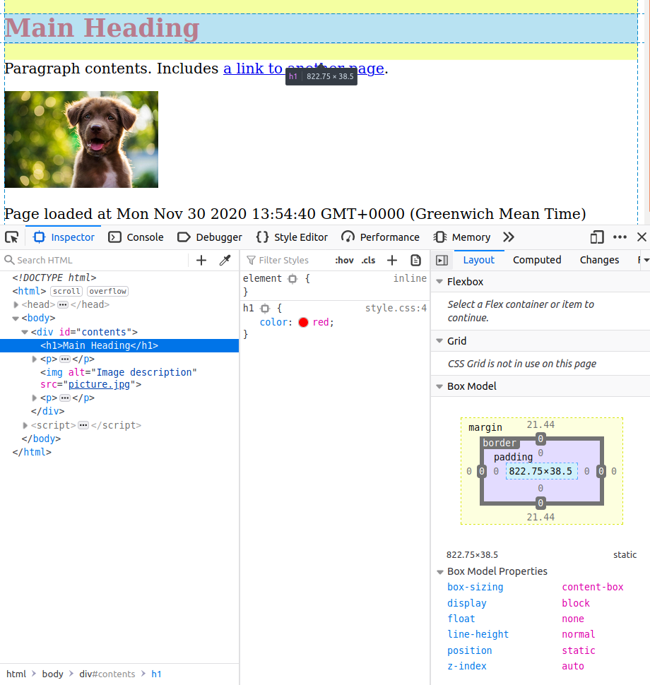

> It's been *a while* since the last post in this series. I haven't been totally idle.  I've built a whole load of online experiments, and developed a series of workshops on the material I'll be covering in these posts. The next few posts should come fairly soon.

---

It's always been useful to be able to run experiments online.
Post COVID-19, it's essential.
In this series of posts, I cover what you need to know
to move your research online.
The posts will be (roughly) as follows:

1. [How the Web Works](../web-1/)
2. [Choosing the Right Tools for the Job](../web-2/)
3. **The Web Developer's Toolbox**
4. Setting the Scene: HTML and CSS [coming later]
5. Making it Move: JavaScript and jQuery [coming later]
6. Saving Data [coming later]
7. The Fancy Stuff: Animation, Canvas Rendering, Multimedia, and More [coming later]

> Working through lockdown, you don't get a lot of feedback on what you write.
> If you have any comments on anything in these posts, including critical ones,
> I want to hear from you!
> Let me know what you think in the comments below, on twitter,
> or by email (`eoin.travers@gmail.com`).

---

You are not the first person who has had to build a website.
Web development is a multi-billion pound industry,
and huge swathes of time and effort have gone into
creating tools and resources that make this easier.
In this post, I cover some tools you should be familiar with before we get to work.

<link rel="stylesheet" type="text/css" media="all" href="style.css" />

# Documentation

There are no end of websites that will teach you how to build websites. For me, the [Mozilla Developer Network (MDN)](https://developer.mozilla.org/en-US/) is always the first port of call, and I'll be linking to it gratuitously in the posts to come. Everyone should at least read their [Getting started with the Web](https://developer.mozilla.org/en-US/docs/Learn/Getting_started_with_the_web) page, and have a look at their introductory [tutorials](https://developer.mozilla.org/en-US/docs/Web/Tutorials). In some of the later posts in this series, I'll be assuming that readers have read through the basics on MDN, since they can teach you about JavaScript much better than I can, and I'll only provide a short recap of the bits that are crucial for building experiments. 

## Other sources

- [W3schools](https://www.w3schools.com) is an older site which can also be useful, although it’s out of date in places.
- Google also have a useful [web developers site](https://developers.google.com/web), although it doesn’t cover the basics as well as the Mozilla one.
- The [Web Demystified](https://www.youtube.com/playlist?list=PLo3w8EB99pqLEopnunz-dOOBJ8t-Wgt2g) YouTube series looks good.
-  [CSS Tricks](https://css-tricks.com/) has some great examples of the fancier things you can do with CSS.
- https://www.smashingmagazine.com/ is for the real nerds.
- [Hakim El Hattab](https://hakim.se/) creates some beautiful stuff using the tools we'll be learning about. Good for inspiration, and for stealing ideas.

# Developer Console

All web browsers come with a set of built-in tools for inspecting and debugging the code underlying the websites you visit. [This post](https://webmasters.stackexchange.com/questions/8525/how-do-i-open-the-javascript-console-in-different-browsers/77337#77337) has details on how to access these tools on each browser (I'll be using Firefox, and you can find out more about the Firefox developer tools [here](https://developer.mozilla.org/en-US/docs/Tools)). There are a few related tools that we'll need.

To explain how these work, we need to say a little about what happens under the hood when you browse the internet (some of this was covered in [part 1](../web-1/)). Whenever you visit a page, either by typing in the [URL](https://en.wikipedia.org/wiki/URL) or following a link, your browser sends a request to the server (never mind which server for now) saying "please send me this page". The server responds by sending the HTML page over the internet to your browser, along with any resources that are included in the page, such as images, videos, and JavaScript or CSS code. Your browser then processes all of these files, uses that information to create a model of what the page should look like (the [document object model](https://developer.mozilla.org/en-US/docs/Web/API/Document_Object_Model/Introduction), DOM), and uses this model to dictate what you see on your screen. 

## Inspector

The [Inspector tool](https://developer.mozilla.org/en-US/docs/Tools/Page_Inspector) lets us hover the mouse cursor over specific chunks of HTML code in the DOM (lower left), and highlights the visible section on the page generated by that code, if any (top). It also lets us do the opposite, using the picker tool just to the left of "Inspector" button, where we hover over bits of the page and see the corresponding code. Selecting an element using either of these tools brings up information about the CSS styles applied to that element (centre and right columns), for instance showing that the reason the words "Main Heading" are in red is that we've set the `color` property of all `h1` elements to `red` on line 4 of our `style.css` file. 

One of the main uses of the developer tools is to manually make changes to your browser's model of what the page should look like, and see those changes in real time. 

We can do this by manually editing the HTML (left column) or the CSS (centre column, see also the *Style Editor* tab).  Later, we'll be doing something similar using JavaScript, when we write scripts that manipulate the contents of our pages on the fly as part of our experiments.

It's worth stressing that this doesn't mean you're changing the actual code that's saved on the server, and that gets sent to other people when they request the page. What you're making changes to is your browser's model of the page, which was constructed from the code sent by the server. It's useful to think of this like the mental models we see in theories of reasoning and reinforcement learning: you're not changing the things in the external environment (code on the server), but you are updating your mental model of those things. Later, we'll be using the browser to view pages we've created ourselves that are stored on our computers, rather than on a server. These are treated just like pages from the server, which means that we're not using the Inspector to edit the code saved on our hard drive. Instead, we'll be using the inspector to figure out what our code *should* be, and see the changes we make in real time, and then using a *code editor* (discussed below) to edit our code files accordingly.

## JavaScript Console

The other main tool is the JavaScript console. We can use this to interactively write and execute JavaScript code, illustrated below. This is an important part of the development process. No developer, no matter how experienced, writes 100% correct code first time around. Instead, they try out different chunks of code, see what happens, and iteratively change things until it all works. You'll be doing lots of this, and there's no shame in it. The console is particularly useful later, when we start using JavaScript to manipulate the rest of the page.

# Code Editor

Since you're going to be writing and editing code, you're going to need a program to do it with. Your operating system includes some kind of an application for editing plain text files, like Nodepad or TextEdit, but using these to write or edit code is a very, very bad idea. Instead, get yourself a specialised *code editor*. There are, broadly speaking, two kinds available. An *integrated development environment* (IDE) is an editor designed for one language specifically, and comes with lots of specialised tools for that language. RStudio and the MATLAB editor are both IDEs. A regular code editor is less specialised, but unlike an IDE can be used for writing code in any language (see what happens if you try to write MATLAB code in RStudio, or R code in the MATLAB editor). 

Of course, if you already have a code editor you like, you can stick with it. For beginners, I recommend [VSCode](https://code.visualstudio.com/), which is relatively easy to get the hang of, but also provides some very [useful features](https://code.visualstudio.com/docs/editor/intellisense) like code completing suggestions, hints and documentation (from MDN). If you don't already have a code editor, go get VSCode.

# Extras

There are a few other tools that are very useful for any kind of coding and software development, but aren't strictly necessary for learning to build online experiments. [Earth Lab](https://www.earthdatascience.org/courses/intro-to-earth-data-science/) have a great set of introductory materials on a lot of this (particularly Git, the command line, and writing good code), aimed at geoscientists but useful for everyone.

Here are some other links to get you started:

- [GitHub](www.github.com) and [Git](www.git-scm.com) for version control. See [*Curating Research Assets: A Tutorial on the Git Version Control System*](https://journals.sagepub.com/doi/full/10.1177/2515245918754826).
- A lot of things that take a great deal of clicking and scrolling to do in a graphical interface can be done quickly and easily on the *terminal* or *command line*, if you know how. For web development in particular, it's useful to be familiar with the *BASH* terminal. This comes with OSX and Linux systems, and can be installed on Windows. I don't know a single cohesive introduction to this, but these look useful.
  - [Earth Lab tutorial](https://www.earthdatascience.org/courses/intro-to-earth-data-science/open-reproducible-science/bash/)
  - [Introduction to Bash](https://cs.lmu.edu/~ray/notes/bash/)
  - [Git Bash for Windows](https://gitforwindows.org/) (see also [this](https://www.atlassian.com/git/tutorials/git-bash))
- [StackOverflow](www.stackoverflow.com) is a Q&A site for programmers. It's a badly kept secret that most programmers spend far more time searching for answers on StackOverflow and copying it into their own code than they do actually writing things themselves. There's no shame in this. Also check out [CrossValidated](https://stats.stackexchange.com/), which is the same thing but for statistics. There's also one for [Psychology and Neuroscience](https://psychology.stackexchange.com/), although it isn't as popular.