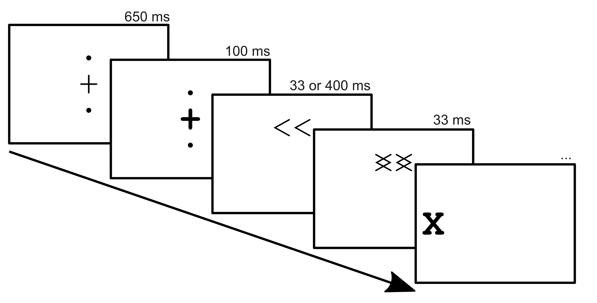

A few months ago
-- back when I wasn't keeping this blog very up to date --
philopher and journalist
[Dave Edmonds](https://twitter.com/davidedmonds100)
spoke to a whole bunch of researchers -- me included --
about the thorny problem of consciousness.
These interviews are broadcast in two episodes of
for the BBC World Service documentary series The Why Factor:
[*Why are we conscious of so little?*](https://www.bbc.co.uk/programmes/w3csyv0d)
and [*Why are we conscious?*](https://www.bbc.co.uk/programmes/w3csyv0f)

You can hear what I had to say about
consciousness, subliminal priming, and learning,
in *Why are we conscious of so little?*,
alongside some much more knowledgable people.

<iframe src="https://open.spotify.com/embed-podcast/episode/5MBPpYAYBRD6YhTW2MJwQ9" width="100%" height="232" frameborder="0" allowtransparency="true" allow="encrypted-media"></iframe>

You can hear what other people have to say in *Why are we conscious?*

<iframe src="https://open.spotify.com/embed-podcast/episode/2GCTt1RxdrS5U43l8dT2Qd" width="100%" height="232" frameborder="0" allowtransparency="true" allow="encrypted-media"></iframe>

## Masked Priming

I spoke to Dave about some of the work Nick Shea, Chris Frith and I did at the
Institute of Philosophy [(Travers, Frith & Shea, 2018)](https://journals.sagepub.com/doi/abs/10.1080/17470218.2017.1373834).
We presented participants with onscreen stimuli
that they saw, but didn't know they saw.
We did this using *visual masked priming*:
we present the stimuli -- arrows in this case --
for just 33 milliseconds (two frames on a computer monitor)
and then immediately hide them behind a *mask* pattern.
They then have to respond to an **X** (the *target*)
that appears on either side of the screen
by pressing a button with their left hand if it appears on the left,
and their right hand if it appears on the right.
We know that people saw the arrows even when they were presented for 33 milliseconds
becuse they were faster when the target appeared on the side of the screen they pointed to.
We know that people didn't know they had seen the arrows
because when we asked them which way they pointed,
they were only correct half the time.

Importantly, for half the experiment the arrows usually pointed in the right direction
-- towards where the target would appear --
while for the other half they usually pointed the wrong way.
When we showed the arrows for a long time, so that people were aware of them,
they learned to expect the target on the opposite side
if that was where it usually appeared.
When we showed the arrows quickly -- *subliminally* --
participants didn't learn if they usually pointed the right way or the wrong way.
Instead, they always unconsciously expected the target to appear
whereever the arrows were pointing.

*Without consciouss awareness, participants weren't able to learn*.

## Auditory Masked Priming

This is a nice result, and the task makes for a pretty cool visual demonstration:
you can show the stimuli slowly, so they're consciously perceived,
then show them quickly, so they aren't.
Unfortunately, this was a radio show.

Luckily,
some clever people in Paris
([Kouider, de Gardelle, Dehaene, Dupoux & Pallier, 2010](http://www.pallier.org/papers/Kouider.Pallier.subliminal.priming.fmri.2009.pdf);
[Kouider & Dopoux, 2005](https://sidkouider.com/wp-content/uploads/2018/05/ExternalLink_Kouider-Dupoux_PsychScience2005.pdf))
have come up with a way of doing this with sounds.
By speeding up spoken words,
and playing them along with distracting speech-like background sounds,
they were able to present participants with words that they heard,
but didn't know they had heard.
This is the perfect way to adapt our usual subliminal priming demo for the radio.

## Making it work

I've posted the code used to generate these audio segments to [GitHub](https://github.com/EoinTravers/AuditoryPriming).

To make them, I

- Convinced friends and colleagues to lend me their voices:
  a woman to say "left" and "right" (targets),
  and a man to say those words plus some fillers (primes and masks).
- Manually edited the recordings in audacity so that all of the targets,
  and all of the primes and masks, were the same length.
  This can be done by slightly speeding up or slowing down segments,
  or by cutting out windows from the audio to shorten vowel sounds.
- Wrote a python script, using [Pydub](http://pydub.com/) and
  [FFmpeg](https://www.ffmpeg.org/)
  (called using the [ffmpy](https://pypi.org/project/ffmpy/) wrapper), to
    - Compress the primes and masks
    - Reverse the masks
    - Combine the primes, masks, and targets to produce the audio stimuli.

I hope this code might be useful to someone down the line.

