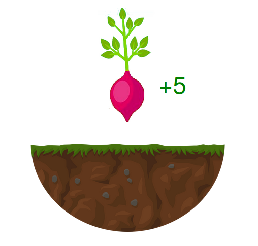

Experiments used to study self-initiated action are,
by tradition, very bad.
The standard paradigm is to just put participants in a room,
connected to the EEG,
and tell them to press a button *whenever they feel like it*.

To avoid this, I designed a number of *waiting games*:
tasks where participants had to decide how long to wait
before performing an action in a meaningful context.

> I've embedded the main section of each task within this webpage.
> These tasks weren't designed to be used this way, so for the full experience
> please follow the links to the original pages.

## Soufflé Task

In this task,
participants had to bake a soufflé on each trial.
If you open the oven before soufflé is ready,
it collapses and you need to start again.
Participants had to learn, in different conditions,
how long they needed to wait before opening the oven.

The EEG version of this task is described in
[Travers, Friedmann & Haggard (2020; bioRxiv)](https://www.biorxiv.org/content/10.1101/2020.04.16.045344v1)

<a target="_blank"
   href="http://eointravers.com/web/portfolio/souffle/">
    Click here to open this task in a new window</a>.

## Vegetable Task

This was an alternative version of the soufflé task.
You get 5 points if you wait long enough for your vegetable to grow,
but only one point for digging it up too soon.
In ways it's nicer aesthetically,
but it would have been more difficult to adapt for EEG,
so never went ahead.

<a target="_blank"
   href="http://eointravers.com/web/portfolio/veg/">
    Click here to open this task in a new window</a>.

## Flower Task

This was a slightly different paradigm
that we pilotted before developing the tasks above.
Most of the seeds eventually grow into flowers.
Some never do, and participants had to decide how long to wait before
throwing out those bad seeds and moving on to the next one.

<a target="_blank"
   href="http://eointravers.com/web/portfolio/flower/">
    Click here to open this task in a new window</a>.

